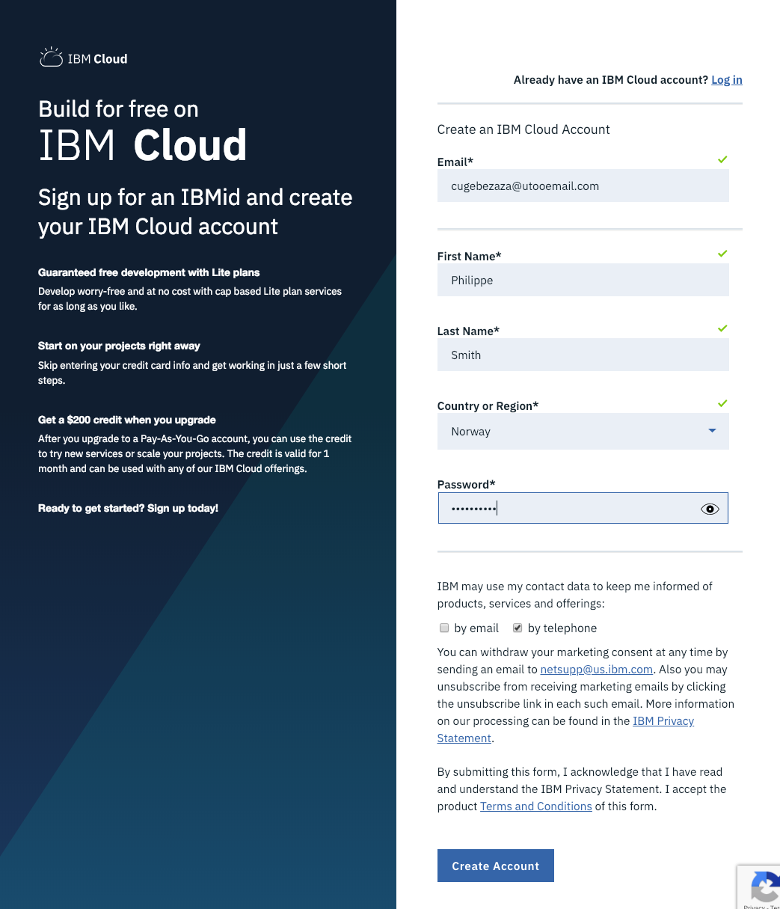
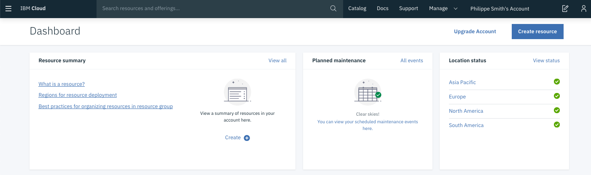

# IBM Cloud Container Workshop
---
# Lab1: Preparing the environment
---


Before you can run all the labs about containers in IBM Cloud, you should prepare your environment to execute those labs. Check the following instructions.


# Task 1. IBM Cloud registration

Labs are running on the **IBM Cloud** (ex Bluemix).

So before you can start any labs, you should have satisfied the following prerequisites :
- [ ] You should have **1 valid email** 

- [ ] Sign up to the **IBM Cloud** 


**If you already have a IBM id, jump to task 2.**

> If you don't have a valid email address or you don't want to use your personal or professional email address, then you can use https://temp-mail.org/en/

This web site will give you a temporary email address for 10 minutes :


From that screen,  you can use this temporaty email address (cugebezaza@utooemail.com for example) for the time to register to the IBM Cloud. 

### Sign in to IBM Cloud
If you don't have already registered to **IBM Cloud**, open this link  [IBM Cloud](https://cloud.ibm.com/registration?cm_mmc=IBM-MDS-Container1) or type https://cloud.ibm.com/registration?cm_mmc=IBM-MDS-Container1 in your favorite internet browser.


### Fill in the form
Specify last name, first name, country, phone number and password.
> By **default**, all new people that register to IBM Cloud will have an **Lite Account** with **no time restriction**. This is not a 30 day trial account. 

Click on **Create Account** button.

 


Then if everything is fine, you will receive the following page:


### Confirm your registration to IBM Cloud from your inbox
From your email application , you should have received an email from the IBM Cloud:


Click on the link to confirm the account:


Log in to IBM Cloud with your credentials :


Then type your password and click **Continue**


Type your password and click Login button:


You should see the following **Dashboard**:



You are now connected (and registred) to the IBM Cloud.

> IMPORTANT : Take a note of your email address and your password.


# Task 2. Apply a promo code 

Go to **Manage >Account > Account Settings** and press enter.


You should get the following section in the **account setting page**  :


Click **Apply Code** button.


Enter your **promo code** and click **Apply** 


> Close this window and **logout / login** to your account.

Go back to the **Catalog** and check that now you have access to **Containers in Kubernetes Clusters** and the Container Registry.


# Task 7.  Login to IBM Cloud

For these labs, we have decided to login to the IBM Cloud - so let's check if Your account works.

Login to IBM Cloud with the ibmcloud command :

 ``ibmcloud login -a cloud.ibm.com -r us-south -g Default``

 And answer a few questions: email, password :

```console
# ibmcloud login -a cloud.ibm.com -r us-south -g Default
API endpoint: https://cloud.ibm.com

Email> kari@dmailpro.net

Password> 
Authenticating...
OK

Targeted account Kiali Malli's Account (60b7082462f64beabb5dabae8a8b1b95)

Targeted resource group Default

Targeted region us-south

                      
API endpoint:      https://cloud.ibm.com   
Region:            us-south   
User:              kari@dmailpro.net   
Account:           Kiali Malli's Account (60b7082462f64beabb5dabae8a8b1b95)   
Resource group:    Default   
CF API endpoint:      
Org:                  
Space:                

Tip: If you are managing Cloud Foundry applications and services
- Use 'ibmcloud target --cf' to target Cloud Foundry org/space interactively, or use 'ibmcloud target --cf-api ENDPOINT -o ORG -s SPACE' to target the org/space.
- Use 'ibmcloud cf' if you want to run the Cloud Foundry CLI with current IBM Cloud CLI context.
```


# Task 8 : Create your first Kubernetes cluster

Kubernetes is an orchestration tool for scheduling app containers onto a cluster of compute machines. With Kubernetes, developers can rapidly develop highly available applications by using the power and flexibility of containers.

Before you can deploy an app by using Kubernetes, start by **creating a cluster**. A cluster is a set of worker nodes that are organized into a network. The purpose of the cluster is to define a set of resources, nodes, networks, and storage devices that keep applications highly available.

We will use this service later today.

To create a lite cluster:

## 1.  Select the IBM Kubernetes Service	

From the Catalog, in the Containers category, click **Kubernetes Service**.


## 2. Create the service

To use that service, click the blue button(**create**) at the bottom:


## 3.	Choose a region and a free Cluster

Select **Free** for the cluster type:


Keep **mycluster** as the name of your cluster


## 4.	Click Create Cluster. 

The details for the cluster open, but the worker node in the cluster takes a few minutes (**around 10-15 minutes**) to provision. You can see the status of the worker node in the Worker nodes tab. When the status reaches Ready, your worker node is ready to be used. A green light will appear.

We don't need to wait for provisioning to be finished, we will need it later today but not now!


## 5.	What is a lite cluster  

The lite cluster has one worker node with 2 CPU and 4 GB memory available for your apps to use for one month.

The worker node is centrally monitored and managed by a dedicated and highly available **IBM-owned Kubernetes master** that controls and monitors all of the Kubernetes resources in the cluster. You can focus on your worker node and the apps that are deployed in the worker node without worrying about managing this master too.

The resources that are required to run the cluster, such as **VLANS and IP addresses**, are managed in an **IBM-owned IBM Cloud** Infrastructure (SoftLayer) account. When you create a standard cluster, you manage these resources in your own IBM Cloud Infrastructure (SoftLayer) account. You can learn more about these resources when you create a standard cluster.

**Tip**: Lite clusters that are created with a IBM Cloud free trial account are automatically removed after the free trial period ends or 30 days after creation, unless you upgrade to a IBM Cloud Pay-As-You-Go account.


# Task 8. Conclusion

###  Results
<span style="background-color:yellow;">Successful exercise ! </span>
You finally went thru the following features :
- [x] You registered to IBM Cloud
- [x] You applied a promo code
- [x] You installed Docker on your laptop
- [x] You installed Git
- [x] You installed the ibmcloud commands
- [x] You login to IBM Cloud successfully
- [x] You started provisioning of Your kubernetes cluster
- [x] You are ready for the labs
---
# End of the lab
---
# IBM Cloud Container Workshop
---
