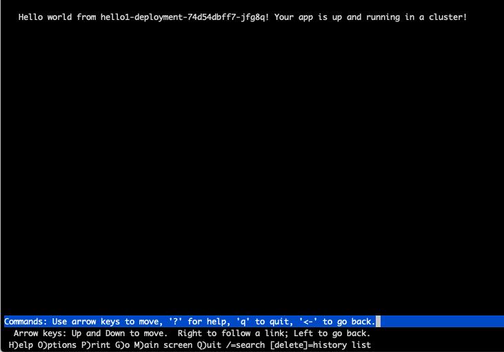

# IBM Cloud Container Workshop

###### Version: 2020-03-20

---

# Cloud Pak for Application Lab - short version


# Part 1: "Pure" Kubernetes


Let's review basic terminology:


**Cluster**

A Kubernetes cluster consists of one or more virtual machines that are called worker nodes. Every worker node represents a compute host where you can deploy, run, and manage containerized apps. Worker nodes are managed by a Kubernetes master that centrally controls and monitors all Kubernetes resources in the cluster. When you deploy a containerized app, the Kubernetes master decides where to deploy the app, taking into account the deployment requirements and available capacity in the cluster.

**Pod**

Every containerized app that is deployed into a Kubernetes cluster is deployed, run, and managed by a pod. Pods represent the smallest deployable units in a Kubernetes cluster and are used to group containers that must be treated as a single unit. In most cases, a container is deployed to its own pod. However, an app might require a container and other helper containers to be deployed into one pod so that those containers can be addressed by using the same private IP address.

**Deployment**

A deployment is a Kubernetes resource where you specify your containers and other Kubernetes resources that are required to run your app, such as persistent storage, services, or annotations. Deployments are documented in a Kubernetes deployment script. When you run a deployment, the Kubernetes master deploys the specified containers into pods taking into account the capacity that is available on the worker nodes of the cluster. Other Kubernetes resources are created and configured as specified in the deployment script. 

You can use a deployment to define update strategies for your app, which includes the number of pods that you want to add during a rolling update and the number of pods that can be unavailable at a time. When you perform a rolling update, the deployment checks whether the revision is working and stops the rollout when failures are detected.

**Service**

A Kubernetes service groups a set of pods and provides network connection to these pods for other services in the cluster without exposing the actual private IP address of each pod. You can use a service to make your app available within your cluster or to the public internet. 


# 1.1 : Prepare your environment

Deploy and manage your own Kubernetes cluster in the cloud. You can automate the deployment, operation, scaling, and monitoring of containerized apps in a cluster of independent compute hosts called worker nodes.


The instructor will give you:

- a user ID and password to connect to the cluster. The user ID is in the format **labuser<xx>** where xx is a number from 00 to 99. Don't use someone else userID except if the instructor ask you to do so. 

- a project name in the format **labproj<xx>**. Each project is associated to the corresponding labuser<xx>. 

## Login to Your virtual machine

Connect to the lab27 server provided by IBM using server name, port number, username and password. 

``ssh -p <PORT> root@<Your IP Address:port``

or use any other SSH client (like putty)


### Check kubectl command

Kubectl is a main kubernetes command line interface. Let's check if it works.

Type the following command :

`kubectl version --short`

You should get version for your client (exact version may differ, it's OK) :

``` bash
# kubectl version --short
Client Version: v1.15.10
The connection to the server localhost:8080 was refused - did you specify the right host or port?
```

The **error at the end is** **normal** because we need to specify how to connect to the master (see below).


### Gain access to the cluster


Even this lab is aimed at "clean" kubernetes skills, we are still using enterprise-ready OpenShift, that is based on kubernetes. That's why we can use some commands that speeds things up.

We will utilize some OpenShift functionality for logging into the cluster - so instead of using plain kubernetes commands to get into the cluster:

```
#DO NOT ENTER THIS, IT IS JUST AN EXAMPLE NOT BEING USED FOR OUR LAB!

kubectl config set-credentials <user>/<cluster> --username=<user> --password=<pass>
kubectl config set-cluster <cluster> --insecure-skip-tls-verify=true --server=<cluster_url>
kubectl config set-context <namespace>/<cluster>/<user> --user=<user>/<cluster> --namespace=<namespace> --cluster=<cluster_url>
kubectl config use-context <namespace>/<cluster>/<user>

```


We will just login with single and simple oc command which speeds the things up.


```
oc login https://master.x.cloudpak.site:8443
```

Plesase use the credentials provided by IBM Staff:


Output:

``` bash
# oc login https://master.x.cloudpak.site:8443
Authentication required for https://master.x.cloudpak.site:8443 (openshift)
Username: labuser01
Password:
Login successful.

You have access to 52 projects, the list has been suppressed. You can list all projects with 'oc projects'

Using project "".
```


 Verify that you can connect to your cluster with kubectl:

```
kubectl version --short
```

response:

```
# kubectl version --short
Client Version: v1.17.4
Server Version: v1.11.0+d4cacc0
```

The versions may differ, it's fine.


Check if the node(s) are ready with "kubectl get nodes" command which lists the nodes that comprises the cluster.

 `kubectl get nodes`

 The output should be :

```con
# kubectl get nodes
NAME                     STATUS   ROLES     AGE    VERSION
master.x.cloudpak.site   Ready    master    141d   v1.11.0+d4cacc0
node1.x.cloudpak.site    Ready    compute   141d   v1.11.0+d4cacc0
node2.x.cloudpak.site    Ready    compute   141d   v1.11.0+d4cacc0
node3.x.cloudpak.site    Ready    infra     141d   v1.11.0+d4cacc0
```

The version and IP may differ, but the status has to be Ready!


# 1.2: Login into the image repository

Kubernetes does not ship container registry by default - it needs to be installed separately, In our case we are using OpenShift, so the registry service is already deployed. We will utilize this for our lab.

First we need to login into the registry with command:

```
docker login -u `oc whoami` -p `oc whoami --show-token` docker-registry-default.apps.x.cloudpak.site
```

result:

```
#docker login -u `oc whoami` -p `oc whoami --show-token` docker-registry-default.apps.x.cloudpak.site
WARNING! Using --password via the CLI is insecure. Use --password-stdin.
WARNING! Your password will be stored unencrypted in /root/.docker/config.json.
Configure a credential helper to remove this warning. See
https://docs.docker.com/engine/reference/commandline/login/#credentials-store

Login Succeeded
```


Now we are ready to push our images to the registry.


# 1.3 : Deploying Apps with Kubernetes


## Download a GIT repo for this exercise

**Create a directory** on your computer and move to that directory

```
cd
mkdir started
cd started
```


Get and download this github repository into that directory :

`git clone https://github.com/IBM/container-service-getting-started-wt.git`
​	

```
root@warsaw901:~/started# git clone https://github.com/IBM/container-service-getting-started-wt.git
Cloning into 'container-service-getting-started-wt'...
remote: Enumerating objects: 62, done.
remote: Counting objects: 100% (62/62), done.
remote: Compressing objects: 100% (43/43), done.
remote: Total 1038 (delta 24), reused 37 (delta 14), pack-reused 976
Receiving objects: 100% (1038/1038), 3.01 MiB | 3.30 MiB/s, done.
Resolving deltas: 100% (520/520), done.
Checking connectivity... done.
```


## Build a Docker image 

Build the image locally and tag it with the name that you want to use on the  kubernetes cluster. The tag includes the namespace name of `<namespace>` in the cluster. The tag also targets the master node of the cluster, which manages the job of placing it on one or more worker nodes. This is because of the alias you created in the previous step, with the cluster name linked to the master node name. Tagging the image this way tells Docker where to push the image in a later step. Use **lowercase alphanumeric** characters or underscores only in the image name. Don't forget the period (.) at the end of the command. The period tells Docker to look inside the current directory for the Dockerfile and build artifacts to build the image.

`cd "container-service-getting-started-wt/Lab 1"`

and than build the image:

`docker build -t docker-registry-default.apps.x.cloudpak.site/<your project>/hello1 .`

like:

`docker build -t docker-registry-default.apps.x.cloudpak.site/labproj01/hello1 . `

Output is:

```
# docker build -t docker-registry-default.apps.x.cloudpak.site/labproj01/hello1 .
Sending build context to Docker daemon  17.92kB
Step 1/6 : FROM node:9.4.0-alpine
9.4.0-alpine: Pulling from library/node
605ce1bd3f31: Pull complete
fe58b30348fe: Pull complete
46ef8987ccbd: Pull complete
Digest: sha256:9cd67a00ed111285460a83847720132204185e9321ec35dacec0d8b9bf674adf
Status: Downloaded newer image for node:9.4.0-alpine
 ---> b5f94997f35f
Step 2/6 : COPY app.js .
 ---> c82ce7803c2e
Step 3/6 : COPY package.json .
 ---> 5bc39fd83075
Step 4/6 : RUN npm install &&    apk update &&    apk upgrade
 ---> Running in 2f03ffc105cc
npm notice created a lockfile as package-lock.json. You should commit this file.
npm WARN hello-world-demo@0.0.1 No repository field.
npm WARN hello-world-demo@0.0.1 No license field.

added 50 packages in 2.339s
fetch http://dl-cdn.alpinelinux.org/alpine/v3.6/main/x86_64/APKINDEX.tar.gz
fetch http://dl-cdn.alpinelinux.org/alpine/v3.6/community/x86_64/APKINDEX.tar.gz
v3.6.5-44-gda55e27396 [http://dl-cdn.alpinelinux.org/alpine/v3.6/main]
v3.6.5-34-gf0ba0b43d5 [http://dl-cdn.alpinelinux.org/alpine/v3.6/community]
OK: 8448 distinct packages available
Upgrading critical system libraries and apk-tools:
(1/1) Upgrading apk-tools (2.7.5-r0 -> 2.7.6-r0)
Executing busybox-1.26.2-r9.trigger
Continuing the upgrade transaction with new apk-tools:
(1/7) Upgrading musl (1.1.16-r14 -> 1.1.16-r15)
(2/7) Upgrading busybox (1.26.2-r9 -> 1.26.2-r11)
Executing busybox-1.26.2-r11.post-upgrade
(3/7) Upgrading libressl2.5-libcrypto (2.5.5-r0 -> 2.5.5-r2)
(4/7) Upgrading libressl2.5-libssl (2.5.5-r0 -> 2.5.5-r2)
(5/7) Installing libressl2.5-libtls (2.5.5-r2)
(6/7) Installing ssl_client (1.26.2-r11)
(7/7) Upgrading musl-utils (1.1.16-r14 -> 1.1.16-r15)
Executing busybox-1.26.2-r11.trigger
OK: 5 MiB in 15 packages
Removing intermediate container 2f03ffc105cc
 ---> 52c35aeb59de
Step 5/6 : EXPOSE  8080
 ---> Running in 9babeda89c55
Removing intermediate container 9babeda89c55
 ---> 25b2025f77ed
Step 6/6 : CMD node app.js
 ---> Running in 212381dacb83
Removing intermediate container 212381dacb83
 ---> a2e9893c8082
Successfully built a2e9893c8082
Successfully tagged docker-registry-default.apps.x.cloudpak.site/labproj01/hello1:latest
```

**The red warnings You may see are from npm tool during the build and are nor important for our exercise.**

To see the image, use the following command:

```
docker images docker-registry-default.apps.x.cloudpak.site/<your project>/hello1
```


Example:

 ```
# docker images docker-registry-default.apps.x.cloudpak.site/labproj01/hello1
REPOSITORY                                                      TAG                 IMAGE ID            CREATED              SIZE
docker-registry-default.apps.x.cloudpak.site/labproj01/hello1   latest              a2e9893c8082        About a minute ago   76.1MB
 ```


## Push the image to the registry 

Push your image into the private registry :

`docker push docker-registry-default.apps.x.cloudpak.site/<your project>/hello1:latest`

like:

`docker push docker-registry-default.apps.x.cloudpak.site/labproj01/hello1:latest`

 Your output should look like this.

```
# docker push docker-registry-default.apps.x.cloudpak.site/labproj01/hello1:latest
The push refers to repository [docker-registry-default.apps.x.cloudpak.site/labproj01/hello1]
549b16376e27: Pushed
0f01aa6ec62b: Pushed
e3d99afed50e: Pushed
0804854a4553: Pushed
6bd4a62f5178: Pushed
9dfa40a0da3b: Pushed
latest: digest: sha256:f9572f5f96411dd1436fd5cd37bd4004d8e166f6f2da2ac24cd60067abe0d218 size: 1576
```

> **IMPORTANT** : be sure that all the layers have been pushed, wait for the digest line at the end.


## Run a deployment


Now we will use image that we have created before to create a kubernetes deployment with the following command (this is one-line command!).

*we are using internal registry locator of docker-registry.default.svc, this is how the he cluster works*

```
kubectl create deployment hello1-deployment --image=docker-registry.default.svc:5000/<Your project>/hello1:latest
```

Output is :

```
#kubectl create deployment hello1-deployment --image=docker-registry.default.svc:5000/labproj01/hello1:latest

deployment.apps/hello1-deployment created
```

You may check if the pods have been created and works:

```
# kubectl get pods
```

Proper answer would be:

```
# kubectl get pods
NAME                                 READY   STATUS    RESTARTS   AGE
hello1-deployment-74d54dbff7-jfg8q   1/1     Running   0          23s
```

If the pod is not in "Running" state You have to verify what has happened. Just ask Your IBM staff for help!

Now we have our application running, but there is no way to access it externally. It's time to change that!


## Create a service 

Create a service to access your running container using the following command.

`kubectl expose deployment/hello1-deployment --type=NodePort --port=8080 --name=hello1-service --target-port=8080`


Your output should be:

```
$ kubectl expose deployment/hello1-deployment --type=NodePort --port=8080 --name=hello1-service --target-port=8080
service "hello1-service" exposed
```


## What is a NodePort service type

With the NodePort type of service, the kubernetes cluster creates a 5-digit port number to access the running container through the service. 

The service is accessed through the IP address of the node with the NodePort port number. To discover the NodePort number that has been assigned, use the following command.

`kubectl describe service hello1-service`

 Your output should look like this.

```
# kubectl describe service hello1-service
Name:                     hello1-service
Namespace:                labproj01
Labels:                   run=hello1-deployment
Annotations:              <none>
Selector:                 run=hello1-deployment
Type:                     NodePort
IP:                       172.30.248.25
Port:                     <unset>  8080/TCP
TargetPort:               8080/TCP
NodePort:                 <unset>  32167/TCP
Endpoints:                10.129.0.193:8080
Session Affinity:         None
External Traffic Policy:  Cluster
Events:                   <none>
```


 


## Let's verify if it works!

In order to connect to the service created You will need to have two informations:

1. IP address of the node (not the internal Cluster IP address!)
2. External port that the service runs on


To get the  **IP Address**  just list the IP of our cluster nodes. As the NodePort service we use exposes the app on each node of the custer, You may pick any of the IP's from the list.

```kubectl get nodes -o wide```

```
# kubectl get nodes -o wide
NAME                     STATUS   ROLES     AGE    VERSION           INTERNAL-IP     EXTERNAL-IP   OS-IMAGE    KERNEL-VERSION               CONTAINER-RUNTIME
master.x.cloudpak.site   Ready    master    141d   v1.11.0+d4cacc0   10.110.121.14   <none>        OpenStack   3.10.0-1062.4.1.el7.x86_64   docker://1.13.1
node1.x.cloudpak.site    Ready    compute   141d   v1.11.0+d4cacc0   10.110.121.11   <none>        OpenStack   3.10.0-1062.4.1.el7.x86_64   docker://1.13.1
node2.x.cloudpak.site    Ready    compute   141d   v1.11.0+d4cacc0   10.110.121.12   <none>        OpenStack   3.10.0-1062.4.1.el7.x86_64   docker://1.13.1
node3.x.cloudpak.site    Ready    infra     141d   v1.11.0+d4cacc0   10.110.121.13   <none>        OpenStack   3.10.0-1062.4.1.el7.x86_64   docker://1.13.1
```


For the **port number** use:

```
kubectl describe service hello1-service | grep NodePort
```

**or** quicker equivalent that uses jsonpath functionality of kubectl:

```
kubectl get service hello1-service -o=jsonpath='{.spec.ports[0].nodePort}{"\n"}'
```


```
kubectl describe service hello1-service | grep  NodePort
Type:                     NodePort
NodePort:                 <unset>  32167/TCP
```

or

```
# kubectl get service hello1-service -o=jsonpath='{.spec.ports[0].nodePort}{"\n"}'
32167
```

In the example above proper port number is 32167


Now let's verify our app. As we are using cluster that is not visible from external world, we can't use Your browser directly. We have to use session initiated from lab27 server instead.

Use the url created as:

```
http://<ip_of_the_node>:<NodePort port>
```

we can use curl or lynx:

```
curl http://10.110.121.12:32167
```

```
# curl http://10.110.121.12:32167
Hello world from hello1-deployment-74d54dbff7-jfg8q! Your app is up and running in a cluster!
```

Using lynx browser:



Please note, that for this scenario we could not use url, we had just IP. That's because of the type of service used. When we will migrate to proper Openshift labs, we will be able to use Route mechanism insted of NodePort - it will allow us to expose the app using proper URL.


## Application troubleshooting 

You can obtain text-based information on all the apps running in your cluster using the following command if you want to debug your application when running.

#### Status  of the application

`kubectl get pods`

Results:

```
# kubectl get pods
NAME                                      READY     STATUS    RESTARTS   AGE
hello-world-deployment-67b694c76f-hvg9k   1/1       Running   0          11m
```


#### Detailed info about the pod

if the POD is not running and is showing an error, You may verify the reason with command:

```
kubectl describe pod  <pod_name>
```

example output:

```
#kubectl describe pod hello1-deployment-2-8bb4df446-fc6jf

Name:           hello1-deployment-2-8bb4df446-fc6jf
Namespace:      labproj01
Priority:       0
Node:           node1.x.cloudpak.site/10.110.121.11
Start Time:     Fri, 20 Mar 2020 12:02:15 +0000
Labels:         pod-template-hash=466089002
                run=hello1-deployment-2
Annotations:    kubernetes.io/limit-ranger:
                  LimitRanger plugin set: cpu, memory request for container hello1-deployment-2; cpu, memory limit for container hello1-deployment-2
                openshift.io/scc: restricted
Status:         Pending
IP:
IPs:            <none>
Controlled By:  ReplicaSet/hello1-deployment-2-8bb4df446
Containers:
  hello1-deployment-2:
    Container ID:
    Image:          docker-registry-default.apps.x.cloudpak.site/labproj01/hello1
    Image ID:
    Port:           <none>
    Host Port:      <none>
    State:          Waiting
      Reason:       ImagePullBackOff
    Ready:          False
    Restart Count:  0
    Limits:
      cpu:     300m
      memory:  500Mi
    Requests:
      cpu:        300m
      memory:     500Mi
    Environment:  <none>
    Mounts:
      /var/run/secrets/kubernetes.io/serviceaccount from default-token-bdvbs (ro)
Conditions:
  Type              Status
  Initialized       True
  Ready             False
  ContainersReady   False
  PodScheduled      True
Volumes:
  default-token-bdvbs:
    Type:        Secret (a volume populated by a Secret)
    SecretName:  default-token-bdvbs
    Optional:    false
QoS Class:       Guaranteed
Node-Selectors:  node-role.kubernetes.io/compute=true
Tolerations:     node.kubernetes.io/memory-pressure:NoSchedule
Events:
  Type     Reason          Age                From                            Message
  ----     ------          ----               ----                            -------
  Normal   Scheduled       74s                default-scheduler               Successfully assigned labproj01/hello1-deployment-2-8bb4df446-fc6jf to node1.x.cloudpak.site
  Normal   Pulling         60s (x2 over 71s)  kubelet, node1.x.cloudpak.site  pulling image "docker-registry-default.apps.x.cloudpak.site/labproj01/hello1"
  Warning  Failed          60s (x2 over 70s)  kubelet, node1.x.cloudpak.site  Failed to pull image "docker-registry-default.apps.x.cloudpak.site/labproj01/hello1": rpc error: code = Unknown desc = Error: image labproj01/hello1:latest not found
  Warning  Failed          60s (x2 over 70s)  kubelet, node1.x.cloudpak.site  Error: ErrImagePull
  Normal   SandboxChanged  49s (x7 over 70s)  kubelet, node1.x.cloudpak.site  Pod sandbox changed, it will be killed and re-created.
  Normal   BackOff         47s (x6 over 67s)  kubelet, node1.x.cloudpak.site  Back-off pulling image "docker-registry-default.apps.x.cloudpak.site/labproj01/hello1"
  Warning  Failed          47s (x6 over 67s)  kubelet, node1.x.cloudpak.site  Error: ImagePullBackOff

```


#### Application's Log 

If the POD is running then You may look at his log (change the pod name with the one shown in latest command):

`kubectl logs hello-world-deployment-67b694c76f-hvg9k  `

Results:

```
# kubectl logs hello-world-deployment-67b694c76f-hvg9k
Sample app is listening on port 8080.

```


#### Shell/Command to the app

You can also exec a command inside your container:

`kubectl exec -it hello-world-deployment-67b694c76f-hvg9k /bin/sh`

Results:

```
# kubectl exec -it hello-world-deployment-67b694c76f-hvg9k /bin/sh
/ # ps
PID   USER     TIME   COMMAND
    1 root       0:00 /bin/sh -c node app.js
    7 root       0:00 node app.js
   19 root       0:00 /bin/sh
   25 root       0:00 ps
/ # 
/ # ls -l
total 96
-rw-r--r--    1 root     root           325 Nov 30 15:30 app.js
drwxr-xr-x    1 root     root          4096 Nov 30 15:31 bin
drwxr-xr-x    5 root     root           360 Nov 30 15:37 dev
drwxr-xr-x    1 root     root          4096 Nov 30 15:37 etc
drwxr-xr-x    1 root     root          4096 Jan 11  2018 home
drwxr-xr-x    1 root     root          4096 Nov 30 15:31 lib
drwxr-xr-x    5 root     root          4096 Jan  9  2018 media
drwxr-xr-x    2 root     root          4096 Jan  9  2018 mnt
drwxr-xr-x   80 root     root          4096 Nov 30 15:31 node_modules
drwxr-xr-x    3 root     root          4096 Jan 11  2018 opt
-rw-r--r--    1 root     root         25023 Nov 30 15:31 package-lock.json
-rw-r--r--    1 root     root           183 Nov 30 15:30 package.json
dr-xr-xr-x  583 root     root             0 Nov 30 15:37 proc
drwx------    1 root     root          4096 Nov 30 15:59 root
drwxr-xr-x    2 root     root          4096 Jan  9  2018 run
drwxr-xr-x    1 root     root          4096 Nov 30 15:31 sbin
drwxr-xr-x    2 root     root          4096 Jan  9  2018 srv
dr-xr-xr-x   13 root     root             0 Nov 30 15:03 sys
drwxrwxrwt    1 root     root          4096 Jan 11  2018 tmp
drwxr-xr-x    1 root     root          4096 Jan 11  2018 usr
drwxr-xr-x    1 root     root          4096 Jan  9  2018 var
/ # 

```

Dont forget to **exit** from the command session!

`# exit`


Congratulations ! You have deployed your first app to the  kubernetes cluster.


# 1.4 : Scaling Apps with Kubernetes

In this lab, You will be able to understand how to update the number of replicas a deployment has and how to safely roll out an update on Kubernetes. 

As some of You could have changed the deployment during debug tasks, we will delete and re-create it.

## Clean up the current deployment

- To remove the deployment, use:

`kubectl delete deployment hello1-deployment`

- To remove the service, use: 

`kubectl delete service hello1-service`

## Run a clean deployment

To do so, use the following commands :

`kubectl create deployment hello1-deployment --image=docker-registry.default.svc:5000/<Your namespace>/hello1:latest`

output:

```
#kubectl create deployment hello1-deployment --image=docker-registry.default.svc:5000/labproj01/hello1:latest

deployment.apps/hello1-deployment created
```


## Scale the application

A replica is how Kubernetes accomplishes scaling out a deployment. A replica is a copy of a pod that already contains a running service. By having multiple replicas of a pod, you can ensure your deployment has the available resources to handle increasing load on your application.

kubectl provides a scale subcommand to change the size of an existing deployment. Let's us it to go from our single running instance to 3 instances.

`kubectl scale --replicas=3 deployment hello1-deployment`

Here is the result:

```
$ kubectl scale --replicas=3 deployment hello1-deployment
deployment "hello1-deployment" scaled
```

Kubernetes will now act according to the desired state model to try and make true, the condition of 10 replicas. It will do this by starting new pods with the same configuration.

To see your changes being rolled out, you can run: 

`kubectl rollout status deployment/hello1-deployment`

**The rollout might occur so quickly that the progress messages might not display**

Once the rollout has finished, ensure your pods are running by using: 

`kubectl get pods`

You should see output listing 3 replicas of your deployment:

Results :

```
$ kubectl get pods
NAME                                 READY     STATUS    RESTARTS   AGE
hello1-deployment-864cd87c7f-675sr   1/1       Running   0          5m
hello1-deployment-864cd87c7f-6wxkp   1/1       Running   0          3m
hello1-deployment-864cd87c7f-8fb7b   1/1       Running   0          3m

```


#### Resource limits

You may further play with the scaller, but please note that there are resource quotas set on our cluster, so the amount of the pods You may create is limited. If You will ask for more replicas than allowed, the system will limit to maximum allowed. So - if we would ask for:

```
kubectl scale --replicas=30 deployment hello1-deployment
```

we could get lower amount of pods:

```
# kubectl get  pods
NAME                                 READY   STATUS    RESTARTS   AGE
hello1-deployment-54cd756999-cc74s   1/1     Running   0          6m
hello1-deployment-54cd756999-kg9r7   1/1     Running   0          6m
hello1-deployment-54cd756999-mpksl   1/1     Running   0          6m
hello1-deployment-54cd756999-z27gg   1/1     Running   0          3m
```


In such situation it is usefull to check cluster events with the command

```
kubectl get events
```

sample output when Your replica request is being limited:

```
1m          1m           1       hello1-deployment.15fe0459b03d2c7b                      Deployment                                          Normal    ScalingReplicaSet   deployment-controller            Scaled up replica set hello1-deployment-54cd756999 to 30
1m          1m           1       hello1-deployment-54cd756999-z27gg.15fe045a40013540     Pod          spec.containers{hello1}                Normal    Pulling             kubelet, node2.x.cloudpak.site   pulling image "docker-registry.default.svc:5000/labproj01/hello1:latest"
1m          1m           1       hello1-deployment-54cd756999-z27gg.15fe045a61a0f501     Pod          spec.containers{hello1}                Normal    Pulled              kubelet, node2.x.cloudpak.site   Successfully pulled image "docker-registry.default.svc:5000/labproj01/hello1:latest"
1m          1m           1       hello1-deployment-54cd756999-z27gg.15fe045a7171d2c4     Pod          spec.containers{hello1}                Normal    Created             kubelet, node2.x.cloudpak.site   Created container
1m          1m           1       hello1-deployment-54cd756999-z27gg.15fe045a81925e8e     Pod          spec.containers{hello1}                Normal    Started             kubelet, node2.x.cloudpak.site   Started container
38s         1m           6       hello1-deployment-54cd756999.15fe045a03cec23c           ReplicaSet                                          Warning   FailedCreate        replicaset-controller            (combined from similar events): Error creating: pods "hello1-deployment-54cd756999-bvj5p" is forbidden: exceeded quota: labproj01-mem-cpu-quota, requested: requests.memory=500Mi, used: requests.memory=2000Mi, limited: requests.memory=2Gi
```


#### Clean the mess

Let's get back to reasonable amount of pods - we may decrease the pod amount as well:

```
kubectl scale --replicas=1 deployment hello1-deployment
```

and check the pods with 

```
kubectl get  pods
```

sample result:

```
# kubectl get  pods
NAME                                 READY   STATUS        RESTARTS   AGE
hello1-deployment-54cd756999-cc74s   1/1     Terminating   0          8m
hello1-deployment-54cd756999-kg9r7   1/1     Terminating   0          8m
hello1-deployment-54cd756999-mpksl   1/1     Running       0          8m
hello1-deployment-54cd756999-z27gg   1/1     Terminating   0          5m
```


## Rollout an update to  the application

Kubernetes allows you to use a rollout to update an app deployment with a new Docker image. This allows you to easily update the running image and also allows you to easily undo a rollout, if a problem is discovered after deployment.

In the previous lab, we created an image. Let's make a new version of the image that includes new content and use a :2 tag. 

If you are in "Lab 1" directory, you need to go to "Lab 2" directory:

`cd "../Lab 2"`


Build a new version (2) of that application: 

`docker build -t docker-registry-default.apps.x.cloudpak.site/<Your project>/hello1:2 .`

output:

```
# docker build -t docker-registry-default.apps.x.cloudpak.site/labproj01/hello1:2 .
Sending build context to Docker daemon  19.97kB
Step 1/6 : FROM node:9.4.0-alpine
 ---> b5f94997f35f
Step 2/6 : COPY app.js .
 ---> 8e0940fea0e7
Step 3/6 : COPY package.json .
 ---> 365db0a6c005
Step 4/6 : RUN npm install &&    apk update &&    apk upgrade
 ---> Running in fa8ce4b973b2
npm notice created a lockfile as package-lock.json. You should commit this file.
npm WARN hello-world-armada@0.0.1 No repository field.
npm WARN hello-world-armada@0.0.1 No license field.

added 50 packages in 2.046s
fetch http://dl-cdn.alpinelinux.org/alpine/v3.6/main/x86_64/APKINDEX.tar.gz
fetch http://dl-cdn.alpinelinux.org/alpine/v3.6/community/x86_64/APKINDEX.tar.gz
v3.6.5-44-gda55e27396 [http://dl-cdn.alpinelinux.org/alpine/v3.6/main]
v3.6.5-34-gf0ba0b43d5 [http://dl-cdn.alpinelinux.org/alpine/v3.6/community]
OK: 8448 distinct packages available
Upgrading critical system libraries and apk-tools:
(1/1) Upgrading apk-tools (2.7.5-r0 -> 2.7.6-r0)
Executing busybox-1.26.2-r9.trigger
Continuing the upgrade transaction with new apk-tools:
(1/7) Upgrading musl (1.1.16-r14 -> 1.1.16-r15)
(2/7) Upgrading busybox (1.26.2-r9 -> 1.26.2-r11)
Executing busybox-1.26.2-r11.post-upgrade
(3/7) Upgrading libressl2.5-libcrypto (2.5.5-r0 -> 2.5.5-r2)
(4/7) Upgrading libressl2.5-libssl (2.5.5-r0 -> 2.5.5-r2)
(5/7) Installing libressl2.5-libtls (2.5.5-r2)
(6/7) Installing ssl_client (1.26.2-r11)
(7/7) Upgrading musl-utils (1.1.16-r14 -> 1.1.16-r15)
Executing busybox-1.26.2-r11.trigger
OK: 5 MiB in 15 packages
Removing intermediate container fa8ce4b973b2
 ---> cff93cbb6966
Step 5/6 : EXPOSE  8080
 ---> Running in c306acbcc7dc
Removing intermediate container c306acbcc7dc
 ---> 00dc33ba08ea
Step 6/6 : CMD node app.js
 ---> Running in a27c20b93715
Removing intermediate container a27c20b93715
 ---> 030e20c302eb
Successfully built 030e20c302eb
Successfully tagged docker-registry-default.apps.x.cloudpak.site/labproj01/hello1:2

```

Then push the new version into the registry:

docker push docker-registry-default.apps.x.cloudpak.site/labproj01/hello1:2

```
docker push docker-registry-default.apps.x.cloudpak.site/<Your project>/hello1:2
```

example output:

```
# docker push docker-registry-default.apps.x.cloudpak.site/labproj01/hello1:2
The push refers to repository [docker-registry-default.apps.x.cloudpak.site/labproj01/hello1]
250be8b60a23: Pushed
12e10c8f0167: Pushed
411b412f21b0: Pushed
0804854a4553: Layer already exists
6bd4a62f5178: Layer already exists
9dfa40a0da3b: Layer already exists
2: digest: sha256:1622c7c6b47a62a7289f46a1b1e374ba4cc02253279edc6515826dbed3c12553 size: 1576
```


You can now update your deployment to use the latest image just by calling kubectl with appropriate options:

```
# kubectl set image deployment/hello1-deployment  hello1=docker-registry.default.svc:5000/<Your project>/hello1:2
```


example output:

```
# kubectl set image deployment/hello1-deployment  hello1=docker-registry.default.svc:5000/labproj01/hello1:2

deployment.extensions/hello1-deployment image updated

```


Note that a pod could have multiple containers, in which case each container will have its own name. Multiple containers can be updated at the same time. 

Run kubectl rollout status deployment/hello-world or kubectl get replicasets to check the status of the rollout. The rollout might occur so quickly that the following messages might not display:

`kubectl rollout status deployment/hello1-deployment`

You may observe the pods being killed and re-created with

``` kubectl get pods```

```
# kubectl get pods
NAME                                 READY   STATUS        RESTARTS   AGE
hello1-deployment-555585fcd9-8wx6n   0/1     Terminating   0          8m3s
hello1-deployment-768cfb6545-47v4n   1/1     Running       0          38s

```

Finally, use that command to see the result:
`kubectl get replicasets`

Results:

```bash
# kubectl get replicasets
NAME                           DESIRED   CURRENT   READY   AGE
hello1-deployment-54cd756999   0         0         0       20m
hello1-deployment-567787464b   0         0         0       3m
hello1-deployment-f55bc9458    1         1         1       1m
```


#### Create a new service:

`kubectl expose deployment/hello1-deployment --type=NodePort --port=8080 --name=hello1-service --target-port=8080`

Check the new **port number** NodePort service uses:

```
kubectl get service hello1-service -o=jsonpath='{.spec.ports[0].nodePort}{"\n"}'
```

example:

```
# kubectl get service hello1-service -o=jsonpath='{.spec.ports[0].nodePort}{"\n"}'
32167
```


#### Check the app

Now let's verify our app. As we are using cluster that is not visible from external world, we can't use Your browser directly. We have to use session initiated from lab27 server instead.

Use the url created as:

```
http://<ip_of_the_node>:<NodePort port>
```

we can use curl or lynx:

```
curl http://10.110.121.12:32167
```

```
# curl http://10.110.121.12:32383
Hello world from hello1-deployment-f55bc9458-p7mf8! Great job getting the second stage up and running!
```


#### Clean the system

- To remove the deployment, use:

`kubectl delete deployment hello1-deployment`

- To remove the service, use: 

`kubectl delete service hello1-service`


----

This concludes this lab