# Cloud Pak for Application Lab - short version


# Part 2: OpenShift


##  Introduction

During this lab, we are going to set up your laptop to be prepared to all labs during this workshop. You should be able to connect to an **OpenShift** Cluster thru the Web Console and navigate thru the different kubernetes resources.


As you can see on the picture, you will connect to the OpenShift Cluster Web UI to the Master for management and development purposes. The end-users will connect to the applications thru the Infra Node.


The instructor will give you:

- a user ID and password to connect to the cluster. The user ID is in the format **labuser<xx>** where xx is a number from 00 to 99. Don't use someone else userID except if the instructor ask you to do so. 
- a project name in the format **labproj<xx>**. Each project is associated to the corresponding labuser<xx>. 


## 2.1 Create simple deployment in the OpenShift Web GUI

### Connect to the server

We have desktop service provisioned on the lab server, accesible via VNC. 

If You don't have vnc client, get it from https://www.realvnc.com/en/connect/download/viewer/ or any other source.

Use the vnc client and connect to the lab27 server. Please double check the port number that this service runs!


### Connect to the Web Console

Select Applications->Internet and open firefox browser


You can now use the following URL :

```http
https://master.x.cloudpak.site:8443
```

Please take a note of this link because we will use it very often. 

**This server is accesible ONLY via the VNC session, so do not try to open it from Your local web browser!**


Our server is using self-signed certificate, which may be identified by the browser as security risk.

Accept any security risk You may encounter (Advanced->Accept Risk and continue).


You are presented with Openshift login page.


Type your credentials (**user ID, password**) and click **Log in**


### Deploy the app 

We have created the image during the kubernetes lab. Let's reuse that and deploy application using Openshift Web GUI to see how simple it is


From the **catalog console**, pick "Deploy Image"

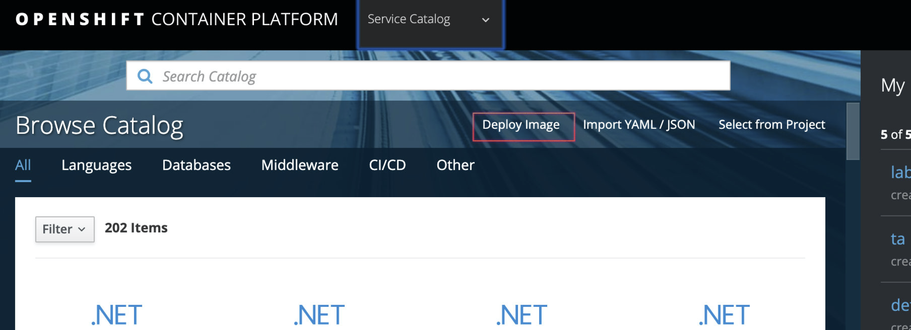


Now set the fields:

- Add to Porject: pick Your project, as given by IBM Staff
- For Image Stream Tag: Namespace: pick Your project, as given by IBM Staff
- For Image Stream Tag: Image Stream: pick the image that we have created (hello1)
- For Image Stream Tag: Tag: pick the "2" tag
- For Name: leave "hello1"


|                                                              |
| :----------------------------------------------------------- |
| 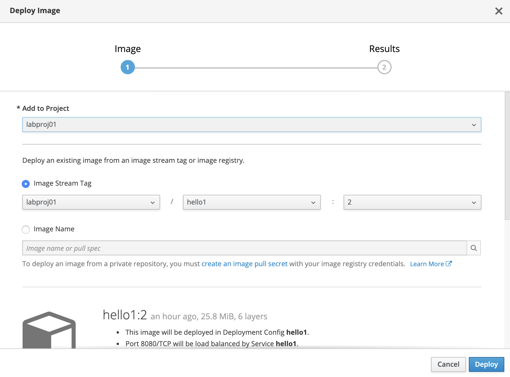 |


Click on "Deploy" and later on "Continue to project overview"

<table><tr><td>
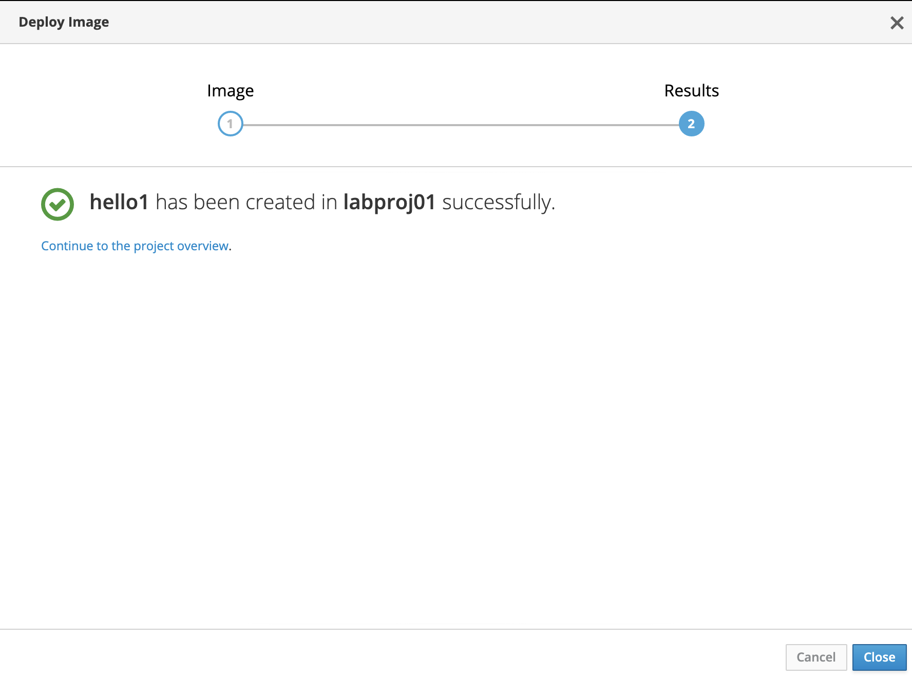
</td></tr></table>


### Expose the app

Expand the hello1 deployment with ">" icon:

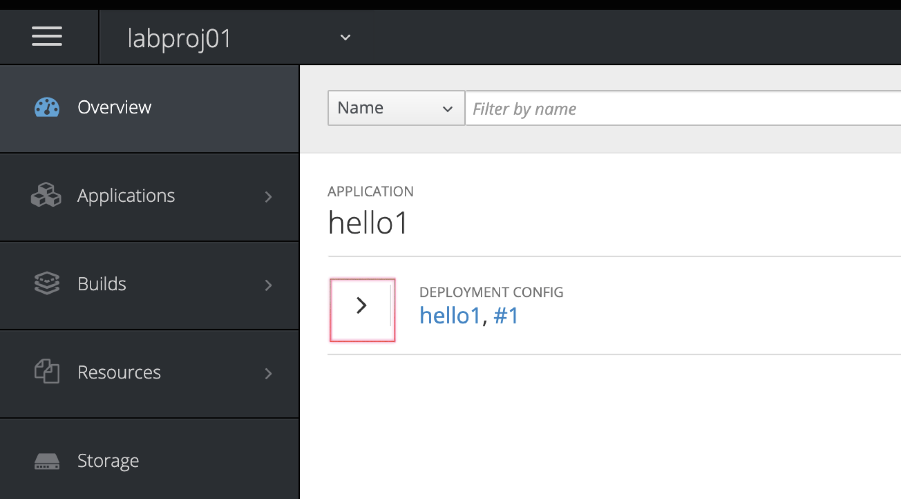


Expose the app - click on "Routes-External Traffic: Create Route"

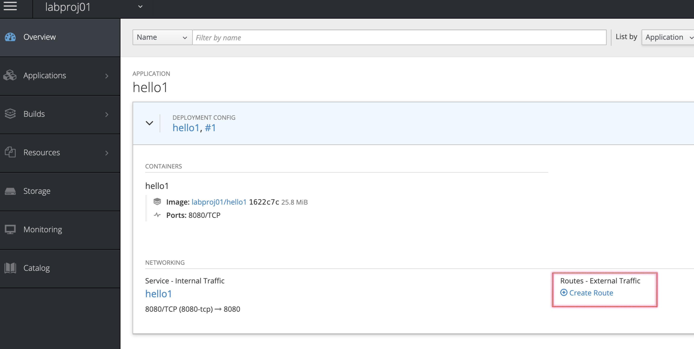


Do not change anything, just click on "**Create**"


### Check if app works

After a while You will be presented with the url created especially for Your deployment. Click on that in order to connect to the application.

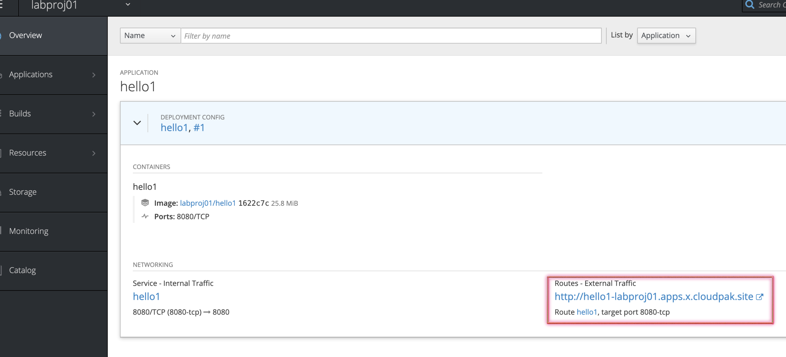


### Scale the app

Increase the number of pods by using scaller steering controls on the deployment page.

Remember about the resource limits that are set on the cluster!

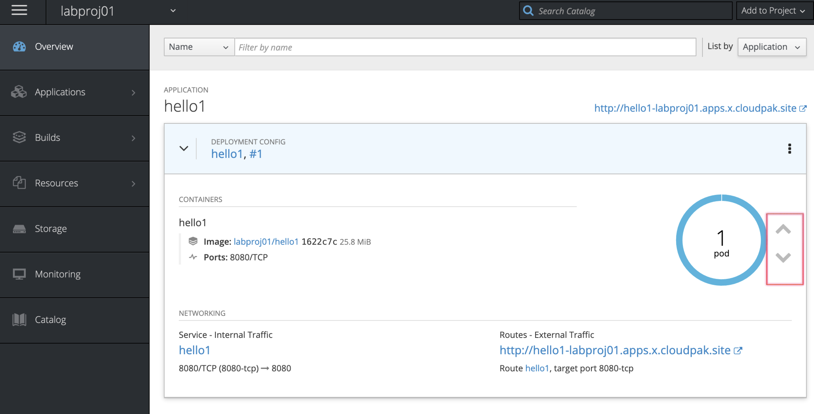


### Check the logs and events

Click on the "three dot" icon on the deployment header and pick "View logs".

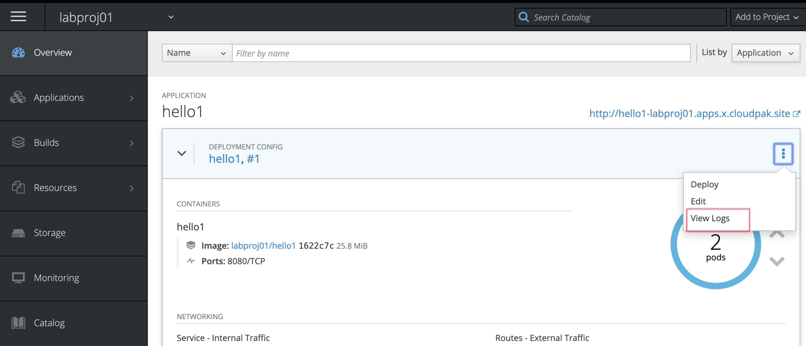


Read thru the Logs" and "Events" to verify the app output and state.

When finished go to the "Details" tab to see pods.

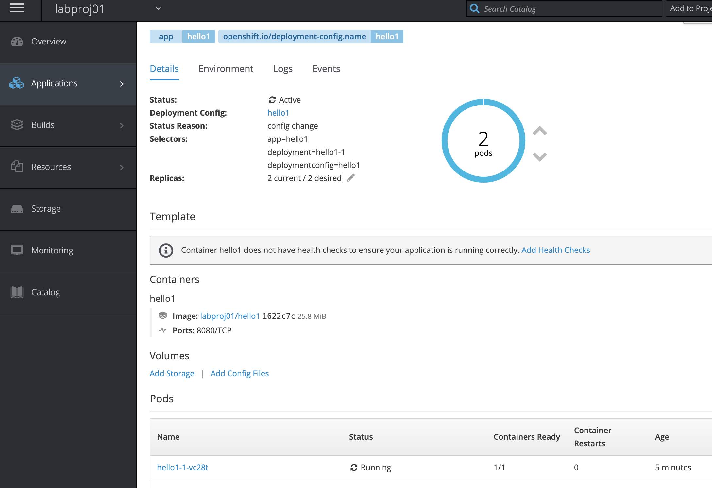


### Delete the deployment

Now let's learn how to access our deployment from the OpenShift menu and how to delete the deployment. Using the menu on the left click on "**Applications"** -> "**Deployments"**, than pick **"hello1"**

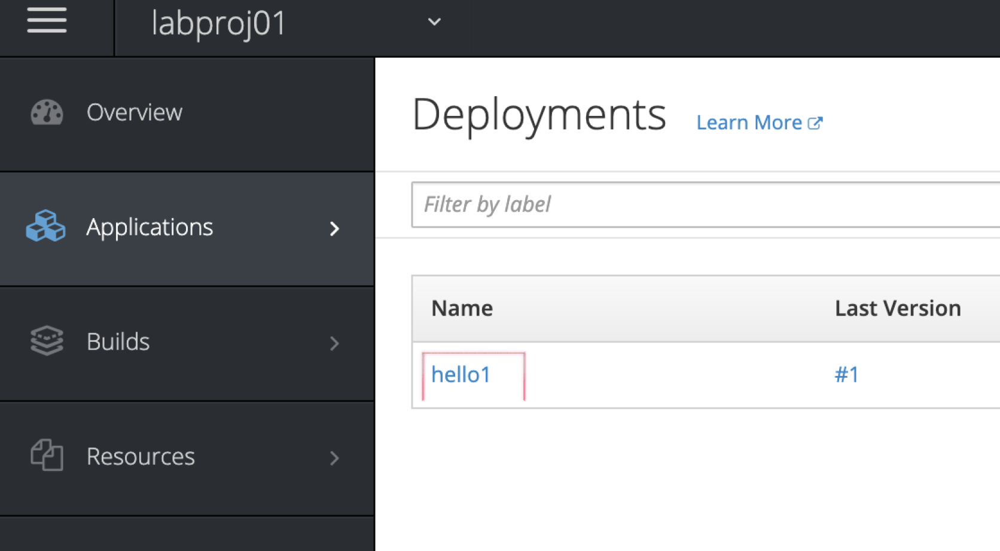


Click on **"Actions" ->> "Delete"** to clear the deployment, confirm with "Delete"

### Delete the Service and Route

Use the:

- **Applications -> Services -> hello1 -> Actions -> Delete** to delete the service created
- **Applications -> Routes -> hello1 -> Actions -> Delete** to delete the route created


---


## 2.2 Utilize the S2I in OpenShift Web GUI

In this lab we will get familiar with the Source-To-Image mechanism, that allows to deploy the application from Your code repository  easily.

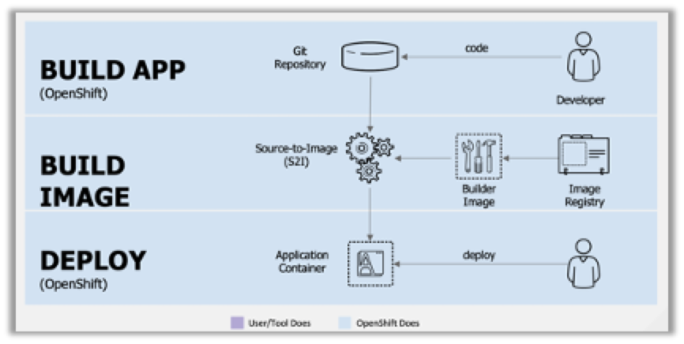

In the previous exercise we have used pre-made container with all the runtime and apllication code. We were responsible for all the container configuration and build. 

Openshift offers different deployment options, including the Source-To-Image that gets application source code from the git repo and created the container automatically.

We will be using sample (and simple) code published here: https://github.com/maciejs20/IBMCloudPakWorkshop/tree/master/Code/1

Please note that there is no Dockerfile in this repo!

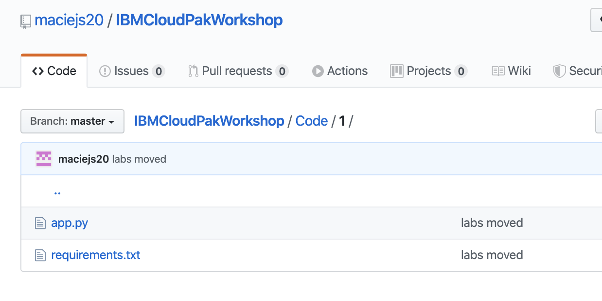

### Log in to the cluster and access the catalog

Go to Your VNC client, open web browser and navigate to our cluster at https://master.x.cloudpak.site:8443

Login using credentials provided by IBM  (Openshift Cluster Account)


You are presented with cluster catalog.

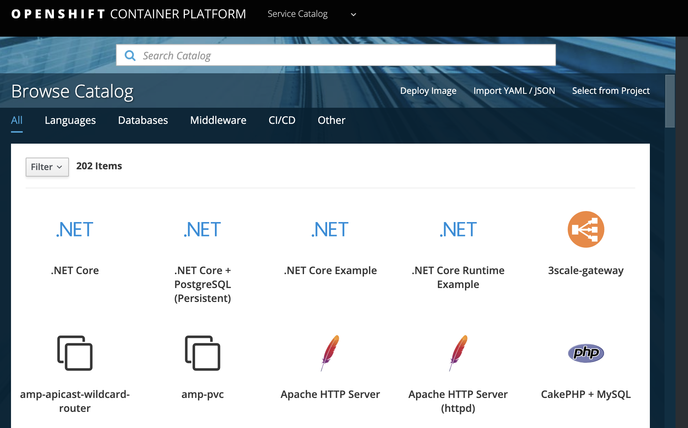

Navigate to **Languages** tab shown on “Browse Catalog” tab

### Create application from python code

Select **"Python"** category and click on **"Python"** icon to start runtime configuration. The system will present You with a creator.

Click **Next** on the first page of the creator.

In the **"Configuration"** select:

- **Add to project** - select Your project (labprojxx)
- **Version** -  3.6

click on **"advanced options"** in the bottom of the screen to open detailed configuration.

Fill remaining fields as follows:

- **Application name** as mypython
- **Git repository URL** as “https://github.com/maciejs20/IBMCloudPakWorkshop.git”
- **Context Dir** as "Code/1"

Leave all remaining fields at it's defaults. Scroll down and click on "**Create**"

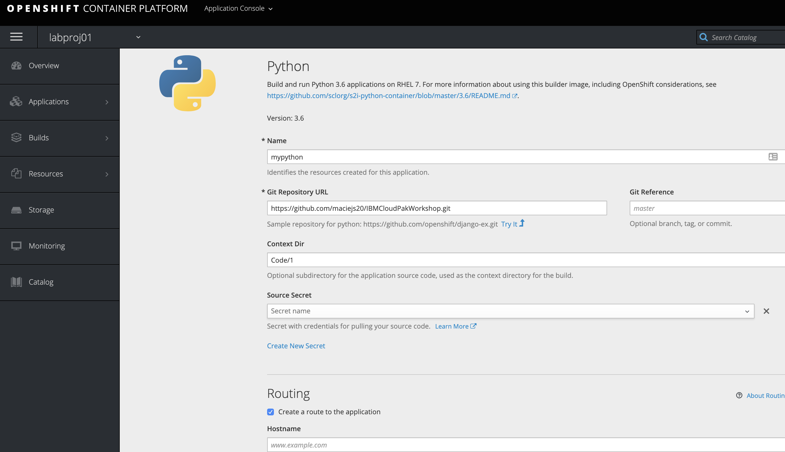


Now go to the **"Builds -> Builds -> mypython** to see all builds for this app. There is only one item available: #1 - the first build. Click on #1 to open the details.

Now verify "Logs" and "Events" to check if the build was successful.


### Access the app created

Now go to the **"Applications -> Routes -> mypython** and click on the app url

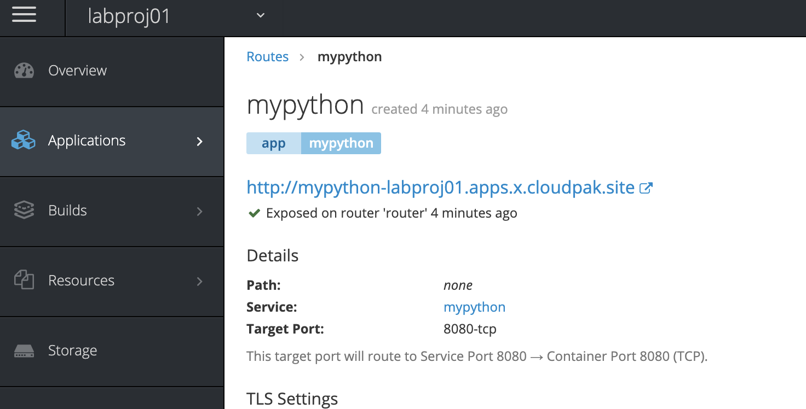

"Hello World" message shows, that the application has been created properly.

---

Let's this concludes the lab