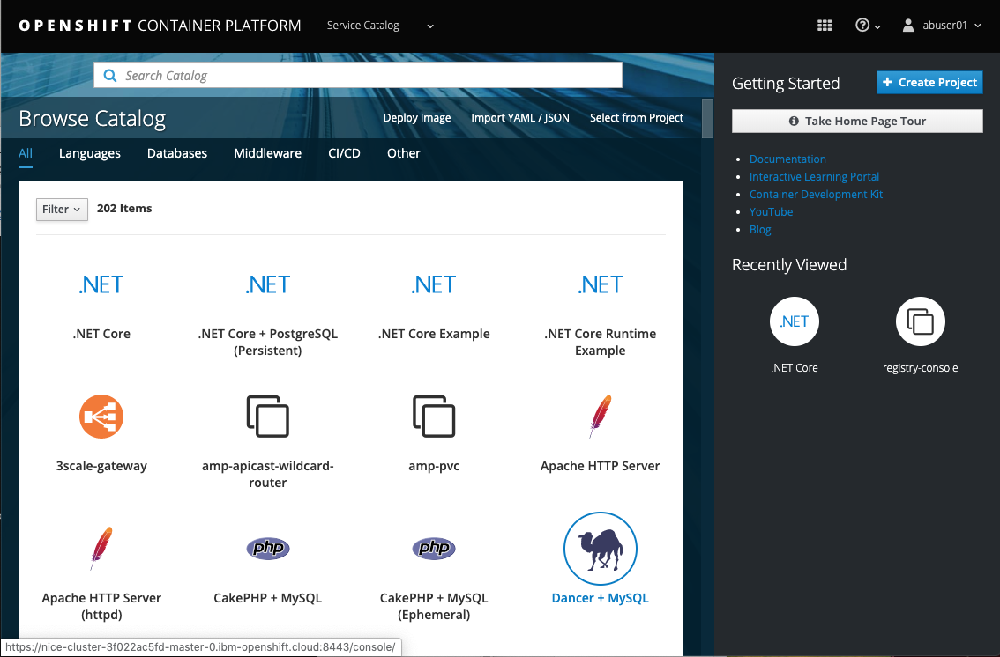

# Cloud Pak for Non-Tech's Lab 

This lab has been created by Maciej Szulc (maciej.szulc@pl.ibm.com) for IBM Poland's Container Workshop. If You are interested in participating in this free event held monthly in Warsaw in polish language, just contact the author.

Workshop also contains parts originally created by  Franck Descollonges (IBM) and Philippe Thomas (IBM)


# Part 1: Preparation

Our lab environment is quite complex, that's why we will be using non-standard techniques to access it. Our CloudPak cluster is not accesible from the Internet, we need to use intermediate server.

This is how it is constructed:


You have received account details which looks like:

```
*****************************************************************************
 ID Środowiska: 25

----------------------------  LAB27 server account -------------------------
 Server:        lab27.team.waw.pl  SSH Port: 22039      VNC Port: 24039

------------ OPENSHIFT CLUSTER ACCOUNT for master.x.cloudpak.site-------------
Userid:   labuser25    Password:   myPass11    Project:   labproj25
------------------------------------------------------------------------------
```


You will have to use:

- VNC port number - **like** "24039" in the example above
- PASSWORD - **like** "myPass11"  in the example above. It works both for VNC and Openshift
- Openshift Userid - **like** "labuser25"  in the example above
- Openshift Project - **like** "labproj25"  in the example above

**Please note this data, You will  need that later.**


In order to complete our exercises You will have to use VNC client.

## VNC for MAC devices

VNC client is a part of MacOS system, You don't have to install anything.

- Open Finder  

- Pick "Go" ("Idź") from the menu in the top section of Your screen

- Pick "Connect to server" ("Połącz z serwerem")

- Enter 

  ```
  vnc://lab27.team.waw.pl:<YOUR VNC PORT NUMBER>
  ```

  example:

  ```
  vnc://lab27.team.waw.pl:24051
  ```

  in the address bar; **substitute <YOUR VNC PORT NUMBER> with the data You have collected before**

  

  Click "Connect" and provide the password You have collected before.

  

  ## VNC for Windows devices

  VNC client is NOT a part of Windows system, You have to install VNC Client.

  There are many sources of VNC client, I'd recommend:

  - https://www.realvnc.com/en/connect/download/viewer/ 

  From the menu below "Download VNC Viewer" pick **"Standalone EXE x86"** and download it. Open the file (it does not require to be installed) and fill with connection address:

  ```
  lab27.team.waw.pl:<YOUR VNC PORT NUMBER>
  ```

  example:

  ```
  lab27.team.waw.pl:24051
  ```

  **substitute <YOUR VNC PORT NUMBER> with the data You have collected before**

  

  


# Part 2: OpenShift


## Lab1

## 2.1 Create simple deployment in the OpenShift Web GUI

Please note that in order to perform tasks below, You have to be logged into our server using the VNC Client.


### What we are trying to achieve

Your technical department has created the app - ready to be installed in OpenShift cluster. It was constructed from the Dockerfile:

```
FROM node:9.4.0-alpine
COPY app.js .
COPY package.json .
RUN npm install &&\
    apk update &&\
    apk upgrade
EXPOSE  8080
CMD node app.js
```

The Image has been already built and is stored in the Image Registry provided by OpenShift - so it is ready to be installed by You! 

Let's do that!!!


### Connect to the Web Console of OpenShift

Select Applications->Internet and open firefox browser


You can now use the following URL - it belongs to our master node that controls whole cluster :

```http
https://master.x.cloudpak.site:8443
```

Please take a note of this link because we will use it very often. 

**This server is accesible ONLY via the VNC session from LAB27 server, so do not try to open it from Your local web browser directly!**


Our server is using self-signed certificate, which may be identified by the browser as security risk.

Accept any security risk You may encounter (Advanced->Accept Risk and continue).


You are presented with Openshift login page.


Type your credentials **user ID  and password** (as given before) and click **Log in**. **Use Your labuserXX account!**

Welcome to OpenShift!




### Deploy the app 


From the **catalog console**, pick "Deploy Image"


Now set the fields:

- **Add to Project:** pick **Your** "labprojXX" project, as given by IBM Staff
- **For Image Stream Tag: Namespace**: Use the "**labproj01**". This is the place those pesky technicians have used to store the application image for You. 
- **For Image Stream Tag: Image Stream:** pick **helloworld**
- **For Image Stream Tag: Tag:** pick the **"1"** tag to select latest revision of our image
- **For Name:** leave "helloworld"


Click on **"Deploy"** and later on **"Continue to project overview"


Our app should be running properly now.

Click on "**Continue to the project overview**"


### Expose the app

The application is running now, but we don't have any method configured to connect to it. It is just working alone inside the cluster...

In order to correct that, we should add OpenShift's **Route** object which exposes the app externally.

Let's configure that!

Expand the hellworld deployment with ">" icon:


Expose the app - click on "Routes-External Traffic: Create Route"


Do not change anything, just click on "**Create**". Openshift will take care about all the things that needs too be done: Kubernetes Service and Openshift Route.


### Check if app works

After a while You will be presented with the url created especially for Your deployment. Click on that in order to connect to the application. 


### Scale the app

More customers than expected? Need to add some more apps to serve them? OK, it is not a problem!

Let's Increase the number of pods by using scaller steering controls on the deployment page.

Don't go too high! There are resource limits set - if You will ask for more than allowed, OpenShift will limit number of pods to allowed amount!


### Check the logs and events

Sometimes the app fails to start of behaves odd. That's why there are many diagnostic tools on the platform. We will not utilize all of them, but one of the most basic one is access to logs and events. 

Click on the "three dot" icon on the deployment header and pick "View logs".


Check the Logs" and "Events" - that's how we may diagnose our app behaviour!


When finished go to the "Details" tab to see pods. Those are our little containers that do the job!


### Delete the deployment

Now let's learn how to access our deployment from the OpenShift menu and how to delete the deployment. 

Use the menu on the left -  click on "**Applications"** -> "**Deployments"**, than pick **"helloworld"**


Click on **"Actions" ->> "Delete"** to clear the deployment, confirm with "Delete"

### Delete the Service and Route

Do You remember that we have created the Route to access our app? 

It needs to be destroyed as well!

Use the:

- **Applications -> Services -> helloworld -> Actions -> Delete** to delete the service created
- **Applications -> Routes -> helloworld -> Actions -> Delete** to delete the route created


---


## Lab 2 

## 2.2 Utilize the S2I in OpenShift Web GUI

In the previous exercise we have used pre-made container with all the runtime and apllication code - so we were responsible for container's configuration and all build steps. It was our Technical Team's responsibility to create Dockerfile and to build and push the image and make it available for You

Openshift offers many different deployment options, including the Source-To-Image that gets application source code directly from the git repo and creates the container automatically. It's a kind of magic - developer pushes the code and Openshift creates the app automagically on each code change.

In this lab we will get familiar with the Source-To-Image mechanism, that allows to deploy the application from Your code repository directly.


We will be using sample (and simple) code published here: https://github.com/maciejs20/IBMCloudPakWorkshop/tree/master/Code/102

Open the URL and note that there is no Dockerfile in this repo - just the Python code and requirements.txt file.


### Log in to the cluster and access the catalog

Go to Your VNC client, open web browser and navigate to our cluster at https://master.x.cloudpak.site:8443

Login using credentials provided by IBM  (Openshift Cluster Account)


You are presented with cluster catalog.


Navigate to **Languages** tab shown on “Browse Catalog” tab


### Create application from python code

Our apps requires Python runtime.

Select **"Python"** category and click on **"Python"** icon to start runtime configuration. The system will present You with a creator.

Click **Next** on the first page of the creator.


In the **"Configuration"** select:

- **Add to project** - select Your project (labprojxx)
- **Version** -  3.6

click on **"advanced options"** in the bottom of the screen to open detailed configuration.


Our code resides in "Code/1" subdirectory on the git server.
Fill remaining fields as follows:

- **Application name** as mypython
- **Git repository URL** as “https://github.com/maciejs20/IBMCloudPakWorkshop.git”
- **Context Dir** as "Code/1"

Leave all remaining fields at it's defaults. Scroll down and click on "**Create**"


Openshift will download base Python image and build the image using embedded build pipeline. It takes some time, but when finished we will have new image in the image repository. If would define the git callback, OpenShift could rebuild the app on each  code change! 

After the system will build the image,  it will also start the app and create it's service and route. 

Now go to the **"Builds -> Builds -> mypython** to see  builds for this app. There should be only one item available: "#1" - the first build. **Click on #1** to open the details.

Now verify "Logs" and "Events" to check if the build was successful.


### Access the app created

Now go to the **"Applications -> Routes -> mypython** 


Try to  click on the app url to see if the app works.

"Hello World" message shows, that the application has been created properly.

---

This concludes the lab