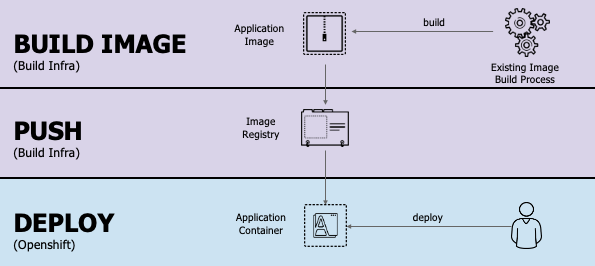

# IBM Cloud Container Workshop

###### *Version: 2020-03-03*

---

# OpenShift S2I based on Docker Image: Jupiter

---

##  Introduction

During this lab we will be using S2I mechanism together with Docker image

Be sure that you have your **labuser**xx userID with xx representing a number from 00 to 99. You also have been set a password associated to labuserxx. 

Don't use someone else userID except if the instructor ask you to do so. 

**This lab is based on Openshift 4.2.** 

We will be using ready made Dockerfile for R-Notebook, available at

https://github.com/jupyter/docker-stacks/tree/master/r-notebook

## 3 - OpenShift Web Console

Get back to Your VNC client and go to the OpenShift Web Console (use your credentials if necessary)

https://console-openshift-console.apps.a.cloudpak.site/dashboards

If asked, pick "htpasswd" as "Log in with...".

Login using credentials provided (labprojxx)

On the right side, click on the blue link : **labproj<xx>**

You will switch from the `Service Catalog` to the `Application Console` 

to the `Application Console` 

This will show the new created application:

> The name of your application, the number of pod, the application URL link ...

Click on the `nodejs-ex, #1` blue link, then you will see some more details on the application: 

Walk thru all the buttons : 

## 

On the left side, click on **Pods**:

Click on the **running** Pod:

You will get this page:

Walk thru the different links to understand this application:

Like for example the logs:

Now, on the left part of the screen, click on `deployments`

Then click on the blue link `nodes-ex`

Click on the Actions button:

Then click on `Edit YAML`to look at the kubernetes resource definition:

 You will recognize the definition deploymentconfig, similar to Kubernetes deployment. 

Finally from the left side of the screen, click on `routes`

And you will see the route definition for that deployment: 

Open Your route (**nodejs-ex**), than click on "**Actions**" -> "**Edit Yaml**" to see the route definition

 Click "**Cancel**"

## 4 - Monitoring your application

To learn about monitoring of your application, on the left pane, click on the `Monitoring`icon:

You should see all the resources involved into your application in the cluster:

Walk thru some itmes like Pods or Builds where you can see some of the previous pages in this lab.

Go to Deployments (nodes-ex) and open the #1

Finally, increase the number of pods (**not too much** - 2). There is a limit set on the number of pods running in our system.

And after a while, you will see 2 active pods:

And at the bottom of the page:

This mens that now 2 pods are serving the requests. 

Now click on one of these new pods and you should a page like this one:

 

Let's try a crazy experience and kill this pod ! click on the action button and select `delete`

The following popup window will appear:

Click on `Delete` and you should see breifly your pod terminating.

A new pod is automatically started !!! Because the number of replicaset has been defined to **2** , even if a pod is crashing, it will be replace automatically by a new one. 

## 5 - Clean the application

Clean the system - delete the application created.

The system has created a few comonents. As our resources are limited, before we will start fith further labs we need to delete the application created.

### 1. Clean the deployment

Select "**Applications**" -> "**Deployments**" from the web console menu on the left.

Click on the application that You have created:

From the **"Actions"** select "**Delete**". Confirm with "**Delete**" again.

## 

## Conclusion

You successfully installed and used the oc CLI and the OpenShift web console thru the installation of a typical Node.JS application (from Github). 

You noticed the following details:

- easy to access the OpenShift web console
- easy to build and deploy the application, the container, the pod.
- easy to scale up and down 
- automatic healing

You also noticed the difference between Kubernetes and OpenShift like 

- the route concept
- the wildcard DNS utilization
- the image stream and S2I concepts to build the docker image

**Congrats**

----

----

# End of Lab

