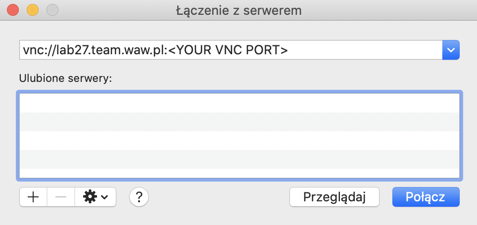
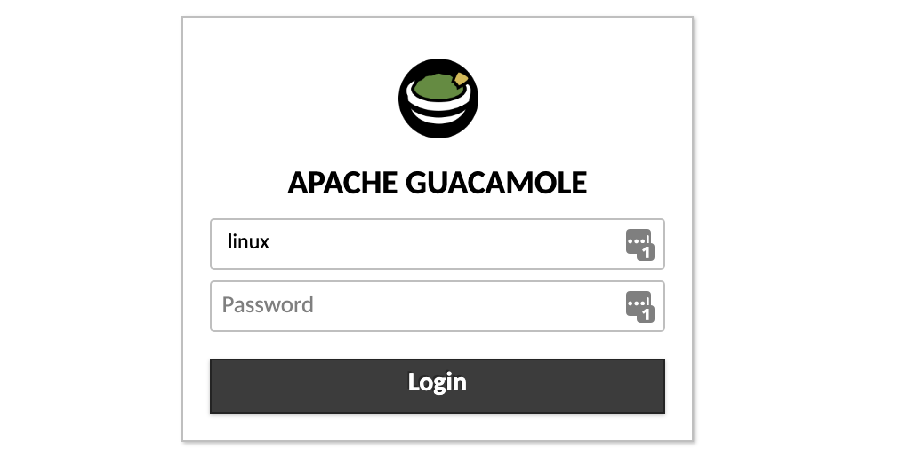
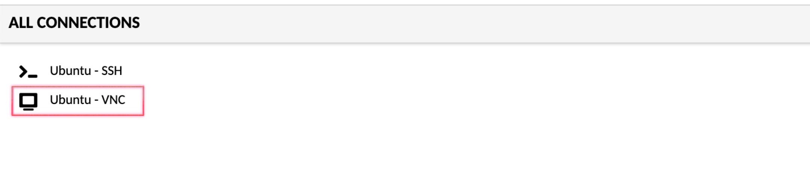
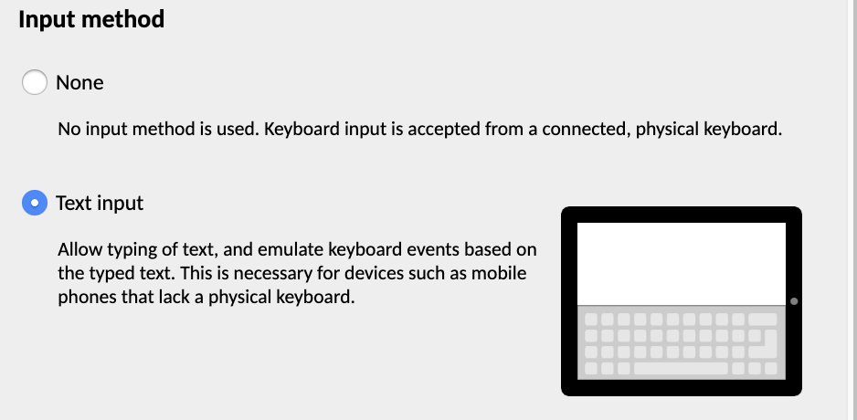
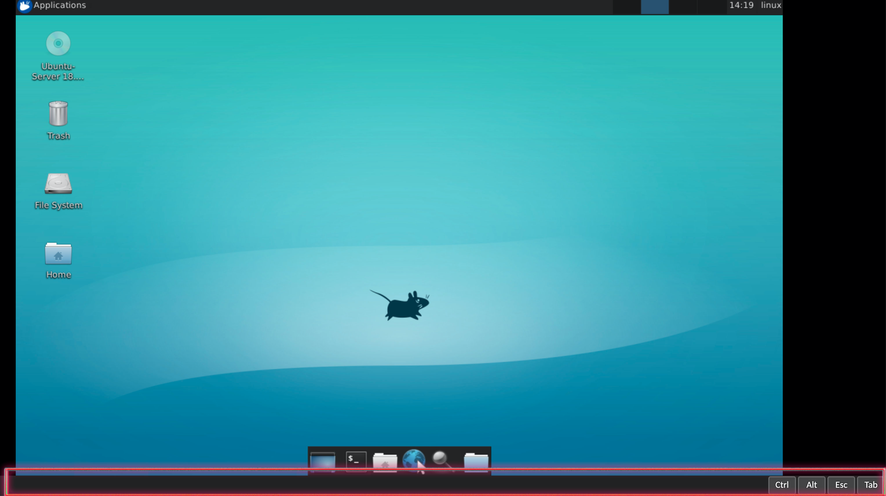
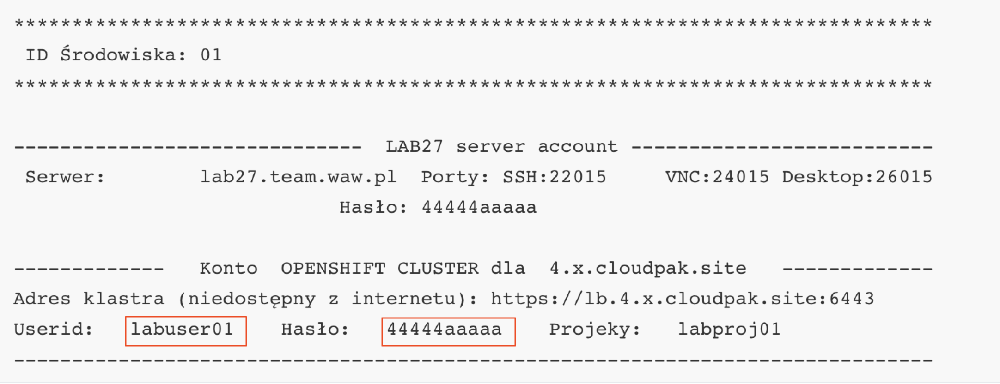
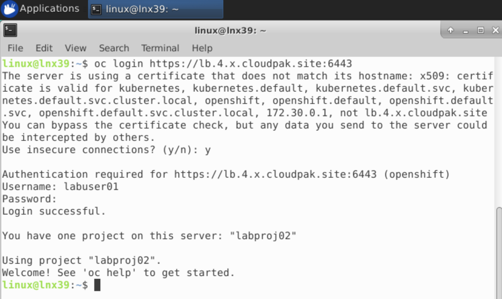

This is a part of IBM CloudPak for Applications Workshop created for IBM Poland by Maciej Szulc (maciej.szulc@pl.ibm.com).
Workshop labs contains parts created originally by several IBMers, including Franck Descollonges, Philippe Thomas,  [Henry Nash](https://github.com/henrynash) and [Steve Martinelli](https://github.com/stevemar).

If You're interested in participating in this event, held monthly in Polish language in Warsaw, contact maciej.szulc@pl.ibm.com.

__We do not distribute presentations used during the workshop.__


This labs contains customization of Appsody Stacks, publishing a new Collections and adding a new Tekton task to our Tekton pipeline.


# 1. Login to the system

Our lab environment is quite complex, that's why we will be using non-standard techniques to access it. Our CloudPak cluster is not accesible from the Internet, we need to use intermediate server.

This is how it is constructed:


You have received account details which looks like:

```
*******************************************************************************
 ID Środowiska: 01
*******************************************************************************

------------------------------  LAB27 server account --------------------------
 Serwer:        lab27.team.waw.pl  Porty: SSH:22015     VNC:24015 Desktop:26015
                            Hasło: 44444aaaaa

-------------   Konto  OPENSHIFT CLUSTER dla  4.x.cloudpak.site   -------------
Adres klastra (niedostępny z internetu): https://lb.4.x.cloudpak.site:6443
Userid:   labuser01    Hasło:   44444aaaaa    Projeky:   labproj01
-------------------------------------------------------------------------------
```


You will have to use:

- VNC port number - **like** "24015" in the example above
- Desktop port number - like 26015 in the example above
- PASSWORD - **like** "44444aaaaa"  in the example above. It works for all types of connection
- Openshift Userid - **like** "labuser01"  in the example above
- Openshift Project - **like** "labproj01"  in the example above

**Please note this data, You will  need that later.**


In order to complete our exercises You will have to connect to the server using ONE of methods:

- VNC Viever - connecting to VNC port. If You already have the VNC Viewer installed, fell free to use this method. 

- WEB Desktop - connecting to Desktop port. It requires only the browser, nothing needs to be installed. It is usually easier to use.

  

## VNC Connection

**Use this section ONLY if You have chosen the VNC as connection method**

### VNC for MAC devices

VNC client is a part of MacOS system, You don't have to install anything.

- Open Finder  

- Pick "Go" ("Idź") from the menu in the top section of Your screen

- Pick "Connect to server" ("Połącz z serwerem")

- Enter 

  ```
  vnc://lab27.team.waw.pl:<YOUR VNC PORT NUMBER>
  ```

  example:

  ```
  vnc://lab27.team.waw.pl:24051
  ```

  in the address bar; **substitute <YOUR VNC PORT NUMBER> with the data You have collected before**

  

  Click "Connect" and provide the password You have collected before.

  


### VNC for Windows devices

VNC client is NOT a part of Windows system, You have to install VNC Client.

There are many sources of VNC client, I'd recommend:

- https://www.realvnc.com/en/connect/download/viewer/ 

From the menu below "Download VNC Viewer" pick **"Standalone EXE x86"** and download it. Open the file (it does not require to be installed) and fill with connection address:

```
lab27.team.waw.pl:<YOUR VNC PORT NUMBER>
```

example:

```
lab27.team.waw.pl:24051
```

**substitute <YOUR VNC PORT NUMBER> with the data You have collected before**


## Web Desktop Connection

**Use this section ONLY if You have chosen the Web Desktop as connection method. It is not required if You are using VNC but You may encounter difficulties with copy-and-paste!**

Open Your browser and enter the address:

```
http://lab27.team.waw.pl:<Web desktop port>/guacamole
```

Your desktop port has been provided by IBM Staff.

Login using username "linux" and Your password.



From the "All Connections" pick "Ubuntu - VNC"



There is a Guacamole menu available to change the settings. You may open this by pressing:

- Shift - Control - Option on MAC devices
- Shift - Alt - Control on Windows devices

It is quite usefull to change the "Input Method" to "Text Input" - it will open the bar at the bottom of the screen that allows to copy-and-paste text to the Linux system.






​	

# 2. System check

Now we have GUI console connected to our lab27 server. It is time to check if Your server is ready for our labs. 

Open the CLI console using button below:


## Appsody CLI

Now let's check our Appsody.

Enter command below in the CLI window.

```
appsody version
```

You should see output similar to the following:


```
$ appsody version
appsody 0.6.0
```

Component versions may differ; that's OK.


## OpenShift CLI

The OpenShift CLI allows you to manage OpenShift resources from a terminal.

You can check that you have the correct version installed by executing the command:


```
oc version
```

You should see output similar to the following:


```
$>oc version

Client Version: 4.2.27-202003300539-33d97ed
error: You must be logged in to the server (Unauthorized)
```

The "Unauthorized" error we got is fine since we are not logged into our Openshift Cluster.

Component versions may differ; that's OK.


# 3. Connect to OpenShift cluster

Login to the cluster using "oc login command"

```
oc login https://lb.4.x.cloudpak.site:6443
```

Use Your **labuserXX** username with corresponding password, as given by IBM Staff. 

Use Your account only!



`Accept` any certificate security warnings.





# 4. The role of a stack in the development process

Developers use stacks to simplify building applications that require a specific set of technologies or development patterns. While there are numerous publicly available stacks to choose from, many enterprises want to build their own set of stacks that uphold their specific requirements and standards for how they want to their developers to build cloud native applications.

In this exercise, you will learn how to modify an existing stack to more closely match your requirements. Before starting this, let's do a quick review of the design requirements for stacks. A stack is designed to support the developer in either a rapid, local development mode or a build-and-deploy mode.

### Rapid, local development mode

In this mode, the stack contains everything a developer needs to build a new application on a local machine, with the application always running in a local containerized Docker environment. Introducing containerization from the start of the application development process (as opposed to development solely in the user space of the local machine) decreases the introduction of subtle errors in the containerization process and removes the need for a developer to install the core technology components of their application.

In this mode, the stack is required to have all the dependencies for the specific technologies pre-built into the Docker image, and also to dynamically compliment these with whatever dependencies the developer adds explicitly for his or her code.

Rapid local development mode in Appsody consists of the Appsody CLI (hooked into a local IDE if required) communicating with a local Docker container that is running the application under development. With this mode, application code can be held on the local file system, while being mounted in the Docker container, so that a local change can automatically trigger a restart of the application.

### Build-and-deploy mode

In this mode, the stack enables the Appsody CLI to build a self-contained Docker image that includes both the core technologies in the stack plus the application code, along with the combined dependencies of both. You can deploy the resulting image manually or programmatically to any platform that supports Docker images (such as a local or public Kubernetes cluster).

A pictorial view of how an application developer uses a stack, looks like this:


Appsody Flow

The above development flow shows the manual deployment to a Kubernetes cluster. In more production-orientated environments, GitOps might trigger the build and deploy steps and Tekton Pipelines would drive the deployment. [Collections](https://github.com/kabanero-io/collections/), which are a part of [Cloud Pak for Applications](https://www.ibm.com/cloud/cloud-pak-for-applications), bring together Appsody stacks, GitOps, and Tekton Pipelines to provide an enterprise-ready solution for cloud-native application development and deployment. We'll look at this in later exercises.

## Stack structure

Because a single Appsody stack can enable both rapid, local development and build-and-deploy modes, all stacks follow a standard structure. The structure below represents the source structure of a stack:


```
my-stack
├── README.md
├── stack.yaml
├── image/
|   ├── config/
|   |   └── app-deploy.yaml
|   ├── project/
|   |   ├── [files that provide the technology components of the stack]
|   |   └── Dockerfile
│   ├── Dockerfile-stack
|   └── LICENSE
└── templates/
    ├── my-template-1/
    |       └── [example files as a starter for the application, e.g. "hello world"]
    └── my-template-2/
            └── [example files as a starter for a more complex application]
```

As a *Stack Architect* you must create the above structure, build it into an actual stack image ready for use by an *Application Developer* who bases their new application on your stack. Part of your role as a stack architect is to include one of more sample applications (known as *templates*) to help the application developer get started.

Hence, when you build a stack, the structure above is processed and generates a Docker image for the stack, along with tar files of each of the templates, which can then all be stored and referenced in a local or public Appsody repo. The Appsody CLI can access the repo to use the stack to initiate local development.

For this exercise we will modify the nodejs-express stack that we have been using for our quote-frontend, to add some additional security hardening (individual enterprises often have specific security standards that need to be met to allow deployment).


# 5. Create a new stack, based on an existing one

The goal of this step is to create a new Node.js Express stack by modifying the existing one. We'll copy it, build, and modify it.

### Initialize the stack

To create a new stack, you must first construct a scaffold of the above structure. Stacks are classified as being `stable`, `incubating` or `experimental`. You can read more about these classifications [here](https://appsody.dev/docs/stacks/stacks-overview). To make things easy, the Appsody CLI supports an `appsody stack create` command to create a new stack, by copying an existing one.

By running the `appsody stack create` command, *nodejs-express* stack will be copied and moved, a directory will be created containing the new stack.


Let's create new directory for our stack

```
cd ~
mkdir appsody-stacks
cd appsody-stacks
```

 than let's create copy of existing stack

```appsody stack create my-nodejs-express --copy cp4a/nodejs-express
appsody stack create my-nodejs-express --copy cp4a/nodejs-expres
```

system should respond with:

```
$ appsody stack create my-nodejs-express --copy cp4a/nodejs-express

Stack created: my-nodejs-express
```


now it's time to verify what has been created

```
cd my-nodejs-express
ls -al
```


You should see output similar to the following:


```
linux@lnx39:~/appsody-stacks/my-nodejs-express$ ls -la
total 28
drwxr-xr-x 4 linux linux 4096 Apr 14 07:04 .
drwxr-xr-x 3 linux linux 4096 Apr 14 07:04 ..
drwxr-xr-x 4 linux linux 4096 Apr 14 07:04 image
-rw-r--r-- 1 linux linux 5026 Apr 14 07:04 README.md
-rw-r--r-- 1 linux linux  320 Apr 14 07:04 stack.yaml
drwxr-xr-x 4 linux linux 4096 Apr 14 07:04 templates
```

If you inspect the contents of the `image` directory, you will see how it matches the stack structure given earlier.


### Build your new stack

Before we make any changes, let's go through the steps of building (or *packaging*) a stack, to create a stack image (which is a Docker image) that the Appsody CLI can use to initiate a project using that stack.

There is a Docker file (`Dockerfile-stack`) within the sample stack structure you copied. The `appsody stack package` command will use this to build the image.

To build your new stack in this way, from the `my-nodejs-express` directory enter:


```
appsody stack package
```

*Errors that may appear during the build in our lab environment are non-critical.*


This runs a Docker build, installs `my-nodejs-express` into a local Appsody repository (called `dev.local`), and runs some basic tests to make sure the file is well formed.

Once the build is complete, use the `appsody list` command to check that it is now available in the local repo:


```
appsody list dev.local
```

You should see output similar to the following:


```
$ appsody list dev.local

REPO     	ID               	VERSION  	TEMPLATES        	DESCRIPTION                      
dev.local	my-nodejs-express	0.2.10   	scaffold, *simple	Express web framework for Node.js

```


### Run the new stack

So, at this point, you have been carrying out your role as a stack architect to build and install your new (albeit unchanged) stack. Now it's time to try it out as an application developer.

Create a new directory and initialize it with this new Appsody stack:


```
mkdir ~/appsody-apps/test-my-stack
cd ~/appsody-apps/test-my-stack
appsody init dev.local/my-nodejs-express
```

Now use `appsody run` to test running an application based on your copy of the stack:


```
appsody run
```

You should see output similar to the following:


```
$ appsody run
Running development environment...
Using local cache for image dev.local/appsody/my-nodejs-express:0.2
Running command: docker run --rm -p 8080:8080 -p 9229:9229 -p 3000:3000 --name test-my-stack -v /home/linux/appsody-apps/test-my-stack/:/project/user-app -v appsody-test-my-stack-20200414075509.62728271:/project/user-app/node_modules -v appsody-controller-0.3.4:/.appsody -t --entrypoint /.appsody/appsody-controller dev.local/appsody/my-nodejs-express:0.2 "--mode=run"
[Container] Running APPSODY_PREP command: npm install --prefix user-app
added 170 packages from 578 contributors and audited 295 packages in 6.109s
[Container] found 1 low severity vulnerability
[Container]   run `npm audit fix` to fix them, or `npm audit` for details
[Container] Running command:  npm start
[Container] 
[Container] > nodejs-express@0.2.10 start /project
[Container] > node server.js
[Container] 
[Container] [Tue Apr 14 07:55:18 2020] com.ibm.diagnostics.healthcenter.loader INFO: Node Application Metrics 5.1.1.202004140713 (Agent Core 4.0.5)
[Container] [Tue Apr 14 07:55:18 2020] com.ibm.diagnostics.healthcenter.mqtt INFO: Connecting to broker localhost:1883
[Container] App started on PORT 3000

```


To check it is running, open a separate terminal window and use `curl` to hit the endpoint:


```
curl -v localhost:3000
```

So now we are ready to make change to our new stack. For this exercise we will harden the HTTP headers that an application, built using this stack, responds with. We can look at the current headers returned:


```
$ curl -v localhost:3000
* Rebuilt URL to: localhost:3000/
*   Trying 127.0.0.1...
* TCP_NODELAY set
* Connected to localhost (127.0.0.1) port 3000 (#0)
> GET / HTTP/1.1
> Host: localhost:3000
> User-Agent: curl/7.58.0
> Accept: */*
> 
< HTTP/1.1 200 OK
< X-Powered-By: Express
< Content-Type: text/html; charset=utf-8
< Content-Length: 19
< ETag: W/"13-0ErcqB22cNteJ3vXrBgUhlCj8os"
< Date: Tue, 14 Apr 2020 07:58:33 GMT
< Connection: keep-alive
< 
* Connection #0 to host localhost left intact
Hello from Appsody!l
```


`Close` the curl window.

Stop  current appsody run by `CTRL-C` in the window, where "appsody run" has been entered.

```
[Container] App started on PORT 3000

^C

Running command: docker stop test-my-stack
[Container] Wait received error on APPSODY_RUN/DEBUG/TEST signal: interrupt
Closing down development environment.

```


For this exercise we will modify the stack to include the popular HTTP header security module [helmet](https://helmetjs.github.io/), and hence this should change the headers we see returned to us. Note we will do this as a *stack architect* since we don't want to rely on *application developers* remembering to do this. By doing this in the stack itself, all applications built using our modified stack will have helmet automatically enabled.

### Modify your custom stack

When creating a custom stack, based on an existing stack, the first thing to do is to take a look at what the existing stack has provided. A more detailed description of the stack components can be found [here](https://appsody.dev/docs/stacks/stack-structure), but the key ones are:

- A Dockerfile (`image/Dockerfile-stack`) that builds your stack image. This is what the `appsody stack package` command used above to build a Docker image of your stack - which is, if you like, the eventual artifact that you deliver as a stack architect to application developers.
- A Dockerfile (`image/project/Dockerfile`) that builds the final application image. This final image will contain both your stack and their application, and this Dockerfile is processed by the application developer running `appsody build` and `appsody deploy`.
- Typically some kind of server side code that is enabling the application the developer will create and run. For this stack, this is `image/project/server.js`.
- Some kind of dependency management, ensuring both the correct inclusion of components defined by the stack, as well as, potentially, any added by the application developer. For this stack, this is `image/project/package.json`.
- At least one sample application (or *template*); these are stored in the `templates` directory.

It is worth taking some time checking out the files given above to get a feel of the stack.

For some stack modifications, you can actually use a form of stack inheritance - i.e. by using the existing stack images as the `FROM` image in `Dockerfile-stack`. An example of this might be where you just want to change one of the Dockerfile variables. In general, however, most modified stacks are effectively copies of an existing stack, with the additional changes added to gain the new, required functionality.

Having examined the files above, you might have already spotted what we need to do to incorporate helmet into the new stack - namely to modify `image/project/server.js` to enable it.

Go back to the `my-nodejs-express` directory.


```
cd ~/appsody-stacks/my-nodejs-express
```


Open the `image/project/server.js`file in gedit:


`gedit image/project/server.js`


The current code in `image/project/server.js` starts like this:

```
// Requires statements and code for non-production mode usage
if (!process.env.NODE_ENV || !process.env.NODE_ENV === 'production') {
  require('appmetrics-dash').attach();
}
const express = require('express');
const health = require('@cloudnative/health-connect');
const fs = require('fs');

require('appmetrics-prometheus').attach();

```

We will modify this file by adding two lines, to import helmet (with `require()`), and to enable it with `app.use()`:

<TUUUU>

```
// Requires statements and code for non-production mode usage
if (!process.env.NODE_ENV || !process.env.NODE_ENV === 'production') {
require('appmetrics-dash').attach();
}
const express = require('express');
const helmet = require('helmet');
const health = require('@cloudnative/health-connect');
const fs = require('fs');


require('appmetrics-prometheus').attach();


const app = express();
app.use(helmet());


const basePath = __dirname + '/user-app/';
...
```

Since we have added a new module that is required, we must also update the dependency management (package.json), to ensure this is pulled in:


```
{
...
"dependencies": {
    "@cloudnative/health-connect": "^2.0.0",
    "appmetrics-prometheus": "^3.0.0",
    "express": "~4.16.0",
    "helmet": "^3.21.1"
},
...
}
```

Now that we have modified our stack, we need to re-package it, using the same command as before:


```
appsody stack package
```

> **NOTE** The `appsody run` command should pull down the latest packaged version, but in case this doesn't work, delete the directory and re-initialize.


```
cd ~/appsody-apps
rm -rf test-my-stack
mkdir test-my-stack
cd test-my-stack
appsody init dev.local/my-nodejs-express
```

This will have updated the dev.local index, so we can again go and run our application:


```
appsody run
```

If we now hit the endpoint as before with `curl` in verbose mode, we can see if the HTTP headers have changed:


```
curl -v localhost:3000
```

You should now see security related headers like `X-DNS-Prefetch-Control`, `Strict-Transport-Security`, and `X-Download-Options`:


```
$ curl -v localhost:3000
*   Trying 127.0.0.1...
* TCP_NODELAY set
* Connected to localhost (127.0.0.1) port 3000 (#0)
> GET / HTTP/1.1
> Host: localhost:3000
> User-Agent: curl/7.64.1
> Accept: */*
>
< HTTP/1.1 200 OK
< X-DNS-Prefetch-Control: off
< X-Frame-Options: SAMEORIGIN
< Strict-Transport-Security: max-age=15552000; includeSubDomains
< X-Download-Options: noopen
< X-Content-Type-Options: nosniff
< X-XSS-Protection: 1; mode=block
< X-Powered-By: Express
< Content-Type: text/html; charset=utf-8
< Content-Length: 19
< ETag: W/"13-0ErcqB22cNteJ3vXrBgUhlCj8os"
< Date: Fri, 08 Nov 2019 19:39:22 GMT
< Connection: keep-alive
<
* Connection #0 to host localhost left intact
Hello from Appsody!*
```

As you should see, because the stack now incorporates helmet, the HTTP headers have changes, and our application runs with this protection. The inclusion of helmet is just an example of some of the security hardening you might want to take within your own enterprise.

Stop this current appsody run by running `appsody stop` in a separate terminal window, from within the same directory.

## 4. Use the new stack in our example application

A final step is to switch the actual quote-frontend application we built in [Exercise 2]() to use our new stack (rather than the original `nodejs-express` stack).

The formal way of doing this is to repeat the steps from Exercise 2, where the new project is initialized (using our new stack), and the dependencies and code for the frontend are copied into the new project directory. However, in this case, where we have not changed anything that is actually placed directly in the project directory, we can take a short cut and just update the project to point at our new stack. This also gives you a bit more of an idea as to how an application project is linked to a stack. In the `quote-frontend` directory you created in Exercise 2, you should see a file called `.appsody-config.yaml`, which was created by the `appsody init` step.


```
cd ~/appsody-apps/quote-frontend
ls -la
```

You should see output similar to the following:


```
$ ls -al
total 192
drwxr-xr-x  16 henrynash  staff    512 15 Oct 12:42 .
drwxr-xr-x+ 85 henrynash  staff   2720 17 Oct 21:37 ..
-rw-r--r--   1 henrynash  staff     64 19 Oct 11:10 .appsody-config.yaml
-rw-r--r--   1 henrynash  staff   1316 15 Oct 11:12 .gitignore
drwxr-xr-x   4 henrynash  staff    128 15 Oct 11:12 .vscode
-rw-rw-r--   1 henrynash  staff    806 15 Oct 12:50 app-deploy.yaml
-rw-r--r--   1 henrynash  staff    290 15 Oct 11:15 app.js
drwxr-xr-x   4 henrynash  staff    128 15 Oct 11:15 config
drwxr-xr-x   2 henrynash  staff     64 15 Oct 11:16 node_modules
-rw-r--r--   1 henrynash  staff      0 15 Oct 11:19 nodejs_dc.log
-rw-r--r--   1 henrynash  staff      0 15 Oct 11:19 nodejs_restclient.log
-rw-r--r--@  1 henrynash  staff  73319 15 Oct 11:16 package-lock.json
-rw-r--r--   1 henrynash  staff    615 15 Oct 11:15 package.json
-rw-r--r--   1 henrynash  staff   2779 15 Oct 11:15 quote.js
drwxr-xr-x   3 henrynash  staff     96 15 Oct 11:12 test
drwxr-xr-x   3 henrynash  staff     96 15 Oct 11:15 views
```

Inspecting that file, reveals that it contains a pointer to the stack:


```
cat .appsody-config.yaml
```

Should output a configuration that uses `nodejs-express`:


```
project-name: quote-frontend
stack: kabanero/nodejs-express:0.2
```

We can simply change the second line to, instead, point to our new stack, i.e.:

> **NOTE**: When using a stack that is in development, it will carry semantic versioning derived from the original copied stack in addition to a latest tag.


```
project-name: quote-frontend
stack: dev.local/appsody/my-nodejs-express:latest
```

Now re-run the frontend with `appsody run`:


```
appsody run
```

It should use our new stack:


```
$ appsody run
Running development environment...
Using local cache for image dev.local/appsody/my-nodejs-express:latest
...
[Container] App started on PORT 3000
```

We can confirm that our new HTTP protection is being used by, instead of using a browser, again using `curl` in verbose mode to hit the published endpoint:


```
curl -v localhost:3000
```

You should see output similar to the following:


```
$ curl -v localhost:3000
*   Trying 127.0.0.1...
* TCP_NODELAY set
* Connected to localhost (127.0.0.1) port 3000 (#0)
> GET / HTTP/1.1
> Host: localhost:3000
> User-Agent: curl/7.64.1
> Accept: */*
>
< HTTP/1.1 302 Found
< X-DNS-Prefetch-Control: off
< X-Frame-Options: SAMEORIGIN
< Strict-Transport-Security: max-age=15552000; includeSubDomains
< X-Download-Options: noopen
< X-Content-Type-Options: nosniff
< X-XSS-Protection: 1; mode=block
< X-Powered-By: Express
< Location: /quote
< Vary: Accept
< Content-Type: text/plain; charset=utf-8
< Content-Length: 28
< Date: Fri, 08 Nov 2019 19:51:50 GMT
< Connection: keep-alive
<
* Connection #0 to host localhost left intact
Found. Redirecting to /quote
```

We can tell our sample application is now using the new stack because it includes the new security related headers.

Stop this current appsody run by running `appsody stop` in a separate terminal window, from within the same directory.

**Congratulations**! We have successfully built and tested out our modified stack - and seen how applications built against this stack automatically gain the (new) features it provides (without the application developer having to do anything themselves). In later exercises, we will discover how to publish this stack for other developers to utilize to build their own applications.