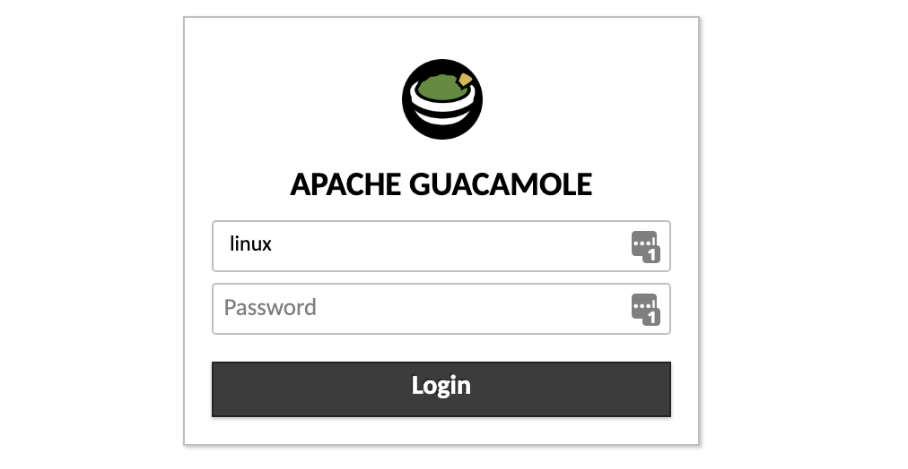
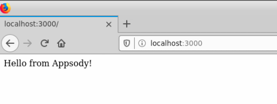
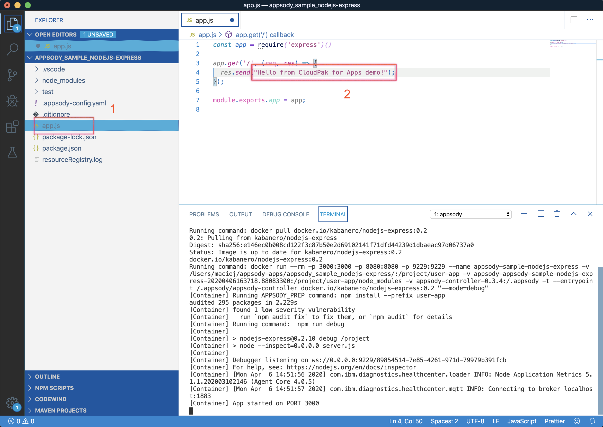
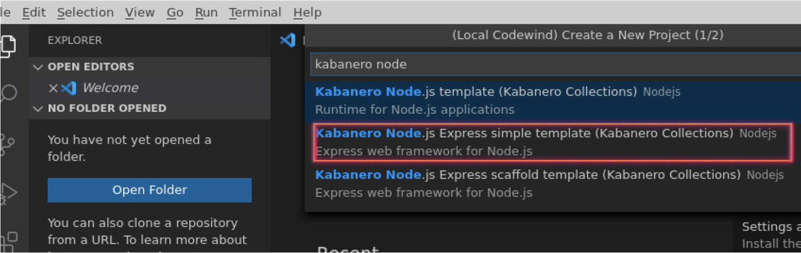
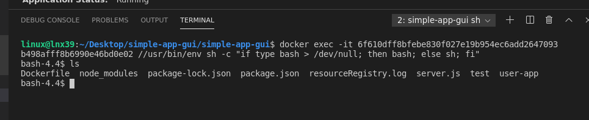

# Login to the system

Our lab environment is quite complex, that's why we will be using non-standard techniques to access it. Our CloudPak cluster is not accesible from the Internet, we need to use intermediate server.

This is how it is constructed:


You have received account details which looks like:

```
*****************************************************************************
 ID Środowiska: 25

----------------------------  LAB27 server account -------------------------
 Server:        lab27.team.waw.pl  SSH Port: 22039      VNC Port: 24039

------------ OPENSHIFT CLUSTER ACCOUNT for master.x.cloudpak.site-------------
Userid:   labuser25    Password:   myPass11    Project:   labproj25
------------------------------------------------------------------------------
```


You will have to use:

- VNC port number - **like** "24039" in the example above
- Desktop port number - like 25039 in the example above
- PASSWORD - **like** "myPass11"  in the example above. It works for all types of connection
- Openshift Userid - **like** "labuser25"  in the example above
- Openshift Project - **like** "labproj25"  in the example above

**Please note this data, You will  need that later.**


In order to complete our exercises You will have to connect to the server using ONE of methods:

- VNC Viever - connecting to VNC port. If You already have the VNC Viewer installed, fell free to use this method. 

- WEB Desktop - connecting to Desktop port. It requires only the browser, nothing needs to be installed. It is usually easier to use.

  

## VNC Connection

**Use this section ONLY if You have chosen the VNC as connection method**

### VNC for MAC devices

VNC client is a part of MacOS system, You don't have to install anything.

- Open Finder  

- Pick "Go" ("Idź") from the menu in the top section of Your screen

- Pick "Connect to server" ("Połącz z serwerem")

- Enter 

  ```
  vnc://lab27.team.waw.pl:<YOUR VNC PORT NUMBER>
  ```

  example:

  ```
  vnc://lab27.team.waw.pl:24051
  ```

  in the address bar; **substitute <YOUR VNC PORT NUMBER> with the data You have collected before**

  

  Click "Connect" and provide the password You have collected before.

  

  ### VNC for Windows devices

  VNC client is NOT a part of Windows system, You have to install VNC Client.

  There are many sources of VNC client, I'd recommend:

  - https://www.realvnc.com/en/connect/download/viewer/ 

  From the menu below "Download VNC Viewer" pick **"Standalone EXE x86"** and download it. Open the file (it does not require to be installed) and fill with connection address:

  ```
  lab27.team.waw.pl:<YOUR VNC PORT NUMBER>
  ```

  example:

  ```
  lab27.team.waw.pl:24051
  ```

  **substitute <YOUR VNC PORT NUMBER> with the data You have collected before**

  

  

## Web Desktop Connection

**Use this section ONLY if You have chosen the Web Desktop as connection method. It is not required if You are using VNC!**

Open Your browser and enter the address:

```
http://lab27.team.waw.pl:<Web desktop port>/guacamole
```

Your desktop port has been provided by IBM Staff.

Login using username "linux" and Your password.



From the "All Connections" pick "Ubuntu - VNC"


There is a Guacamole menu available to change the settings. You may open this by pressing:

- Shift - Control - Option on MAC devices
- Shift - Alt - Control on Windows devices

It is quite usefull to change the "Input Method" to "Text Input" - it will open the bar at the bottom of the screen that allows to copy-and-paste text to the Linux system.


​	

# System check

Now we have GUI console connected to our lab27 server. It is time to check if Your server is ready for our labs. 

Open the CLI console using button below:


## Docker

First we will check if docker works. It is required by CodeWind and appsody.

```
docker version
```

You should see output similar to the following:


```
$>docker version
Client: Docker Engine - Community
 Version:           19.03.2
 API version:       1.40
 Go version:        go1.12.8
 Git commit:        6a30dfc
 Built:             Thu Aug 29 05:26:49 2019
 OS/Arch:           darwin/amd64
 Experimental:      false

Server: Docker Engine - Community
 Engine:
  Version:          19.03.2
  API version:      1.40 (minimum version 1.12)
  Go version:       go1.12.8
  Git commit:       6a30dfc
  Built:            Thu Aug 29 05:32:21 2019
  OS/Arch:          linux/amd64
  Experimental:     false
  (...)
```

## Appsody CLI


```
appsody version
```

You should see output similar to the following:


```
$ appsody version
appsody 0.6.0
```


## OpenShift CLI

The OpenShift CLI allows you to manage OpenShift resources from a terminal.

You can check that you have the correct version installed by executing the command:


```
oc version
```

You should see output similar to the following:


```
$>oc version

Client Version: 4.2.27-202003300539-33d97ed
error: You must be logged in to the server (Unauthorized)
```

The "Unauthorized" error we got is fine since we are not logged into our Openshift Cluster.


# Connect to OpenShift cluster

Login to the cluster using "oc login command"

```
oc login https://lb.4.x.cloudpak.site:6443
```

Use Your **labuserXX** username with corresponding password.


Accept any certificate security warnings.


## Configure Appsody CLI

In this section we'll configure our Appsody CLI to pull in Collections.

### List existing Appsody stacks

The Appsody CLI gives you access to stacks, which are stored in stack repositories. These can be local, private to the Enterprise or public. To get the list of available repos, run this command.


```
appsody repo list
```

Response:


```
appsody repo list

NAME      	URL
*incubator	https://github.com/appsody/stacks/releases/latest/download/incubator-index.yaml
```


The exact repo list may be different to the above. `incubator` is one of the repos in the appsody project public hub (`appsodyhub`). For this workshop we are going to use the private enterprise-grade collection of stacks that come with the Kabanero open source project (which is part of Cloud Pak for Applications). So the first thing we need to do is to tell the CLI about this.


## Add stack that comes with CloudPak for Applications


```
appsody repo add cp4a https://github.com/kabanero-io/kabanero-stack-hub/releases/download/0.6.3/kabanero-stack-hub-index.yaml
```


Now when we get our list of repos, we should see Kabanero listed:


```
appsody repo list
```

You should see output similar to the following:

```
$>appsody repo list

NAME      	URL
*incubator	https://github.com/appsody/stacks/releases/latest/download/incubator-index.yaml
cp4a      	https://github.com/kabanero-io/kabanero-stack-hub/releases/download/0.6.3/kabanero-stack-hub-index.yaml
```


We can now list the appsody stacks available in the Collection:


```
appsody list cp4a
```

You should see output similar to the following:


```
$>appsody list cp4a

REPO	ID               	VERSION  	TEMPLATES        	DESCRIPTION
cp4a	java-microprofile	0.2.26   	*default         	Eclipse MicroProfile on Open Liberty & OpenJ9 using Maven
cp4a	java-openliberty 	0.2.3    	*default         	Open Liberty & OpenJ9 using Maven
cp4a	java-spring-boot2	0.3.24   	*default, kotlin 	Spring Boot using OpenJ9 and Maven
cp4a	nodejs           	0.3.3    	*simple          	Runtime for Node.js applications
cp4a	nodejs-express   	0.2.10   	scaffold, *simple	Express web framework for Node.js
```


Given that we'll exclusively be using the kabanero stacks in this workshop, for ease of use we can set the cp4apps repository to be the default for the CLI:


```
appsody repo set-default cp4a
```

Now is we get the list of repos, we should see cp4a is the default:


```
appsody repo list
```

You should see output similar to the following:


```
$>appsody repo list

NAME     	URL
*cp4a    	https://github.com/kabanero-io/kabanero-stack-hub/releases/download/0.6.3/kabanero-stack-hub-index.yaml
incubator	https://github.com/appsody/stacks/releases/latest/download/incubator-index.yaml
```


## Use Appsody CLI to build, test, run, and debug

Appsody and CodeWind allows You to use both command-line interface and  GUI interface provided by CodeWind. 


We will start this lab with CLI, which is IDE-independent and may be used with every tool You need. e will utilize the GUI in the following sections as well.


In this section we'll be using the following appsody commands:

- `appsody init`

- `appsody run`

- `appsody test`

- `appsody debug`

- `appsody build`

  

### Create a new directory to work with new applications

We recommend creating a new directory from your user home to work with new Appsody based applications, i.e.:

```
cd ~
mkdir appsody-apps
cd appsody-apps
```

### Create a new application

We will now use one of the stacks to create an application. First, create a new directory for the project and change directory into it.


```
mkdir appsody_sample_nodejs-express
cd appsody_sample_nodejs-express/
```


Now we have to initialize the project using appsody init

```
appsody init cp4a/nodejs-express
```


The directory has been initialized with a minimal set of artifacts (which is, in fact, a sample application that uses the chosen stack)

```
.
├── app.js
├── package-lock.json
├── package.json
└── test
    └── test.js
```

The key artifacts are:

- app.js Node.js application module (the default sample application is a simple "hello world")

- package.json NPM package JSON file

- test.js A simple test module

  

### Run the application

The sample application comes ready to run using appsody:


```
appsody run
```


This step results in the stack image, with the sample application mounted into it, run in your local Docker environment. The output finishes by giving you the endpoint for the application.


```
$>appsody run
Running development environment...
Pulling docker image docker.io/kabanero/nodejs-express:0.2
Running command: docker pull docker.io/kabanero/nodejs-express:0.2
0.2: Pulling from kabanero/nodejs-express
Digest: sha256:e146ec0b008cd122f3c87b50e2d69102141f71dfd44239d1dbaeac97d06737a0
Status: Image is up to date for kabanero/nodejs-express:0.2
docker.io/kabanero/nodejs-express:0.2
Running command: docker run --rm -v appsody-controller-0.3.4:/.appsody appsody/init-controller:0.3.4
Unable to find image 'appsody/init-controller:0.3.4' locally
0.3.4: Pulling from appsody/init-controller
bdbbaa22dec6: Pulling fs layer
cb2f469459ad: Pulling fs layer
bdbbaa22dec6: Verifying Checksum
bdbbaa22dec6: Download complete
cb2f469459ad: Verifying Checksum
cb2f469459ad: Download complete
bdbbaa22dec6: Pull complete
cb2f469459ad: Pull complete
Digest: sha256:e8e7c6c2791845e7cb91ba72c4add91c2f4a0d6b6d0ff28d54e91063c3f791f9
Status: Downloaded newer image for appsody/init-controller:0.3.4
Running command: docker run --rm -p 3000:3000 -p 8080:8080 -p 9229:9229 --name appsody-sample-nodejs-express -v /Users/maciej/appsody-apps/appsody_sample_nodejs-express/:/project/user-app -v appsody-appsody-sample-nodejs-express-20200406163718.88083300:/project/user-app/node_modules -v appsody-controller-0.3.4:/.appsody -t --entrypoint /.appsody/appsody-controller docker.io/kabanero/nodejs-express:0.2 "--mode=run"
[Container] Running APPSODY_PREP command: npm install --prefix user-app
added 170 packages from 578 contributors and audited 295 packages in 4.192s
[Container] found 1 low severity vulnerability
[Container]   run `npm audit fix` to fix them, or `npm audit` for details
Running command:  npm start
[Container]
[Container] > nodejs-express@0.2.10 start /project
[Container] > node server.js
[Container]
[Container] [Mon Apr  6 14:37:30 2020] com.ibm.diagnostics.healthcenter.loader INFO: Node Application Metrics 5.1.1.202003102146 (Agent Core 4.0.5)
[Container] [Mon Apr  6 14:37:30 2020] com.ibm.diagnostics.healthcenter.mqtt INFO: Connecting to broker localhost:1883
[Container] App started on PORT 3000
```


Select Applications->Internet and open firefox browser


We can now check that this is running by hitting the endpoint [http://localhost:3000](http://localhost:3000/):

You should see output similar to the following:


By default, the template sample application also provides the following endpoints.

- Readiness endpoint: http://localhost:3000/ready
- Liveness endpoint: http://localhost:3000/live
- Health check endpoint: http://localhost:3000/health
- Metrics endpoint: http://localhost:3000/metrics

For more details on this particular stack, refer to [Node.js Express Stack](https://github.com/kabanero-io/collections/blob/master/incubator/nodejs-express/README.md).

### Stop the application

To stop the application container, run this command from the same directory (e.g. in another terminal window) or just click ctrl-C in the terminal window.

```
appsody stop
```


### Test the application

A stack will typically come with a test framework - and this can be initiated by running:


```
appsody test
```

You should see output similar to the following:


```
$>appsody test
Running test environment
Pulling docker image docker.io/kabanero/nodejs-express:0.2
Running command: docker pull docker.io/kabanero/nodejs-express:0.2
0.2: Pulling from kabanero/nodejs-express
Digest: sha256:e146ec0b008cd122f3c87b50e2d69102141f71dfd44239d1dbaeac97d06737a0
Status: Image is up to date for kabanero/nodejs-express:0.2
docker.io/kabanero/nodejs-express:0.2
Running command: docker run --rm -p 3000:3000 -p 8080:8080 -p 9229:9229 --name appsody-sample-nodejs-express -v /Users/maciej/appsody-apps/appsody_sample_nodejs-express/:/project/user-app -v appsody-appsody-sample-nodejs-express-20200406163718.88083300:/project/user-app/node_modules -v appsody-controller-0.3.4:/.appsody -t --entrypoint /.appsody/appsody-controller docker.io/kabanero/nodejs-express:0.2 "--mode=test"
[Container] Running APPSODY_PREP command: npm install --prefix user-app
audited 295 packages in 9.921s
[Container] found 1 low severity vulnerability
[Container]   run `npm audit fix` to fix them, or `npm audit` for details
[Container] Running command:  npm test && npm test --prefix user-app
[Container]
[Container] > nodejs-express@0.2.10 test /project
[Container] > mocha
[Container]
[Container] [Mon Apr  6 14:39:50 2020] com.ibm.diagnostics.healthcenter.loader INFO: Node Application Metrics 5.1.1.202003102146 (Agent Core 4.0.5)
[Container] [Mon Apr  6 14:39:50 2020] com.ibm.diagnostics.healthcenter.mqtt INFO: Connecting to broker localhost:1883
[Container]
[Container]
[Container] App started on PORT 3000
[Container]   Node.js Express stack
[Container]     /metrics endpoint
[Container]       ✓ status (40ms)
[Container]       ✓ contains os_cpu_used_ratio
[Container]       ✓ contains process_cpu_used_ratio
[Container]     /ready endpoint
[Container]       ✓ status
[Container]     /live endpoint
[Container]       ✓ status
[Container]     /health endpoint
[Container]       ✓ status
[Container]     /blah endpoint
[Container]       ✓ status
[Container]
[Container]
[Container]   7 passing (96ms)
[Container]
[Container]
[Container] > nodejs-express-simple@0.1.0 test /project/user-app
[Container] > mocha
[Container]
[Container] [Mon Apr  6 14:39:51 2020] com.ibm.diagnostics.healthcenter.loader INFO: Node Application Metrics 5.1.1.202003102146 (Agent Core 4.0.5)
[Container] [Mon Apr  6 14:39:52 2020] com.ibm.diagnostics.healthcenter.mqtt INFO: Connecting to broker localhost:1883
[Container]
[Container]
[Container] App started on PORT 3000
[Container]   Node.js Express Simple template
[Container]     / endpoint
[Container]       ✓ status (48ms)
[Container]
[Container]
[Container]   1 passing (65ms)
[Container]
[Container] The file watcher is not running because no APPSODY_RUN/TEST/DEBUG_ON_CHANGE action was specified or it has been disabled using the --no-watcher flag.
Closing down development environment.
```


### Debug the application

As well as supporting the running and testing of your application, an appsody stack enables the execution of your application in debug mode. Typically the stack will be configured to support whatever the appropriate debugger is for the language and technology components within it.

The examples here will be based on VS Code. 


Go to Linux terminal window and check if You are in the proper directory (~/appsody_sample_nodejs-express):


open VSCode by command:

```
code .
```

**Please note that this is NOT just a "code" - it's "code" with additional space and dot.**


our test application opens in the vscode:


Open a new terminal window inside VS Code use `View` -> `Terminal`


To debug the application including reloading the application on code changes run the command below **inside the terminal** within VSCode:


```
appsody debug
```


The output indicates the debug environment is being used

```
$>appsody debug
Running debug environment
Pulling docker image docker.io/kabanero/nodejs-express:0.2
Running command: docker pull docker.io/kabanero/nodejs-express:0.2
0.2: Pulling from kabanero/nodejs-express
Digest: sha256:e146ec0b008cd122f3c87b50e2d69102141f71dfd44239d1dbaeac97d06737a0
Status: Image is up to date for kabanero/nodejs-express:0.2
docker.io/kabanero/nodejs-express:0.2
Running command: docker run --rm -p 3000:3000 -p 8080:8080 -p 9229:9229 --name appsody-sample-nodejs-express -v /Users/maciej/appsody-apps/appsody_sample_nodejs-express/:/project/user-app -v appsody-appsody-sample-nodejs-express-20200406163718.88083300:/project/user-app/node_modules -v appsody-controller-0.3.4:/.appsody -t --entrypoint /.appsody/appsody-controller docker.io/kabanero/nodejs-express:0.2 "--mode=debug"
[Container] Running APPSODY_PREP command: npm install --prefix user-app
audited 295 packages in 2.887s
[Container] found 1 low severity vulnerability
[Container]   run `npm audit fix` to fix them, or `npm audit` for details
[Container] Running command:  npm run debug
[Container]
[Container] > nodejs-express@0.2.10 debug /project
[Container] > node --inspect=0.0.0.0 server.js
[Container]
[Container] Debugger listening on ws://0.0.0.0:9229/faebedb0-6dec-4b63-8dab-1e77709362c5
[Container] For help, see: https://nodejs.org/en/docs/inspector
[Container] [Mon Apr  6 14:44:38 2020] com.ibm.diagnostics.healthcenter.loader INFO: Node Application Metrics 5.1.1.202003102146 (Agent Core 4.0.5)
[Container] [Mon Apr  6 14:44:39 2020] com.ibm.diagnostics.healthcenter.mqtt INFO: Connecting to broker localhost:1883
[Container] App started on PORT 3000
```


Now you can again open the application at http://localhost:3000/ with Firefox browser. Our app works properly.




Make an update to the application by opening the `app.js` file and editing the message. Then save the file.



Appsody will now rebuild the container and reload the application for you.


Open the firefox browser and verify if the app has been updated:


You can attach to the Node.js debugger using VS Code. 

To access the debug view use Debug icon on left menu:


Add a breakpoint to the application, click to the left of the line number:


Click on the `Play` button:


Refresh the browser and watch how the debugger stops at the breakpoint:


Stop the VS Code debugging session (by pressing the red stop/disconnect icon). 


Navigate to the "Terminal" tab in VSCode, press **Ctrl-C** to stop the app.


Now close the VSCode (File->Exit) and go to Your Linux terminal window.


## Build the application

Up until now, we have been using appsody in what we call "Rapid Local Development Mode", where we can cycle through code change, test and debug - all within a local Docker environment. Appsody is making this environment possible, through a combination of the CLI, the stack and appsody code within that stack. Once you are ready to deploy the application outside of appsody control, there are two additional appsody commands to help you.

These enable a couple of capabilities:

- support for building a standalone docker image (containing your application and the stack technologies), that can be deployed either using regular Docker commands, or manually to a kubernetes cluster.
- support deploying the final image directly to a kubernetes cluster, under control of the Appsody Operator. 
- 

In this section we will carry out the first of these - i.e. simply building a standalone image. 


Go to Linux terminal window and check if You are in the proper directory (~/appsody_sample_nodejs-express):


In order to build the image, just use:

```
appsody build
```

There will be quite long build log, but at the end You should see output similar to the following:


We now have a standalone image (independent of appsody). 

We can view the image using our local Docker environment - just type:

```
docker images
```


You should see our apusody-sample-nodejs-express image.

```
~$ docker images
REPOSITORY                                  TAG                    IMAGE ID            CREATED             SIZE
dev.local/appsody-sample-nodejs-express     latest                 4e8ecf69d17f        18 minutes ago      1GB
(...)
```


We can run this with our local Docker environment in the normal way (making sure we map the exposed port):

```
$ docker run -p 3000:3000 dev.local/appsody-sample-nodejs-express
```

You should see output similar to the following:


```
$ docker run -p 3000:3000 dev.local/appsody-sample-nodejs-express

> nodejs-express@0.2.10 start /project
> node server.js

[Thu Apr  9 14:01:46 2020] com.ibm.diagnostics.healthcenter.loader INFO: Node Application Metrics 5.1.1.202004091338 (Agent Core 4.0.5)
[Thu Apr  9 14:01:47 2020] com.ibm.diagnostics.healthcenter.mqtt INFO: Connecting to broker localhost:1883
App started on PORT 3000
```


Again, hitting the endpoint of http://localhost:3000/ with Firefox should give us the hello message.

You now have seen the basics of the appsody CLI in operation. We'll now take things up a level, and see how the CLI can be integrated into an IDE (VS Code in this case). Before we do this, **terminate** the current docker run using **Ctrl-C.**

Now it is time to clean our old project, making space for new one!

Go to Your home directory and delete the appsody catalog:

```
cd
rm -rf appsody_sample_nodejs-express/ 
```


## Appsody tasks on VS Code

Go to Linux terminal window and open VSCode by command:

```
code
```

There is **NO** need to add the dot at the end - as we don't have project directory (You have deleted it just as few seconds ago)

Open the **explorer of VSCode** - if not already opened and than open the **CodeWind tab** in the explorer. It is located at the bottom of Your screen.


Click on the "No projects" item, than enter "kabanero node" in the runtime selection sub window:


Pick the "Node.js Express simple template" - this is the same runtime as we have used for our command-line interface!




enter the name of our new app, like "simple-app-gui"


the file browser window appears. Navigate to "Desktop" and create new directory named "simple-app-gui"


Now click on select the parent diectory


Codewind will prepare the app, build the container and start it automatically - You may verify by checking "Codewind" tab. It should list the "simple-app-gui" as "[Running]".


Right-Click on the "simple app" and pick "Add Project to Workspace".


### Project option

Go to the "simple-app-gui" application and `right click` on it to access the various options available:


Click `Open Application` to access the application - firefox window will be opened automatically:


> **NOTE** Codewind exposes your applications on different external ports. This will allow you to run multiple projects of same type.

Close the browser.


Go to the "simple-app-gui" application and `right click` on it to access the various options available. 

Let's verify our project details -  click on `Open Project Overview`:


Go to the "simple-app-gui" application and `right click` on it to access the various options available. 

You can access the container shell directly from the IDE by using `Open Container Shell`:




Go to the "simple-app-gui" application and `right click` on it to access the various options available. 

To access the logs of the application, click on `Show all logs`:


You can also hide the logs if you want to by using `Hide all logs` option:

If you have multiple applications and want to manage the logs for them, you can use `Manage logs`:

You can also run the application by using `Restart in Run Mode`:


Once it is restarted, you can access the application by clicking on the button as shown below:


Similarly, you can also do debugging by using `Restart in Debug Mode`.


### Application Performance, Monitor, Profiling with Codewind**

You can launch the app monitor by selecting `Open Appplication Monitor`:


Open application monitor

The monitor dashboard will open in the browser:


View the dashboard

You can launch the app performance dashboard by selecting `Open Performance Dashboard`:


Open application performance

The performance dashboard will open in the browser:


View the performance dashboard

You can click Run Test and have Monitor and Performance dashboards side by side during the test:


Run test and monitor results

> **NOTE:** Profiling the node.js code is currently not working, an [issue](https://github.com/eclipse/codewind/issues/533) is opened on the github repo for the codewind node.js profiler extension.

**Congratulations**! You've just completed the intro exercises for Appsody and Codewind!

[
](https://cloudpakforapplications.gitbook.io/workshop/day-1/about-day-1)