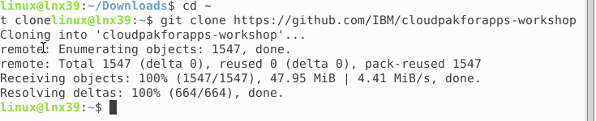
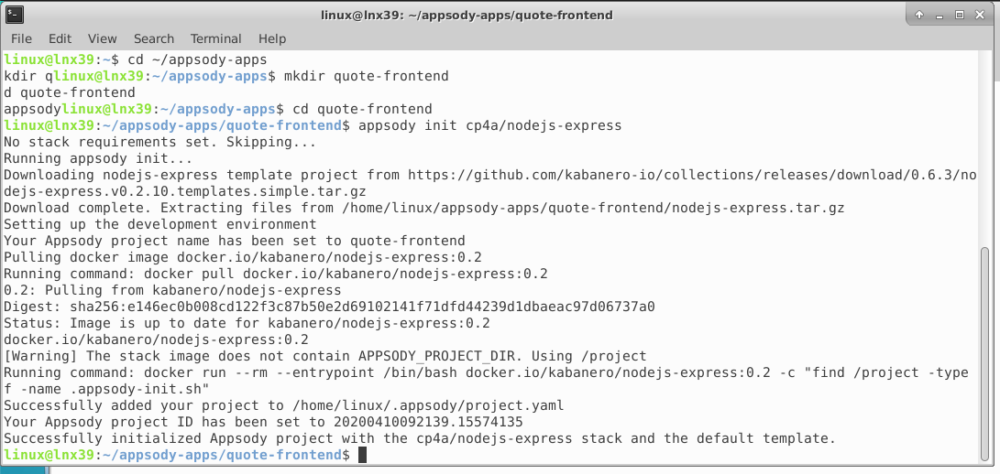
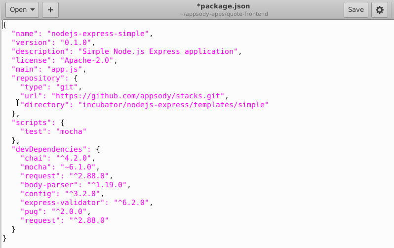

This is a part of IBM CloudPak for Applications Workshop created for IBM Poland by Maciej Szulc (maciej.szulc@pl.ibm.com).
Workshop labs contains parts created originally by several IBMers, including Franck Descollonges, Philippe Thomas,  [Henry Nash](https://github.com/henrynash) and [Steve Martinelli](https://github.com/stevemar). 

If You're interested in participating in this event, held monthly in Polish language in Warsaw, contact maciej.szulc@pl.ibm.com.

__We do not distribute presentations used during the workshop.__


In this exercise, we will show how to create a sample insurance quote application using Appsody. Appsody, part of Cloud Pak for Applications, is a project that provides the following tools you can use to build cloud-native applications:

- a command-line interface to develop containerized applications, test them locally, and then build and deploy them to Kubernetes
- a set of pre-configured "stacks" and templates for popular open source runtimes (such as Node.js and Spring Boot) on which to build applications

When you have completed this exercise, you will understand how to

- create a frontend web application and a backend REST application using the Appsody Node.js Express and Spring Boot stacks
- test the applications locally in a containerized environment


# Application architecture


1. The user enters the URL of the frontend application into a browser. The frontend application displays an insurance quote form in response.
2. The user fills in the form and clicks a button to submit it. The frontend application validates the form data and sends a REST request to the backend application.
3. The backend application uses the [Dacadoo Health Score API](https://info.dacadoo.com/) to compute a health score from the form data and then computes a quote from that.

# 


# 1. Login to the system

Our lab environment is quite complex, that's why we will be using non-standard techniques to access it. Our CloudPak cluster is not accesible from the Internet, we need to use intermediate server.

This is how it is constructed:


You have received account details which looks like:

```
*******************************************************************************
 ID Środowiska: 01
*******************************************************************************

------------------------------  LAB27 server account --------------------------
 Serwer:        lab27.team.waw.pl  Porty: SSH:22015     VNC:24015 Desktop:26015
                            Hasło: 44444aaaaa

-------------   Konto  OPENSHIFT CLUSTER dla  4.x.cloudpak.site   -------------
Adres klastra (niedostępny z internetu): https://lb.4.x.cloudpak.site:6443
Userid:   labuser01    Hasło:   44444aaaaa    Projeky:   labproj01
-------------------------------------------------------------------------------
```


You will have to use:

- VNC port number - **like** "24015" in the example above
- Desktop port number - like 26015 in the example above
- PASSWORD - **like** "44444aaaaa"  in the example above. It works for all types of connection
- Openshift Userid - **like** "labuser01"  in the example above
- Openshift Project - **like** "labproj01"  in the example above

**Please note this data, You will  need that later.**


In order to complete our exercises You will have to connect to the server using ONE of methods:

- VNC Viever - connecting to VNC port. If You already have the VNC Viewer installed, fell free to use this method. 

- WEB Desktop - connecting to Desktop port. It requires only the browser, nothing needs to be installed. It is usually easier to use.

  

## VNC Connection

**Use this section ONLY if You have chosen the VNC as connection method**

### VNC for MAC devices

VNC client is a part of MacOS system, You don't have to install anything.

- Open Finder  

- Pick "Go" ("Idź") from the menu in the top section of Your screen

- Pick "Connect to server" ("Połącz z serwerem")

- Enter 

  ```
  vnc://lab27.team.waw.pl:<YOUR VNC PORT NUMBER>
  ```

  example:

  ```
  vnc://lab27.team.waw.pl:24051
  ```

  in the address bar; **substitute <YOUR VNC PORT NUMBER> with the data You have collected before**

  

  Click "Connect" and provide the password You have collected before.

  


### VNC for Windows devices

VNC client is NOT a part of Windows system, You have to install VNC Client.

There are many sources of VNC client, I'd recommend:

- https://www.realvnc.com/en/connect/download/viewer/ 

From the menu below "Download VNC Viewer" pick **"Standalone EXE x86"** and download it. Open the file (it does not require to be installed) and fill with connection address:

```
lab27.team.waw.pl:<YOUR VNC PORT NUMBER>
```

example:

```
lab27.team.waw.pl:24051
```

**substitute <YOUR VNC PORT NUMBER> with the data You have collected before**


## Web Desktop Connection

**Use this section ONLY if You have chosen the Web Desktop as connection method. It is not required if You are using VNC but You may encounter difficulties with copy-and-paste!**

Open Your browser and enter the address:

```
http://lab27.team.waw.pl:<Web desktop port>/guacamole
```

Your desktop port has been provided by IBM Staff.

Login using username "linux" and Your password.


From the "All Connections" pick "Ubuntu - VNC"


There is a Guacamole menu available to change the settings. You may open this by pressing:

- Shift - Control - Option on MAC devices
- Shift - Alt - Control on Windows devices

It is quite usefull to change the "Input Method" to "Text Input" - it will open the bar at the bottom of the screen that allows to copy-and-paste text to the Linux system.


​	

# Clone the repo 


We need to clone the repo: https://github.com/IBM/cloudpakforapps-workshop in Your home directory.

Navigate to the CLI window and issue commands:

```
cd ~
git clone https://github.com/IBM/cloudpakforapps-workshop
```





# App build steps

1. [Create the frontend application and run it locally]()
2. [Create the backend application and run it locally]()


## Create the frontend application and run it locally

The frontend application is written in Node.js Express. First let's initialize an Appsody project that uses the Node.js Express stack. 

Create a directory somewhere outside where you cloned this project and run the `appsody init` command shown below.


```
cd ~/appsody-apps
mkdir quote-frontend
cd quote-frontend
appsody init cp4a/nodejs-express
```




After `appsody init` completes, list the content of the directory. You'll see that Appsody has created a starter application for you.


```
.
├── app.js
├── package-lock.json
├── package.json
└── test
    └── test.js
```


We're going to replace the starter code with the insurance quote frontend application. First you must edit the `package.json`.

There are two editors available on our server:

- command-line `vi`
- gui-based `gedit`


Pick what best suits Your needs. We will use gedit, but any text editor will do the job.

```
gedit package.json
```


Add the following to the `devDendencies` section:

```
...
    "body-parser": "^1.19.0",
    "config": "^3.2.0",
    "express-validator": "^6.2.0",
    "pug": "^2.0.0",
    "request": "^2.88.0"
...
```


Double check the `commas` on the devDependencies list!



`Save` the file and `exit` the editor.


Now copy the files from the `quote-frontend` directory in the cloned git repo to your Appsody project:

```
cp -R ~/cloudpakforapps-workshop/exercise-frontend/* .
```


The resulting directory structure of your Appsody project should look like this:


Let's check if app works. Start the app by command below: 

```
appsody run
```

the app should start:


Select `Applications->Internet` from the desktop menu and open `firefox` browser


We can now check that the app is running by hitting the endpoint [http://localhost:3000](http://localhost:3000/). You have to use the browser on lab27 server, not on Your laptop!


You can fill in the form and hit the button to submit it and a response will appear. In this case the frontend application is not sending a request to the backend application. Instead it is configured to use a **mock endpoint for testing purposes in development mode**. This works as follows.

- `quote.js` uses the [config](https://www.npmjs.com/package/config) module to get the value for the backend URL.
- When the application runs in development mode, the config module uses `config/development.json` to find the value for the backend URL.

This file sets the URL to the mock endpoint.


```
{
    "backendUrl": "http://localhost:3000/quote/test"
}
```

- When the application runs in production mode (which we'll see later), the config module uses `config/custom-environment-variables.json` to find the value for the backend URL.

This file sets the URL from the `BACKEND_URL` environment variable.


```
{
    "backendUrl": "BACKEND_URL"
}
```


Get back to the CLI window, press `Ctrl-C` in the window where the application is running to stop it.


## Create the backend application and run it locally

The backend application is written in Spring Boot. 

Let's initialize an Appsody project that uses the Spring Boot 2 stack. 

```
cd ~/appsody-apps
mkdir quote-backend
cd quote-backend
appsody init cp4a/java-spring-boot2
```


The Spring Boot 2 stack also provides out-of-the-box health checking and application metrics endpoints.

- Health endpoint: http://localhost:8080/actuator/health
- Liveness endpoint: http://localhost:8080/actuator/liveness
- Metrics endpoint: http://localhost:8080/actuator/metrics
- Prometheus endpoint: http://localhost:8080/actuator/prometheus

We're going to replace the starter code with the insurance quote backend application. 


There are two editors available on our server:

- command-line `vi`
- gui-based `gedit`

Pick what best suits Your needs. We will use gedit, but any text editor will do the job.


Edit the `pom.xml` file and add the following dependency to the dependencies section.

```
gedit pom.xml
```


```
  <dependencies>
    .
    .
    .
    <dependency>
        <groupId>org.projectlombok</groupId>
        <artifactId>lombok</artifactId>
        <version>1.18.8</version>
    </dependency>
  </dependencies>
```

Now copy the files from the `quote-backend` directory in the cloned git repo to your Appsody project, for example:


```
cp -R ~/cloudpakforapps-workshop/exercise-backend/* .
```

The resulting directory structure of your Appsody project should look like this:


```
.
├── src/main/java/application/LivenessEndpoint.java
├──                          /Main.java
├── src/main/resources/public/index.html
├──                   /application.properties
├──                   /application.yaml
├── test/java/application/MainTests.java
├── test/java/application/QuoteTests.java
├── target/* (compiled code)
├── .appsody-config.yaml
├── .gitignore
├── backend-input.json
└── pom.xml
```

You can test the backend API using [curl](https://curl.haxx.se/download.html). The file `backend-input.json` contains sample input for the API. Issue the `curl` command from the project directory.


```
curl -X POST -d @backend-input.json  -H "Content-Type: application/json"  http://localhost:8080/quote
```

You should see output similar to the following:


```
$ curl -X POST -d @backend-input.json  -H "Content-Type: application/json"  http://localhost:8080/quote
{"quotedAmount":30,"basis":"mocked backend computation"}
```

In this case the backend application is not sending a request to the Dacadoo health score API. Instead it is configured to use a mock endpoint for testing purposes in development mode. This works as follows:

- `src/main/java/application/Quote.java` uses `@Value("${DACADOO_URL}")` and `@Value("${DACADOO_APIKEY}")` to get the values of the Dacadoo Health Score API endpoint URL and the API key.

- `src/main/resources/application.yaml` defines mock values for the URL and API key.

  

  ```
  DACADOO_URL: http://localhost:8080/mockscore
  DACADOO_APIKEY: TEST
  ```

- When the application runs in production mode (which we'll see later), environment variables can be used to set the URL and API key. Environment variables override the values in the `application.yaml` file.

Press `Ctrl-C` in the window where the application is running to stop it.

You can use `appsody test` to run automated tests for this application.


```
appsody test
```

Look at [quote-backend/src/test/java/application/QuoteTests.java](https://github.com/IBM/cloudpakforapps-workshop/tree/e49da15d609c4657f15a1d7a51e4ce48b9a88d57/workshop/exercise-2/quote-backend/src/test/java/application/QuoteTests.java) to see the tests for the backend application.

**Congratulations**! We have tested out our sample application locally and are ready to move on to the next step, deploying it!


# Lab finished

Congratulations**! You've just completed the intro exercises for Appsody and Codewind!

