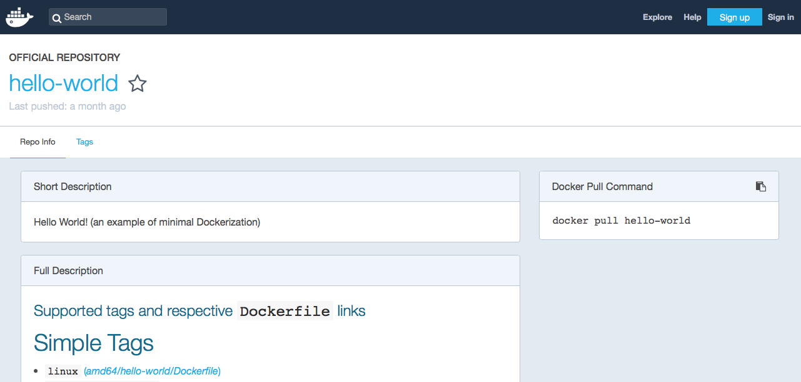
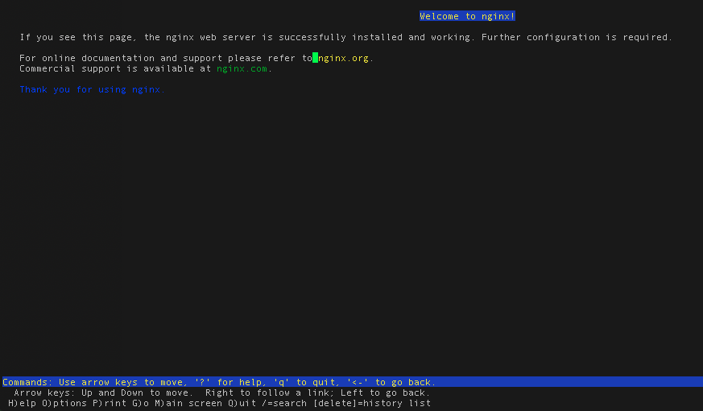

# IBM Cloud Container Workshop

###### version: 2020-03-03

---
# Lab 2: Let's get familiar with Docker
---


## Prerequisites
>***Note:*** This lab assumes that you are running this from a "clean" environment. Clean means that you have not used docker with the images in this lab. This is important for someone who hasn't seen docker so they can see the activity as images are downloaded.


# 1. Working with Docker


## Check Docker version


Connect to the lab27 server provided by IBM using server name, port number, username and password. 

``ssh -p <PORT> root@<Your IP Address:port``

or use any other SSH client (like putty)

Confirm that docker is installed.

`docker version`

Output (version may differ, it's OK):

```console
docker version
Client: Docker Engine - Community
 Version:           18.09.1
 API version:       1.39
 Go version:        go1.10.6
 Git commit:        4c52b90
 Built:             Wed Jan  9 19:33:12 2019
 OS/Arch:           darwin/amd64
 Experimental:      false

Server: Docker Engine - Community
 Engine:
  Version:          18.09.1
  API version:      1.39 (minimum version 1.12)
  Go version:       go1.10.6
  Git commit:       4c52b90
  Built:            Wed Jan  9 19:41:49 2019
  OS/Arch:          linux/amd64
  Experimental:     true
```


## Run your first container

As with all new computer things, it is obligatory that we start with "hello-world"

`docker run hello-world`

Output:

```console 
> docker run hello-world
Unable to find image 'hello-world:latest' locally
latest: Pulling from library/hello-world
1b930d010525: Pull complete 
Digest: sha256:2557e3c07ed1e38f26e389462d03ed943586f744621577a99efb77324b0fe535
Status: Downloaded newer image for hello-world:latest

Hello from Docker!
This message shows that your installation appears to be working correctly.

To generate this message, Docker took the following steps:
 1. The Docker client contacted the Docker daemon.
 2. The Docker daemon pulled the "hello-world" image from the Docker Hub.
    (amd64)
 3. The Docker daemon created a new container from that image which runs the
    executable that produces the output you are currently reading.
 4. The Docker daemon streamed that output to the Docker client, which sent it
    to your terminal.

To try something more ambitious, you can run an Ubuntu container with:
 $ docker run -it ubuntu bash

Share images, automate workflows, and more with a free Docker ID:
 https://hub.docker.com/

For more examples and ideas, visit:
 https://docs.docker.com/get-started/
```

   

 > Notice the message `Unable to find image 'hello-world:latest' locally` First you see that the image was automatically downloaded without any additional commands. Second the version `:latest` was added to the name of the image. We did not specify a version for this image.


## Rerun "hello-world" 

Notice that the image is not pulled down again. It already exists locally, so it is run.

`docker run hello-world`

Output:

```console 
> docker run hello-world

Hello from Docker!
This message shows that your installation appears to be working correctly.

To generate this message, Docker took the following steps:
 1. The Docker client contacted the Docker daemon.
 2. The Docker daemon pulled the "hello-world" image from the Docker Hub.
    (amd64)
 3. The Docker daemon created a new container from that image which runs the
    executable that produces the output you are currently reading.
 4. The Docker daemon streamed that output to the Docker client, which sent it
    to your terminal.

To try something more ambitious, you can run an Ubuntu container with:
 $ docker run -it ubuntu bash

Share images, automate workflows, and more with a free Docker ID:
 https://hub.docker.com/

For more examples and ideas, visit:
 https://docs.docker.com/get-started/
```


## Show the image

List all the images:

 `docker images hello-world`

Output:

```console 
docker images
REPOSITORY          TAG                 IMAGE ID            CREATED             SIZE
hello-world         latest              fce289e99eb9        3 weeks ago         1.84kB
```


## From where was the `hello-world` image pulled? 

Go to 

https://hub.docker.com/_/hello-world

[]: https://hub.docker.com/_/hello-world


[https://hub.docker.com/_/hello-world]: https://hub.docker.com/_/hello-world	"Docker hub for hello-world"

 and you can read about this image. Docker-hub is a registry that holds docker images for use. Docker-hub is not the only registry, IBM Cloud Public can serve as a docker registry. You can also have (or define) private registries.

 


## Run a new container

This image is a typical image to get started with Docker. When an image is run it usually continues to run. 

The running image is called a **container**. Let us run a more typical image; This image contains the noSQL database **couchDB**. As there is no image containing couchDB on your laptop, you will first pull it from the Docker Hub and then once all the layers have been downloaded and extracted, you will run it.

`docker run -d couchdb:2.3`

Output:

```console 
# docker run -d couchdb:2.3
Unable to find image 'couchdb:2.3' locally
2.3: Pulling from library/couchdb
6d28e14ab8c8: Pull complete 
9cf6e27e7e38: Pull complete 
42b5abda8b4a: Pull complete 
8bebdbf0d037: Pull complete 
c4fe5c72aa46: Pull complete 
826e8450a2f9: Pull complete 
b532c77aaab4: Pull complete 
082543d2064f: Pull complete 
47ef01c661ae: Pull complete 
bc430133d600: Pull complete 
0b97babb4122: Pull complete 
Digest: sha256:336eb80a4c328b50fe310d46806fc85624985e674c2b0bb97608628881284fcf
Status: Downloaded newer image for couchdb:2.3

0ae497ff65e56d005189906bf4ddfa6a85484cd5ba2796d725e2db1b6b9c639e
```

 The output above was captured while the image was still downloading from docker-hub. When the download is complete,  you don't see anything from the container, like with hello-world. Instead you see a long hex id like `0ae497ff65e56d005189906bf4ddfa6a85484cd5ba2796d725e2db1b6b9c639e`. **This is the long id of the container**.

```console 
Digest: sha256:336eb80a4c328b50fe310d46806fc85624985e674c2b0bb97608628881284fcf
Status: Downloaded newer image for couchdb:2.3

0ae497ff65e56d005189906bf4ddfa6a85484cd5ba2796d725e2db1b6b9c639e
```

Also notice that the -d in the run command with launch the container as **detached** and so you can get the prompt and the command has been completed.


### Here's how you would see the running container. 

Notice only the first part of that long hex id is displayed. Typically this is more than enough to uniquely identify that container. `docker ps` provides information about when the container was created, how long it has been running, then name of the image as well as the name of the container. Note that each container must have a unique name. You can specify a name for each container as long as it is unique.

`docker ps | grep couchdb` or `docker ps`

Output:

```console 
docker ps               
CONTAINER ID        IMAGE               COMMAND                  CREATED             STATUS              PORTS                          NAMES
272d409a806c        couchdb             "tini -- /docker-ent…"   3 minutes ago       Up 3 minutes        4369/tcp, 5984/tcp, 9100/tcp   xenodochial_heisenberg
```

You will notice that the name is auto-generated by Docker:  **xenodochial_heisenberg**. So to avoid this, a good practice is to always give a name to a container with the **--name** parameter.


### An image can be run multiple times 

Launch another container for the couchdb image.

`docker run -d couchdb:2.3`
Output:

```console 
> docker run -d couchdb:2.3
fd511f9cd8965395bfcb652d6a10b5eec5c0b4479950064d7e238420c8099a6b
```

Did you notice how quickly the second instance started? There was no need to download the image this time. The id of the container is show after is has started. You can notice that we are reusing all the layers already downloaded when we first pull the image.


### Two couchDB containers  

`docker ps | grep couchdb` or just `docker ps`

Outpout:

```console 
root@lnx101:~# docker ps 
CONTAINER ID        IMAGE               COMMAND                  CREATED             STATUS              PORTS                          NAMES
66f573e0a722        couchdb:2.3         "tini -- /docker-ent…"   24 seconds ago      Up 23 seconds       4369/tcp, 5984/tcp, 9100/tcp   sharp_archimedes
0ae497ff65e5        couchdb:2.3         "tini -- /docker-ent…"   2 minutes ago       Up About a minute   4369/tcp, 5984/tcp, 9100/tcp   busy_merkle
```


### Similar couchDB instances 

The containers look similar, but they have unique names and unique ids. 

Stop the most recent container and then check to see what's running - use docker stop command with **Your CONTAINER ID, as returned by last command**:

`docker stop 66f573e0a722 `

Output:

```console 
> docker stop 66f573e0a722
66f573e0a722
```

Then check the container list:

`docker ps | grep couchdb`or `docker ps`

Output:

```console
root@lnx101:~# docker ps 
CONTAINER ID        IMAGE               COMMAND                  CREATED             STATUS              PORTS                          NAMES
0ae497ff65e5        couchdb:2.3         "tini -- /docker-ent…"   3 minutes ago       Up 2 minutes        4369/tcp, 5984/tcp, 9100/tcp   busy_merkle
```

So we still have one running container.

​    


### Stop the other container

Stop the other container and see what is running - use docker stop command with **Your CONTAINER ID, as returned by "docker ps" command**:

 `docker stop 0ae497ff65e5`

 `docker ps | grep couchdb` or `docker ps`

Output:

```console 
docker ps
CONTAINER ID        IMAGE               COMMAND             CREATED             STATUS              PORTS               NAMES
```

We have no more couchDB running constainer.

 

## What about the images

 Notice that the images still exist.

 `docker images`

Output:

```console
root@lnx101:~# docker images
REPOSITORY          TAG                 IMAGE ID            CREATED             SIZE
couchdb             2.3                 23350347cb48        25 hours ago        201MB
hello-world         latest              fce289e99eb9        14 months ago       1.84kB
```

>  You can filter the images by they names : `docker images couchdb`   

## How to pass the config data to the container?

We have used the 2.3 version of the couchdb server. Let's check if it is easy to switch to 3.0 branch. Let's exec container with the 3.0.0 version of the database:

```docker run -d couchdb:3.0.0```

result:

```
root@lnx101:~# docker run  couchdb:3.0.0
Unable to find image 'couchdb:3.0.0' locally
3.0.0: Pulling from library/couchdb
68ced04f60ab: Pull complete 
82b53e02635d: Pull complete 
ad3b2c6707d6: Pull complete 
476af73bc077: Pull complete 
1e9097bacd3c: Pull complete 
5f1735d1e02f: Pull complete 
1d290ca76246: Pull complete 
61019970e820: Pull complete 
7efd4f928fc2: Pull complete 
a2de1ec2ac9a: Pull complete 
a2b2b47b6f3d: Pull complete 
Digest: sha256:50e377f2f8d17d47fb621a785af4ad7d4bb5e7dc8f7f1259af44436db8c38e07
Status: Downloaded newer image for couchdb:3.0.0

ad087a2a41b9bf2a06a9900d378103c1bbfc32bcb2cf74e3ee4d4550e41e939f
```

let's check if it is working in the background:

```
docker ps
```

but the result is not so promising - the database is not working:

```
root@lnx101:~# docker ps
CONTAINER ID        IMAGE               COMMAND             CREATED             STATUS              PORTS               NAMES

```

so let's check logs. First we need to verify the ID of failed container asking also for stopped containers with -a flag:

```docker ps -a```

result:

```
root@lnx101:~# docker ps -a
CONTAINER ID        IMAGE               COMMAND                  CREATED              STATUS                          PORTS               NAMES
ad087a2a41b9        couchdb:3.0.0       "tini -- /docker-ent…"   About a minute ago   Exited (1) About a minute ago                       relaxed_shirley

```

and now we may ask for logs with the command below (**use the container ID from command above**:

```
root@lnx101:~# docker logs ad087a2a41b9
*************************************************************
ERROR: CouchDB 3.0+ will no longer run in "Admin Party"
       mode. You *MUST* specify an admin user and
       password, either via your own .ini file mapped
       into the container at /opt/couchdb/etc/local.ini
       or inside /opt/couchdb/etc/local.d, or with
       "-e COUCHDB_USER=admin -e COUCHDB_PASSWORD=password"
       to set it via "docker run".
*************************************************************
```

It has turned out, that newer version requires to pass the admin username and password, otherwise it refuses to work. You may pass the parameters as a environment variable with a "-e" flag.

Let's do that!

```
docker run -e COUCHDB_USER=admin -e COUCHDB_PASSWORD=password -d couchdb
```

and the result:

```
root@lnx101:~# docker run -e COUCHDB_USER=admin -e COUCHDB_PASSWORD=password -d couchdb

Unable to find image 'couchdb:latest' locally
latest: Pulling from library/couchdb
Digest: sha256:50e377f2f8d17d47fb621a785af4ad7d4bb5e7dc8f7f1259af44436db8c38e07
Status: Downloaded newer image for couchdb:latest
509496667e4d32522391b2a214370625d5972664e166cc61379298c147e08d26
```

let's check if database works:

```
docker ps
```

and yes, it works:

```
root@lnx101:~# docker ps 
CONTAINER ID        IMAGE               COMMAND                  CREATED             STATUS              PORTS                          NAMES
509496667e4d        couchdb             "tini -- /docker-ent…"   13 seconds ago      Up 11 seconds       4369/tcp, 5984/tcp, 9100/tcp   dreamy_euclid

```


## Now remove the couchDB image 

Go ahead and delete the couchDB image and double check that it is gone.

` docker rmi couchdb:2.3`

Output:

```console
root@lnx101:~# docker rmi couchdb:2.3
Error response from daemon: conflict: unable to remove repository reference "couchdb:2.3" (must force) - container 0ae497ff65e5 is using its referenced image 23350347cb48

```

Apparently some stopped containers are still using this images and you can see the ids.

   

### Oops, it is not working

We can't delete that image until we delete the "couchdb" containers.

> Note the `docker ps -a` will show us all the containers, not just the ones that are running but also the ones that stopped.
You will noticed that all containers that you are listing have been stopped. 

`docker ps -a | grep couchdb:2.3`

Output:

```console
root@lnx101:~# docker ps -a | grep couchdb:2.3
66f573e0a722        couchdb:2.3         "tini -- /docker-ent…"   18 minutes ago      Exited (0) 17 minutes ago                                  sharp_archimedes
0ae497ff65e5        couchdb:2.3         "tini -- /docker-ent…"   20 minutes ago      Exited (0) 8 minutes ago                                   busy_merkle

```

 

### How to remove the image

Delete the stopped couchdb containers, delete the couchdb image, and make sure it is gone. You can leave hello-world. Use "docker rm" command with **Your CONTAINER ID, as returned by "docker ps" command**:

`docker rm 
Output:

```console 
> docker rm 66f573e0a722 0ae497ff65e5
fd511f9cd896
272d409a806c
```

And use the rmi subcommand to remove the image:

 `docker rmi couchdb:2.3`

Output:

```console 
docker rmi couchdb:2.3
Untagged: couchdb:2.3
Untagged: couchdb@sha256:7f3e6372ff8a87f1a11c63a787ec7dceda85a8fe80005d6c5bbdfa6a6bcde73e
Deleted: sha256:3bfb066ff4c595317efd3dc672a98b3defce21427947ecb9288ffec6c7040c2b
Deleted: sha256:24efa375156ab1fe149fd095d21323680c4530f0f64989969d7997d0a32cebc2
Deleted: sha256:50840db451c21948e918cf3c2db0a89c4ed76f729a8cac419d1e0d745e739fda
Deleted: sha256:c272e617d5eed77d55fd7073a4c4200d50bf18ea5e35243cbc0ec7745912d065
Deleted: sha256:f74e6db8d559ada1ff9b71c757b241e429fbc150a8a3f7e007900846ff10c248
Deleted: sha256:0b9811c169c2edddf0e191a8da18786c781aa24d3ca4d4462fe5dbf345a5f656
Deleted: sha256:59cd6ba3a99fdece33f78b17ae7d908f684613d6be1a5429dc4290741f578269
Deleted: sha256:c474aa358b6a6d72574df65d49cc69fec3dd49679c462d0a3d0fc97c4c047b6e
Deleted: sha256:50f770ebecbd64387b54a687174e0c49097ca322b273d210ebea2635ce617552
Deleted: sha256:364bb10db37ea4450918268f69022d61d2fc650c4866b8c5847da29c6602e8ba
Deleted: sha256:a73e1b77a9ebbb952dc8a70fea3a3acfec7a87169ca8ce2f8255c9705994e8d1
Deleted: sha256:b7d374e01be227502917dab0d981f6018e29519f966bc94d7e70fd5f89850aa5
Deleted: sha256:3c816b4ead84066ec2cadec2b943993aaacc3fe35fcd77ada3d09dc4f3937313
```

Notice that all the layers in the image have been gone.  

`docker ps -a | grep couchdb:2.3`

  >***Note:*** Docker images and containers can be referenced by **name** or by **id**. 
  >
  >An alternative to these commands is to use a combined command like the following one :
  >
  > `docker rm -v $(docker ps -a -q)`
  >
  >However be carefull with that command that will remove all containers.

## Clean the environment. 

**Check what You have learnt: Try to stop the couchdb:3.0.0 container that runs on Your host and remove it's image by Yourself!**


# 2: Building Docker Images

A Dockerfile is a text file that has a series of instructions on how to build your image. It supports a simple set of commands that you need to use in your Dockerfile. There are several commands supported like FROM, CMD, ENTRYPOINT, VOLUME, ENV and more. We shall look at some of them.

Let us first start with the the overall flow, which goes something like this:

1. You create a Dockerfile with the required instructions.
2. Then you will use the docker build command to create a Docker image based on the Dockerfile that you created in step 1.

With this information, let us get going.


## Our First Dockerfile

First let's create a directory:

`mkdir images`

`cd images`

`nano Dockerfile`or `notepad Dockerfile` or ```vi Dockerfile```

Now type the following 2 lines:

```
FROM busybox:latest
MAINTAINER yourname
```

Replace **yourname** with your name. 

Since, a Docker image is nothing but a series of layers built on top of each other, we start with a base image. The FROM command sets the base image for the rest of the instructions. The MAINTAINER command tells who is the author of the generated images. This is a good practice. You could have taken any other base image in the FROM instruction too, for e.g. ubuntu:latest or ubunt:14.04, etc.

**Busybox** is just the set of most of the shell commands. A very light subset of Linux. Busybox as an image has not been pulled yet.

Now, **save** the file and come back to the prompt (ctrl O, enter, ctrl X) for nano.

Execute the following in the /images folder as shown below (don't forget the **dot** at the end):

`docker build -t myimage:latest .`

Result: 
``` console
> docker build -t myimage:latest .
Sending build context to Docker daemon  2.048kB
Step 1/2 : FROM busybox:latest
latest: Pulling from library/busybox
57c14dd66db0: Pull complete 
Digest: sha256:7964ad52e396a6e045c39b5a44438424ac52e12e4d5a25d94895f2058cb863a0
Status: Downloaded newer image for busybox:latest
 ---> 3a093384ac30
Step 2/2 : MAINTAINER yourname
 ---> Running in 97df43af5cdb
Removing intermediate container 97df43af5cdb
 ---> e50f1efaafdc
Successfully built e50f1efaafdc
Successfully tagged myimage:latest
```
This command is used to build a Docker image. The parameters that we have passed are:

- -t is the Docker image tag. You can give a name to your image and a tag.
- The second parameter (a ‘.’) specifies the location of the Dockerfile that we created. Since we created the Dockerfile in the same folder in which we are running the docker build, we specified the current directory.

Notice the various steps that the build process goes through to build out your image.

If you run a docker images command now, you will see the myimage image listed in the output as shown below:

`docker images | grep myimage`

```console
> docker images | grep myimage
REPOSITORY          TAG                 IMAGE ID            CREATED             SIZE
myimage             latest              e50f1efaafdc        4 minutes ago       1.2MB
```

You can notice that we have created myimage ! The images are very tiny.

You can now launch a container, any time via the standard docker run command:

`docker run -it myimage`

```console
> docker run -it myimage
/ # ls
bin   dev   etc   home  proc  root  sys   tmp   usr   var
/ # ps
PID   USER     TIME  COMMAND
    1 root      0:00 sh
    8 root      0:00 ps
/ # exit
```

We are entering into the myimage shell (-it parameter). And you can use any shell commands like ls or ps inside the container. Type ***exit*** to come back to the standard shell.

`nano Dockerfile`or `notepad Dockerfile` 

```console
FROM busybox:latest
MAINTAINER yourname
CMD ["date"]
```

Then build and run the myimage container:

`docker build -t myimage:latest .`

`docker run -it myimage`

```console
> docker run -it myimage
Mon Apr 16 12:44:10 UTC 2018
```


The CMD instruction takes various forms and when it is used individually in the file without the ENTRYPOINT command (which we will see in a while), it takes the following format:

`CMD ["executable","param1","param2"]`

So in our case, we provided the date command as the executable and when we ran a container based on the myimage now, it printed out the data.

In fact, while launching the container, you can override the default CMD by providing it at the command line as shown below. In this example, we are saying to launch the shell , thereby overriding the default CMD instruction for the Docker Image. Notice that it will lead us into the shell.

Change your Dockerfile to the following:

```console
FROM busybox
MAINTAINER myname
ENTRYPOINT ["/bin/cat"]
CMD ["/etc/passwd"]
```

Save, **Build** and re-rerun myimage. 

`docker build -t myimage:latest .`

`docker run -it myimage`

```console
root:[images]: docker run -it myimage
root:x:0:0:root:/root:/bin/sh
daemon:x:1:1:daemon:/usr/sbin:/bin/false
bin:x:2:2:bin:/bin:/bin/false
sys:x:3:3:sys:/dev:/bin/false
sync:x:4:100:sync:/bin:/bin/sync
mail:x:8:8:mail:/var/spool/mail:/bin/false
www-data:x:33:33:www-data:/var/www:/bin/false
operator:x:37:37:Operator:/var:/bin/false
nobody:x:65534:65534:nobody:/home:/bin/false
```


## Building a web server


Now, let us look at another Dockerfile shown below:

```console
FROM ubuntu
MAINTAINER maciej.szulc
RUN apt-get update \
     && apt-get install -y nginx \
     && rm -rf /var/lib/apt/lists/*
ENTRYPOINT ["/usr/sbin/nginx","-g","daemon off;"]
EXPOSE 80
```

Here, what we are building is an image that will run the nginx proxy server for us. Look at the set of instructions and it should be pretty clear. After the standard FROM and MAINTAINER instructions, we are executing a couple of RUN instructions. A RUN instruction is used to execute any commands during the **build** process. In this case we are running a package update and then installing nginx. The ENTRYPOINT is then running the nginx executable and we are using the EXPOSE command here to inform what port the container will be listening on. Remember in our earlier chapters, we saw that if we use the -P command, then the EXPOSE port will be used by default. However, you can always change the host port via the -p parameter as needed.

Here are the steps:

`cd`

`mkdir webapp`

`cd webapp`

`nano Dockerfile` or `notepad Dockerfile` or `vi Dockerfile`

Copy and paste the Dockerfile text (see above). Save the file.

Now build the image:

`docker build . -t webapp:1`

And run it:

`docker run -d -p 8081:80 --name webserver webapp:1`

Let's verify if the app works with curl.

`curl http://localhost:8081`

Results :

```console
# curl http://localhost:8081
<!DOCTYPE html>
<html>
<head>
<title>Welcome to nginx!</title>
<style>
    body {
        width: 35em;
        margin: 0 auto;
        font-family: Tahoma, Verdana, Arial, sans-serif;
    }
</style>
</head>
<body>
<h1>Welcome to nginx!</h1>
<p>If you see this page, the nginx web server is successfully installed and
working. Further configuration is required.</p>
<p>For online documentation and support please refer to
<a href="http://nginx.org/">nginx.org</a>.<br/>
Commercial support is available at
<a href="http://nginx.com/">nginx.com</a>.</p>
<p><em>Thank you for using nginx.</em></p>
</body>
</html>
```

Or you can also open a command line text-mode http browser :

```lynx http:://localhost:8081```



###3. Troubleshooting containers  

To troubleshoot your container or your application, you may want to go inside the container to look at some logs or to see the processes.

`docker exec -it webserver "/bin/bash"`

> -it : this concerns the interation with the container by using a bash shell
>
> A prompt with the container id will be returned to you : **root@cc88b7536a57:/#**
>
> You can then type any kind of linux commands

Output:

```console
> docker exec -it webserver "/bin/bash"
root@cc88b7536a57:/# 
root@cc88b7536a57:/# 
root@cc88b7536a57:/# ll
total 72
drwxr-xr-x   1 root root 4096 Nov 30 14:59 ./
drwxr-xr-x   1 root root 4096 Nov 30 14:59 ../
-rwxr-xr-x   1 root root    0 Nov 30 14:59 .dockerenv*
drwxr-xr-x   1 root root 4096 Nov 30 14:58 bin/
drwxr-xr-x   2 root root 4096 Apr 24  2018 boot/
drwxr-xr-x   5 root root  340 Nov 30 14:59 dev/
drwxr-xr-x   1 root root 4096 Nov 30 14:59 etc/
drwxr-xr-x   2 root root 4096 Apr 24  2018 home/
drwxr-xr-x   1 root root 4096 Nov 12 20:54 lib/
drwxr-xr-x   2 root root 4096 Nov 12 20:55 lib64/
drwxr-xr-x   2 root root 4096 Nov 12 20:54 media/
drwxr-xr-x   2 root root 4096 Nov 12 20:54 mnt/
drwxr-xr-x   2 root root 4096 Nov 12 20:54 opt/
dr-xr-xr-x 580 root root    0 Nov 30 14:59 proc/
drwx------   2 root root 4096 Nov 12 20:56 root/
drwxr-xr-x   1 root root 4096 Nov 30 14:59 run/
drwxr-xr-x   1 root root 4096 Nov 30 14:58 sbin/
drwxr-xr-x   2 root root 4096 Nov 12 20:54 srv/
dr-xr-xr-x  13 root root    0 Nov 30 14:59 sys/
drwxrwxrwt   1 root root 4096 Nov 30 14:58 tmp/
drwxr-xr-x   1 root root 4096 Nov 12 20:54 usr/
drwxr-xr-x   1 root root 4096 Nov 30 14:58 var/
root@cc88b7536a57:/# ps -ef
UID        PID  PPID  C STIME TTY          TIME CMD
root         1     0  0 14:59 ?        00:00:00 nginx: master process /usr/sbin/
www-data     7     1  0 14:59 ?        00:00:00 nginx: worker process
www-data     8     1  0 14:59 ?        00:00:00 nginx: worker process
www-data     9     1  0 14:59 ?        00:00:00 nginx: worker process
www-data    10     1  0 14:59 ?        00:00:00 nginx: worker process
www-data    11     1  0 14:59 ?        00:00:00 nginx: worker process
www-data    12     1  0 14:59 ?        00:00:00 nginx: worker process
www-data    13     1  0 14:59 ?        00:00:00 nginx: worker process
www-data    14     1  0 14:59 ?        00:00:00 nginx: worker process
root        15     0  0 15:03 pts/0    00:00:00 /bin/bash
root        27    15  0 15:03 pts/0    00:00:00 ps -ef
```


Don't forget to **exit** from the container:

`# exit`

# 3: Clean the environment
Using the knowledge gained in this exercise:

1. Stop all running containers (docker ps, docker stop, docker rm)
2. Remove all images (docker images, docker rmi)

So the result will be as below:

```
root@lnx101:~/webapp# docker ps -a
CONTAINER ID        IMAGE               COMMAND             CREATED             STATUS              PORTS               NAMES

root@lnx101:~/webapp# docker images
REPOSITORY          TAG                 IMAGE ID            CREATED             SIZE

```


## Conclusion

Congratulations, you have successfully completed this Containers lab !  You've just build and run your first Docker-based web app !  

---
# End of the lab
---
