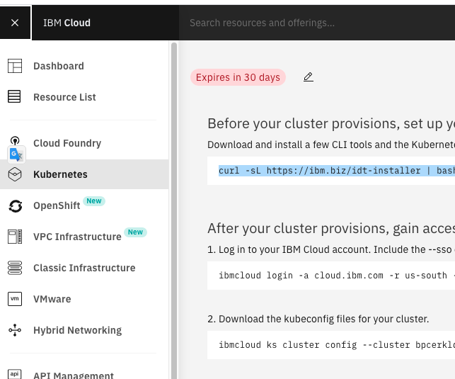
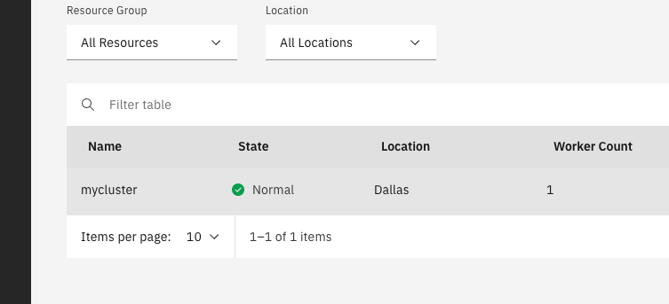
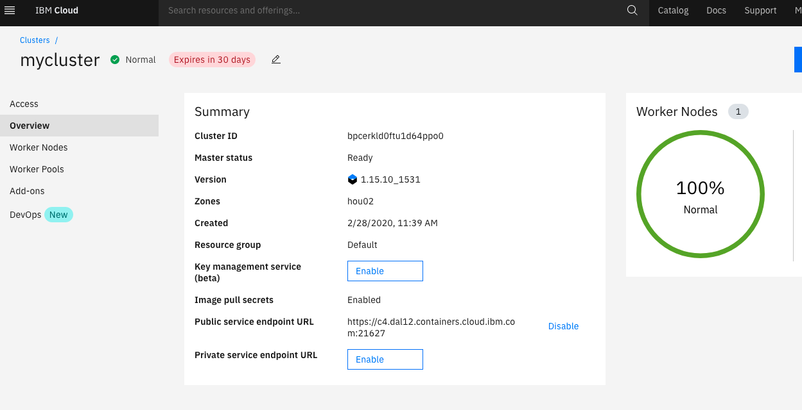
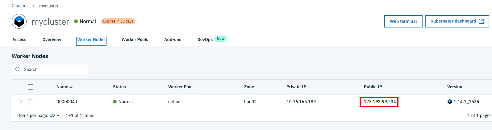
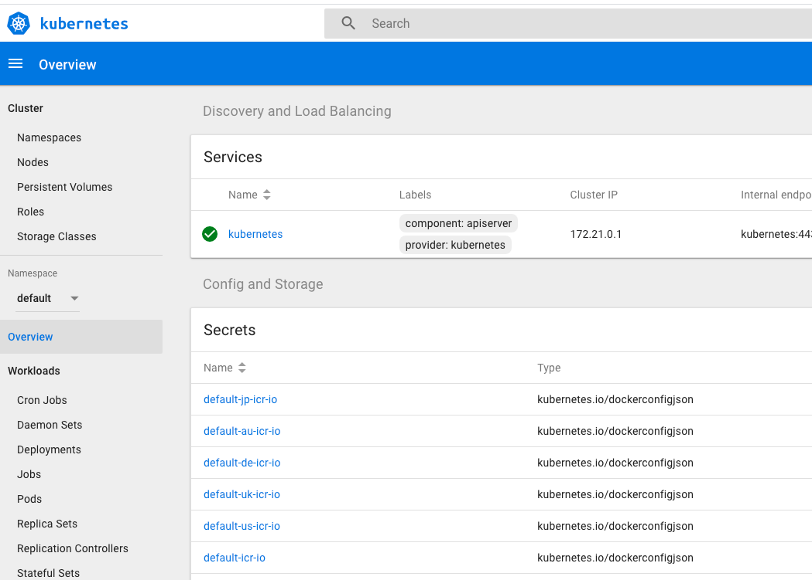
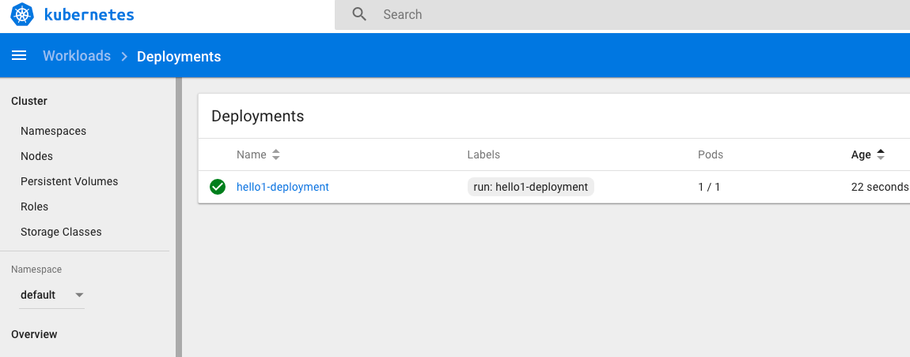
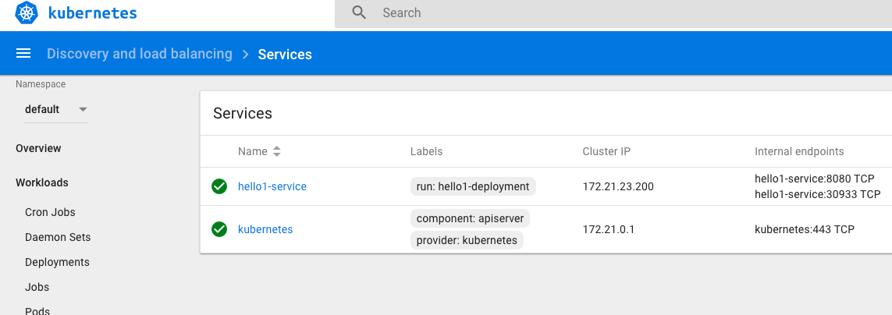
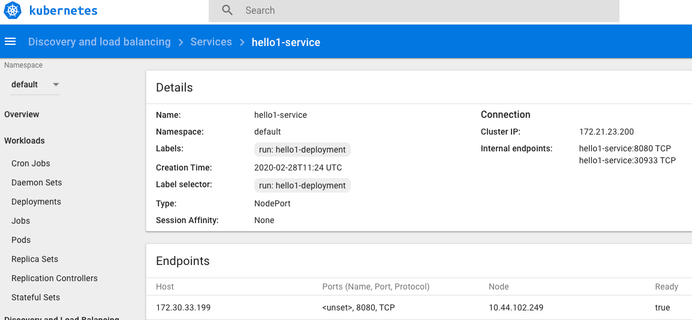
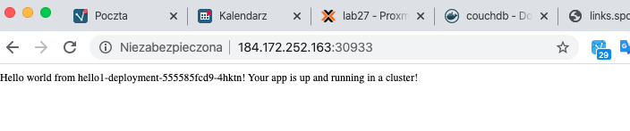
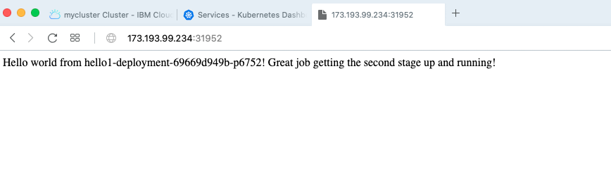

IBM Cloud Container Workshop

---
# Kubernetes in IBM Cloud Lab
---


---


# Introduction to IBM Cloud Kubernetes Service (IKS)

During our labs we will be using two different clusters: one installed on the server and one cloud-based. Let's meet first of them: IKS.

IBM Cloud Kubernetes Service is a hosted Kubernets in IBM Cloud.

It combines Docker and Kubernetes to deliver powerful tools, an intuitive user experience, and built-in security and isolation to automate the deployment, operation, scaling, and monitoring of containerized apps over a cluster of independent compute hosts by using the Kubernetes APIs.

During this lab we will be using two command line tools:

```
ibmcloud
```

which is a universal command line tool for interacting with all IBM Cloud services, including Kubernetes cluster.

```
kubectl
```

which is a Kubernetes configuration tool which works with all kubernetes installations.

## Kubernetes


Let's review basic terminology:


**Cluster**

A Kubernetes cluster consists of one or more virtual machines that are called worker nodes. Every worker node represents a compute host where you can deploy, run, and manage containerized apps. Worker nodes are managed by a Kubernetes master that centrally controls and monitors all Kubernetes resources in the cluster. When you deploy a containerized app, the Kubernetes master decides where to deploy the app, taking into account the deployment requirements and available capacity in the cluster.

**Pod**

Every containerized app that is deployed into a Kubernetes cluster is deployed, run, and managed by a pod. Pods represent the smallest deployable units in a Kubernetes cluster and are used to group containers that must be treated as a single unit. In most cases, a container is deployed to its own pod. However, an app might require a container and other helper containers to be deployed into one pod so that those containers can be addressed by using the same private IP address.

**Deployment**

A deployment is a Kubernetes resource where you specify your containers and other Kubernetes resources that are required to run your app, such as persistent storage, services, or annotations. Deployments are documented in a Kubernetes deployment script. When you run a deployment, the Kubernetes master deploys the specified containers into pods taking into account the capacity that is available on the worker nodes of the cluster. Other Kubernetes resources are created and configured as specified in the deployment script. 

You can use a deployment to define update strategies for your app, which includes the number of pods that you want to add during a rolling update and the number of pods that can be unavailable at a time. When you perform a rolling update, the deployment checks whether the revision is working and stops the rollout when failures are detected.

**Service**

A Kubernetes service groups a set of pods and provides network connection to these pods for other services in the cluster without exposing the actual private IP address of each pod. You can use a service to make your app available within your cluster or to the public internet. 

With IBM Cloud Kubernetes Service (IKS), you can define complex architectures that implement resiliency, high availability and replication between data centers and regions (also called AZ – availability zones).  

In this lab, we are not going to implement such a complex environment. 

We will use the cluster that You have provisioned in the "Preparations" lab today.

# Task 1 : prepare your environment

Deploy and manage your own Kubernetes cluster in the cloud. You can automate the deployment, operation, scaling, and monitoring of containerized apps in a cluster of independent compute hosts called worker nodes.

## 

### 1. Login to Your virtual machine

Login to Your provisioned server. Use Your IP address, as reveived from IBM staff.

```ssh root@<YOUR IP ADDRESS>:port```

### 2. Check that ibmcloud  command

Ibmcloud tools allows You to connect to all services in IBM cloud. Let's checks if it works again.

`ibmcloud plugin list`

Results: 

```bash
# ibmcloud plugin list
Listing installed plug-ins...

Plugin Name                            Version   Status   
cloud-functions/wsk/functions/fn       1.0.36       
cloud-object-storage                   1.1.2        
container-registry                     0.1.454      
container-service/kubernetes-service   0.4.90       
dev                                    2.4.6        
```

If there is no container-registry and container service, ask Your IBM staff.

### 3. Check kubectl command

Kubectl is a kubernetes command line interface. Let's check if it works.

Type the following command :

`kubectl version --short`

And you should get version for your client (exact version may differ, it's OK) :

``` bash
# kubectl version --short
Client Version: v1.15.10
The connection to the server localhost:8080 was refused - did you specify the right host or port?
```

The error at the end is **normal** because we need to specify how to connect to the master (see below).


### 4. Gain access to the cluster

In the first lab You have created cluster in the IBM Cloud. Now it is the time to connect!

We need to:

1. Login to IBM Cloud

2. Target Your cluster

3. Get credentials for kubectl command to work.

   

So - log into your IBM Cloud account, use the account data that You have created before:

`ibmcloud login -a cloud.ibm.com -r us-south -g Default`

result:

```
# ibmcloud login -a cloud.ibm.com -r us-south -g Default
API endpoint: https://cloud.ibm.com

Email> kari@dmailpro.net

Password> 
Authenticating...
OK

Targeted account Kiali Malli's Account (60b7082462f64beabb5dabae8a8b1b95)

Targeted resource group Default

Targeted region us-south

                      
API endpoint:      https://cloud.ibm.com   
Region:            us-south   
User:              kari@dmailpro.net   
Account:           Kiali Malli's Account (60b7082462f64beabb5dabae8a8b1b95)   
Resource group:    Default   
CF API endpoint:      
Org:                  
Space:                

Tip: If you are managing Cloud Foundry applications and services
- Use 'ibmcloud target --cf' to target Cloud Foundry org/space interactively, or use 'ibmcloud target --cf-api ENDPOINT -o ORG -s SPACE' to target the org/space.
- Use 'ibmcloud cf' if you want to run the Cloud Foundry CLI with current IBM Cloud CLI context.

```

Now we are logged in. Let's check if Your cluster is up and running:

```
ibmcloud ks cluster ls
```

the result should list the cluster as "**normal**":

```
oot@lnx101:~# ibmcloud ks cluster ls
OK
Name        ID                     State    Created          Workers   Location   Version        Resource Group Name   Provider   
mycluster   bpcerkld0ftu1d64ppo0   normal   24 minutes ago   1         Dallas     1.15.10_1531   Default               classic   

```

Next thing is to select cluster in CLI using "ibmcloud ks" command and prepare the "kubectl" credentials.

`ibmcloud ks cluster config mycluster`

Output:

``` bash
root@lnx101:~# ibmcloud ks cluster config mycluster
WARNING: The behavior of this command in your current CLI version is deprecated, and becomes unsupported when CLI version 1.0 is released in March 2020. To use the new behavior now, set the 'IKS_BETA_VERSION' environment variable. In bash, run 'export IKS_BETA_VERSION=1'.
Note: Changing the beta version can include other breaking changes. For more information, see 'https://ibm.biz/iks-cli-v1'

OK
The configuration for mycluster was downloaded successfully.

Export environment variables to start using Kubernetes.

export KUBECONFIG=/root/.bluemix/plugins/container-service/clusters/mycluster/kube-config-hou02-mycluster.yml
```

 > **IMPORTANT** : Set the KUBECONFIG environment variable. **Copy the output from the previous command and paste it in your terminal**. The command output should look similar to the following.

 

```
export KUBECONFIG=/root/.bluemix/plugins/container-service/clusters/mycluster/kube-config-hou02-mycluster.yml
```


 Verify that you can connect to your cluster by listing your worker nodes.

 `kubectl get nodes`

 The output should be :

```con
# kubectl get nodes
NAME            STATUS   ROLES    AGE   VERSION
10.44.102.249   Ready    <none>   97s   v1.15.10+IKS
```

**YOU ARE NOW CONNECTED TO YOUR CLUSTER** !


# Task 2 : Creating a private registry

Set up your own private image repository in IBM Cloud Container Registry to securely store and share Docker images with all cluster users. A private image repository in IBM Cloud is identified by a **namespace**. The namespace is used to create a unique URL to your image repository that developers can use to access private Docker images.

We choose a unique name as our namespace to group all images in our account. 

Replace <your_namespace> with a namespace of your choice and not something that is related to the tutorial. In case of doubts, use  ***<Surname>-<Born Year>-<Name>***, i.e: **maciej-1975-nowak**

```
ibmcloud cr namespace-add <my_namespace>
```

Results:

```bash
ibmcloud cr namespace-add maciej-1975-nowak
Adding namespace 'maciej-1975-nowak'...

Successfully added namespace 'maciej-1975-nowak'
```

Now login to the IBM Cloud registry:

`ibmcloud cr login`

Output:

```bash
# ibmcloud cr login
Logging in to 'registry.ng.bluemix.net'...
Logged in to 'registry.ng.bluemix.net'.

Logging in to 'us.icr.io'...
Logged in to 'us.icr.io'.

OK
```


To test our new **private registry**, do the following steps:

1. Get the hello-world image from Docker-Hub and put into Your server

`docker pull hello-world`

2. Tag the hello-world image with a name containing your private registry name :

`docker tag hello-world us.icr.io/<my_namespace>/hello-world:latest`
like:
`docker tag hello-world us.icr.io/maciej-1975-nowak/hello-world:latest`

3. push your image in the private registry

`docker push us.icr.io/<my_namespace>/hello-world:latest`
like:
`docker push us.icr.io/maciej-1975-nowak/hello-world:latest`

4. List the images in the private registry

`ibmcloud cr image-list`

example:

```bash 
# ibmcloud cr image-list
Listing images...

Repository                                Tag      Digest         Namespace           Created      Size    Security status   
us.icr.io/maciej-1975-nowak/hello-world   latest   92c7f9c92844   maciej-1975-nowak   1 year ago   977 B   Unsupported OS   

OK
```


# Task 3 : Deploying Apps with Kubernetes


### 1. Download a GIT repo for this exercise

**Create a directory** on your computer and move to that directory

```
cd
mkdir started
cd started
```


Get and download this github repository into that directory :

`git clone https://github.com/IBM/container-service-getting-started-wt.git`
​	

```
root@warsaw901:~/started# git clone https://github.com/IBM/container-service-getting-started-wt.git
Cloning into 'container-service-getting-started-wt'...
remote: Enumerating objects: 62, done.
remote: Counting objects: 100% (62/62), done.
remote: Compressing objects: 100% (43/43), done.
remote: Total 1038 (delta 24), reused 37 (delta 14), pack-reused 976
Receiving objects: 100% (1038/1038), 3.01 MiB | 3.30 MiB/s, done.
Resolving deltas: 100% (520/520), done.
Checking connectivity... done.
```


### 2. Build a Docker image 

Build the image locally and tag it with the name that you want to use on the  kubernetes cluster. The tag includes the namespace name of `<namespace>` in the cluster. The tag also targets the master node of the cluster, which manages the job of placing it on one or more worker nodes. This is because of the alias you created in the previous step, with the cluster name linked to the master node name. Tagging the image this way tells Docker where to push the image in a later step. Use **lowercase alphanumeric** characters or underscores only in the image name. Don't forget the period (.) at the end of the command. The period tells Docker to look inside the current directory for the Dockerfile and build artifacts to build the image.

`cd "container-service-getting-started-wt/Lab 1"`

and than build the image:

`docker build -t us.icr.io/<your namespace>/hello1 .`

like:

`docker build -t us.icr.io/maciej-1975-nowak/hello1 .`

Output is:

```
# docker build -t us.icr.io/maciej-1975-nowak/hello1 .
Sending build context to Docker daemon  14.85kB
Step 1/6 : FROM node:9.4.0-alpine
9.4.0-alpine: Pulling from library/node
605ce1bd3f31: Pull complete 
fe58b30348fe: Pull complete 
46ef8987ccbd: Pull complete 
Digest: sha256:9cd67a00ed111285460a83847720132204185e9321ec35dacec0d8b9bf674adf
Status: Downloaded newer image for node:9.4.0-alpine
 ---> b5f94997f35f
Step 2/6 : COPY app.js .
 ---> 3210b6d84b4e
Step 3/6 : COPY package.json .
 ---> c0e0f0bbfcc0
Step 4/6 : RUN npm install &&    apk update &&    apk upgrade
 ---> Running in e2a783dea7b2
npm notice created a lockfile as package-lock.json. You should commit this file.
npm WARN hello-world-demo@0.0.1 No repository field.
npm WARN hello-world-demo@0.0.1 No license field.

added 50 packages in 2.001s
fetch http://dl-cdn.alpinelinux.org/alpine/v3.6/main/x86_64/APKINDEX.tar.gz
fetch http://dl-cdn.alpinelinux.org/alpine/v3.6/community/x86_64/APKINDEX.tar.gz
v3.6.5-44-gda55e27396 [http://dl-cdn.alpinelinux.org/alpine/v3.6/main]
v3.6.5-34-gf0ba0b43d5 [http://dl-cdn.alpinelinux.org/alpine/v3.6/community]
OK: 8448 distinct packages available
Upgrading critical system libraries and apk-tools:
(1/1) Upgrading apk-tools (2.7.5-r0 -> 2.7.6-r0)
Executing busybox-1.26.2-r9.trigger
Continuing the upgrade transaction with new apk-tools:
(1/7) Upgrading musl (1.1.16-r14 -> 1.1.16-r15)
(2/7) Upgrading busybox (1.26.2-r9 -> 1.26.2-r11)
Executing busybox-1.26.2-r11.post-upgrade
(3/7) Upgrading libressl2.5-libcrypto (2.5.5-r0 -> 2.5.5-r2)
(4/7) Upgrading libressl2.5-libssl (2.5.5-r0 -> 2.5.5-r2)
(5/7) Installing libressl2.5-libtls (2.5.5-r2)
(6/7) Installing ssl_client (1.26.2-r11)
(7/7) Upgrading musl-utils (1.1.16-r14 -> 1.1.16-r15)
Executing busybox-1.26.2-r11.trigger
OK: 5 MiB in 15 packages
Removing intermediate container e2a783dea7b2
 ---> 6a3d9066bfc5
Step 5/6 : EXPOSE  8080
 ---> Running in efa6808bcb0d
Removing intermediate container efa6808bcb0d
 ---> 3ea3ab5e6e58
Step 6/6 : CMD node app.js
 ---> Running in 13fd5de3ca28
Removing intermediate container 13fd5de3ca28
 ---> a6b30886ecf1
Successfully built a6b30886ecf1
Successfully tagged us.icr.io/maciej-1975-nowak/hello1:latest
```

**The red warnings You may see are from npm tool during the build and are nor important for our exercise.**

To see the image, use the following command:

```
docker images us.icr.io/<your_namespace>/hello1
```


Example:

 ```
# docker images us.icr.io/maciej-1975-nowak/hello1
REPOSITORY                           TAG                 IMAGE ID            CREATED              SIZE
us.icr.io/maciej-1975-nowak/hello1   latest              a6b30886ecf1        About a minute ago   76.1MB
 ```

### 4. Push the image to the registry and authorise IKS to use the registry

Push your image into the private registry :

`docker push us.icr.io/<Your Namespace>/hello1:latest`

like:

`docker push us.icr.io/maciej-1975-nowak/hello1:latest`

 Your output should look like this.

```
# docker push us.icr.io/maciej-1975-nowak/hello1:latest
The push refers to repository [us.icr.io/maciej-1975-nowak/hello1]
2cce891a5ad1: Pushed 
d8e24d055d0e: Pushed 
c78bd3df24a6: Pushed 
0804854a4553: Pushed 
6bd4a62f5178: Pushed 
9dfa40a0da3b: Pushed 
latest: digest: sha256:562234b8c35962e89132d738ad8b229f1229d154ba766a83e20d6620e4f0e303 size: 1576

```

> **IMPORTANT** : be sure that all the layers have been pushed, wait for the digest line at the end.


IKS service needs a permission to connect to image registry. While it is usually provisioned properly, the accounts created in the past may have improper secrets set. We need to make sure they are OK.

Run following command to pull the secrets required for IKS to pull from the git

```
$ibmcloud ks cluster pull-secret apply --cluster mycluster
OK
```

Verify if the secrets are ready:

```
kubectl get secrets
```

proper result:

```
$kubectl get secrets
NAME                  TYPE                                  DATA   AGE
default-au-icr-io     kubernetes.io/dockerconfigjson        1      90m
default-de-icr-io     kubernetes.io/dockerconfigjson        1      90m
default-icr-io        kubernetes.io/dockerconfigjson        1      90m
default-jp-icr-io     kubernetes.io/dockerconfigjson        1      90m
default-token-jmvwt   kubernetes.io/service-account-token   3      91m
default-uk-icr-io     kubernetes.io/dockerconfigjson        1      90m
default-us-icr-io     kubernetes.io/dockerconfigjson        1      90m
```


### 5. Open the Kubernetes Console

Go to your IBM Cloud Console and click on the IBM Cloud icon on the top left part of the screen, than pick  "Kubernetes":



Pick "mycluster"



You are presented with a view on the cluster You've created.




> Now go to the Worker Nodes section (on the left pane) and **take a note** of the **public IP of that worker node**. You will need it later! :




Kubernetes has it's own graphical UI. Let's get familiar with that.

On the right part of the screen, **click the blue button** : Kubernetes Dashboard. You are presented with a screen like below (it may differ due to Kubernetes version)



You may look around in the dashboard to see all the different resources (pods, nodes ...) or  the workloads (deployments, services ...).


### 6. Run a deployment

Use your image to create a kubernetes deployment with the following command.

`kubectl run hello1-deployment --image=us.icr.io/<namespace>/hello1`

Output is :

```
# kubectl run hello1-deployment --image=us.icr.io/maciej-1975-nowak/hello1
kubectl run --generator=deployment/apps.v1 is DEPRECATED and will be removed in a future version. Use kubectl run --generator=run-pod/v1 or kubectl create instead.
deployment.apps/hello1-deployment created

```

You may check if the pods have been created and works:

```
# kubectl get pods
```

Proper answer would be:

```
# kubectl get pods
NAME                                 READY   STATUS    RESTARTS   AGE
hello1-deployment-555585fcd9-4hktn   1/1     Running   0          110s
```

If the pod is not in "Running" state You have to verify what has happened. Just ask Your IBM staff for help!

You can also look at the Kubernetes GUI dashboard to see the deployment and pods:




### 7. Create a service 

Create a service to access your running container using the following command.

`kubectl expose deployment/hello1-deployment --type=NodePort --port=8080 --name=hello1-service --target-port=8080`


Your output should be:

```
$ kubectl expose deployment/hello1-deployment --type=NodePort --port=8080 --name=hello1-service --target-port=8080
service "hello1-service" exposed
```

And you can also go to the dashboard :




### 8. What is a NodePort service type

With the NodePort type of service, the kubernetes cluster creates a 5-digit port number to access the running container through the service. 

The service is accessed through the IP address of the node with the NodePort port number. To discover the NodePort number that has been assigned, use the following command.

`kubectl describe service hello1-service`

 Your output should look like this.

```
# kubectl describe service hello1-service
Name:                     hello1-service
Namespace:                default
Labels:                   run=hello1-deployment
Annotations:              <none>
Selector:                 run=hello1-deployment
Type:                     NodePort
IP:                       172.21.23.200
Port:                     <unset>  8080/TCP
TargetPort:               8080/TCP
NodePort:                 <unset>  30933/TCP
Endpoints:                172.30.33.199:8080
Session Affinity:         None
External Traffic Policy:  Cluster
Events:                   <none>

```

Or look at the dashboard:



 


### 9. Let's verify if it works!

In order to connect to the service created You will need to have two informations:

1. IP address of the node (not the internal Cluster IP address!)
2. External port that the service runs on


**Both informations have been collected in previous exercises!**

If You haven't noted that - for **IP Address**  use :

```kubectl get nodes -o wide```

```
# kubectl get nodes -o wide
NAME            STATUS   ROLES    AGE   VERSION        INTERNAL-IP     EXTERNAL-IP       OS-IMAGE             KERNEL-VERSION      CONTAINER-RUNTIME
10.44.102.249   Ready    <none>   29m   v1.15.10+IKS   10.44.102.249   184.172.252.163   Ubuntu 16.04.6 LTS   4.4.0-173-generic   containerd://1.2.12
```

In the example above proper IP is 184.172.252.163

And for the **port number** use:

```
kubectl describe service hello1-service
```


```
#kubectl describe service hello1-service
Name:                     hello1-service
Namespace:                default
Labels:                   run=hello1-deployment
Annotations:              <none>
Selector:                 run=hello1-deployment
Type:                     NodePort
IP:                       172.21.23.200
Port:                     <unset>  8080/TCP
TargetPort:               8080/TCP
NodePort:                 <unset>  30933/TCP
Endpoints:                172.30.33.199:8080
Session Affinity:         None
External Traffic Policy:  Cluster
Events:                   <none>

```

In the example above proper port number is 30933


Now let's verify our app.

There are two methods: command line or browser from Your laptop.

Using CLI:

```
curl http://184.172.252.163:30933
```

```
# curl http://184.172.252.163:30933
Hello world from hello1-deployment-555585fcd9-4hktn! Your app is up and running in a cluster!
```

Using browser:



### 10. Application troubleshooting 

You can obtain text-based information on all the resources running in your cluster using the following command if you want to debug your application when running

`kubectl get pods`

Results:

```
# kubectl get pods
NAME                                      READY     STATUS    RESTARTS   AGE
hello-world-deployment-67b694c76f-hvg9k   1/1       Running   0          11m
```

If the POD is running then look at the log (change the pod name with the one shown in latest command):

`kubectl logs hello-world-deployment-67b694c76f-hvg9k  `

Results:

```
# kubectl logs hello-world-deployment-67b694c76f-hvg9k
Sample app is listening on port 8080.

```

You can see the output of your nodeJS application.

You can also go inside your container:

`kubectl exec -it hello-world-deployment-67b694c76f-hvg9k /bin/sh`

Results:

```
# kubectl exec -it hello-world-deployment-67b694c76f-hvg9k /bin/sh
/ # ps
PID   USER     TIME   COMMAND
    1 root       0:00 /bin/sh -c node app.js
    7 root       0:00 node app.js
   19 root       0:00 /bin/sh
   25 root       0:00 ps
/ # 
/ # ls -l
total 96
-rw-r--r--    1 root     root           325 Nov 30 15:30 app.js
drwxr-xr-x    1 root     root          4096 Nov 30 15:31 bin
drwxr-xr-x    5 root     root           360 Nov 30 15:37 dev
drwxr-xr-x    1 root     root          4096 Nov 30 15:37 etc
drwxr-xr-x    1 root     root          4096 Jan 11  2018 home
drwxr-xr-x    1 root     root          4096 Nov 30 15:31 lib
drwxr-xr-x    5 root     root          4096 Jan  9  2018 media
drwxr-xr-x    2 root     root          4096 Jan  9  2018 mnt
drwxr-xr-x   80 root     root          4096 Nov 30 15:31 node_modules
drwxr-xr-x    3 root     root          4096 Jan 11  2018 opt
-rw-r--r--    1 root     root         25023 Nov 30 15:31 package-lock.json
-rw-r--r--    1 root     root           183 Nov 30 15:30 package.json
dr-xr-xr-x  583 root     root             0 Nov 30 15:37 proc
drwx------    1 root     root          4096 Nov 30 15:59 root
drwxr-xr-x    2 root     root          4096 Jan  9  2018 run
drwxr-xr-x    1 root     root          4096 Nov 30 15:31 sbin
drwxr-xr-x    2 root     root          4096 Jan  9  2018 srv
dr-xr-xr-x   13 root     root             0 Nov 30 15:03 sys
drwxrwxrwt    1 root     root          4096 Jan 11  2018 tmp
drwxr-xr-x    1 root     root          4096 Jan 11  2018 usr
drwxr-xr-x    1 root     root          4096 Jan  9  2018 var
/ # 

```

You can use some commands like: ps, ls, cat ... and you can also install commands that are not there (using apt-get install for example).

Dont forget to **exit**

`# exit`


Congratulations ! You have deployed your first app to the IBM Cloud kubernetes cluster.


# Task 5 : Scaling Apps with Kubernetes

In this lab, understand how to update the number of replicas a deployment has and how to safely roll out an update on Kubernetes. Learn, also, how to perform a simple health check.

For this lab, you need a running deployment with a single replica. First, we cleaned up the running deployment.

### 1. Clean up the current deployment

To do so, use the following commands :
- To remove the deployment, use:

`kubectl delete deployment hello1-deployment`

- To remove the service, use: 

`kubectl delete service hello1-service`

### 2. Run a clean deployment

To do so, use the following commands :

`kubectl run hello1-deployment --image=us.icr.io/<Your namespace>/hello1`

output:

```
#kubectl run hello1-deployment --image=us.icr.io/maciej-1975-nowak/hello1
kubectl run --generator=deployment/apps.v1 is DEPRECATED and will be removed in a future version. Use kubectl run --generator=run-pod/v1 or kubectl create instead.
deployment.apps/hello1-deployment created

```


### 3. Scale the application

A replica is how Kubernetes accomplishes scaling out a deployment. A replica is a copy of a pod that already contains a running service. By having multiple replicas of a pod, you can ensure your deployment has the available resources to handle increasing load on your application.

kubectl provides a scale subcommand to change the size of an existing deployment. Let's us it to go from our single running instance to 10 instances.

`kubectl scale --replicas=10 deployment hello1-deployment`

Here is the result:

```
$ kubectl scale --replicas=10 deployment hello1-deployment
deployment "hello1-deployment" scaled
```

Kubernetes will now act according to the desired state model to try and make true, the condition of 10 replicas. It will do this by starting new pods with the same configuration.

To see your changes being rolled out, you can run: 

`kubectl rollout status deployment/hello1-deployment`

**The rollout might occur so quickly that the progress messages might not display:**

```bash
$ kubectl rollout status deployment/hello1-deployment
Waiting for rollout to finish: 1 of 10 updated replicas are available...
Waiting for rollout to finish: 2 of 10 updated replicas are available...
Waiting for rollout to finish: 3 of 10 updated replicas are available...
Waiting for rollout to finish: 4 of 10 updated replicas are available...
Waiting for rollout to finish: 5 of 10 updated replicas are available...
Waiting for rollout to finish: 6 of 10 updated replicas are available...
Waiting for rollout to finish: 7 of 10 updated replicas are available...
Waiting for rollout to finish: 8 of 10 updated replicas are available...
Waiting for rollout to finish: 9 of 10 updated replicas are available...
deployment "hello1-deployment" successfully rolled out
```


Once the rollout has finished, ensure your pods are running by using: 

`kubectl get pods`

You should see output listing 10 replicas of your deployment:

Results :

```
$ kubectl get pods
NAME                                 READY     STATUS    RESTARTS   AGE
hello1-deployment-864cd87c7f-675sr   1/1       Running   0          5m
hello1-deployment-864cd87c7f-6wxkp   1/1       Running   0          3m
hello1-deployment-864cd87c7f-8fb7b   1/1       Running   0          3m
hello1-deployment-864cd87c7f-fn5t8   1/1       Running   0          3m
hello1-deployment-864cd87c7f-ksvgm   1/1       Running   0          3m
hello1-deployment-864cd87c7f-l2x97   1/1       Running   0          3m
hello1-deployment-864cd87c7f-mb5fw   1/1       Running   0          3m
hello1-deployment-864cd87c7f-nwzr5   1/1       Running   0          3m
hello1-deployment-864cd87c7f-vfnbl   1/1       Running   0          3m
hello1-deployment-864cd87c7f-w7p6m   1/1       Running   0          3m
```

### 4. Rollout an update to  the application

Kubernetes allows you to use a rollout to update an app deployment with a new Docker image. This allows you to easily update the running image and also allows you to easily undo a rollout, if a problem is discovered after deployment.

In the previous lab, we created an image with a 1 tag. Let's make a version of the image that includes new content and use a 2 tag. This lab also contains a Dockerfile. Let's build and push it up to our image registry.

If you are in "Lab 1" directory, you need to go to "Lab 2" directory:

`cd "../Lab 2"`


Build a new version (2) of that application: 

`docker build -t us.icr.io/<namespace>/hello1:2 .`

output:

```
# docker build -t us.icr.io/maciej-1975-nowak/hello1:2 .
Sending build context to Docker daemon  19.97kB
Step 1/6 : FROM node:9.4.0-alpine
 ---> b5f94997f35f
Step 2/6 : COPY app.js .
 ---> bf5ca5300f16
Step 3/6 : COPY package.json .
 ---> 66b20c2d0dae
Step 4/6 : RUN npm install &&    apk update &&    apk upgrade
 ---> Running in 31fb05f2bdc4
npm notice created a lockfile as package-lock.json. You should commit this file.
npm WARN hello-world-armada@0.0.1 No repository field.
npm WARN hello-world-armada@0.0.1 No license field.

added 50 packages in 1.985s
fetch http://dl-cdn.alpinelinux.org/alpine/v3.6/main/x86_64/APKINDEX.tar.gz
fetch http://dl-cdn.alpinelinux.org/alpine/v3.6/community/x86_64/APKINDEX.tar.gz
v3.6.5-44-gda55e27396 [http://dl-cdn.alpinelinux.org/alpine/v3.6/main]
v3.6.5-34-gf0ba0b43d5 [http://dl-cdn.alpinelinux.org/alpine/v3.6/community]
OK: 8448 distinct packages available
Upgrading critical system libraries and apk-tools:
(1/1) Upgrading apk-tools (2.7.5-r0 -> 2.7.6-r0)
Executing busybox-1.26.2-r9.trigger
Continuing the upgrade transaction with new apk-tools:
(1/7) Upgrading musl (1.1.16-r14 -> 1.1.16-r15)
(2/7) Upgrading busybox (1.26.2-r9 -> 1.26.2-r11)
Executing busybox-1.26.2-r11.post-upgrade
(3/7) Upgrading libressl2.5-libcrypto (2.5.5-r0 -> 2.5.5-r2)
(4/7) Upgrading libressl2.5-libssl (2.5.5-r0 -> 2.5.5-r2)
(5/7) Installing libressl2.5-libtls (2.5.5-r2)
(6/7) Installing ssl_client (1.26.2-r11)
(7/7) Upgrading musl-utils (1.1.16-r14 -> 1.1.16-r15)
Executing busybox-1.26.2-r11.trigger
OK: 5 MiB in 15 packages
Removing intermediate container 31fb05f2bdc4
 ---> 2a829a9673ef
Step 5/6 : EXPOSE  8080
 ---> Running in 37a7839d09a1
Removing intermediate container 37a7839d09a1
 ---> 0e87eed95c39
Step 6/6 : CMD node app.js
 ---> Running in 86af0d770205
Removing intermediate container 86af0d770205
 ---> fcce557a5f2a
Successfully built fcce557a5f2a
Successfully tagged us.icr.io/maciej-1975-nowak/hello1:2
```

Then push the new version into the registry:

`docker push us.icr.io/<namespace>/hello1:2`

example output:

```
# docker push us.icr.io/maciej-1975-nowak/hello1:2
The push refers to repository [us.icr.io/maciej-1975-nowak/hello1]
ca8c90c2d252: Pushed 
17d71139da06: Pushed 
51b259b33eea: Pushed 
0804854a4553: Layer already exists 
6bd4a62f5178: Layer already exists 
9dfa40a0da3b: Layer already exists 
2: digest: sha256:2bd1318a2206541c5918585416c75d2173e945dec8b1ced73b395100b10e3ca3 size: 1576
```


Using kubectl, you can now update your deployment to use the latest image. kubectl allows you to change details about existing resources with the set subcommand. We can use it to change the image being used.

```
kubectl set image deployment/hello1-deployment hello1-deployment=us.icr.io/<Your repository name>/hello1:2
```


example output:

```
# kubectl set image deployment/hello1-deployment hello1-deployment=us.icr.io/maciej-1975-nowak/hello1:2
deployment.extensions/hello1-deployment image updated

```


Note that a pod could have multiple containers, in which case each container will have its own name. Multiple containers can be updated at the same time. 

Run kubectl rollout status deployment/hello-world or kubectl get replicasets to check the status of the rollout. The rollout might occur so quickly that the following messages might not display:

`kubectl rollout status deployment/hello1-deployment`

```bash
$ kubectl rollout status deployment/hello1-deployment
Waiting for rollout to finish: 2 out of 10 new replicas have been updated...
Waiting for rollout to finish: 3 out of 10 new replicas have been updated...
Waiting for rollout to finish: 3 out of 10 new replicas have been updated...
Waiting for rollout to finish: 3 out of 10 new replicas have been updated...
Waiting for rollout to finish: 4 out of 10 new replicas have been updated...
Waiting for rollout to finish: 4 out of 10 new replicas have been updated...
Waiting for rollout to finish: 4 out of 10 new replicas have been updated...
Waiting for rollout to finish: 4 out of 10 new replicas have been updated...
Waiting for rollout to finish: 4 out of 10 new replicas have been updated...
Waiting for rollout to finish: 5 out of 10 new replicas have been updated...
Waiting for rollout to finish: 5 out of 10 new replicas have been updated...
Waiting for rollout to finish: 5 out of 10 new replicas have been updated...
Waiting for rollout to finish: 6 out of 10 new replicas have been updated...
Waiting for rollout to finish: 6 out of 10 new replicas have been updated...
Waiting for rollout to finish: 6 out of 10 new replicas have been updated...
Waiting for rollout to finish: 7 out of 10 new replicas have been updated...
Waiting for rollout to finish: 7 out of 10 new replicas have been updated...
Waiting for rollout to finish: 7 out of 10 new replicas have been updated...
Waiting for rollout to finish: 7 out of 10 new replicas have been updated...
Waiting for rollout to finish: 8 out of 10 new replicas have been updated...
Waiting for rollout to finish: 8 out of 10 new replicas have been updated...
Waiting for rollout to finish: 8 out of 10 new replicas have been updated...
Waiting for rollout to finish: 8 out of 10 new replicas have been updated...
Waiting for rollout to finish: 9 out of 10 new replicas have been updated...
Waiting for rollout to finish: 9 out of 10 new replicas have been updated...
Waiting for rollout to finish: 9 out of 10 new replicas have been updated...
Waiting for rollout to finish: 1 old replicas are pending termination...
Waiting for rollout to finish: 1 old replicas are pending termination...
Waiting for rollout to finish: 1 old replicas are pending termination...
Waiting for rollout to finish: 9 of 10 updated replicas are available...
Waiting for rollout to finish: 9 of 10 updated replicas are available...
Waiting for rollout to finish: 9 of 10 updated replicas are available...
deployment "hello1" successfully rolled out
```

You may observe the pods being killed and re-created with

``` kubectl get pods```

```
# kubectl get pods
NAME                                 READY   STATUS        RESTARTS   AGE
hello1-deployment-555585fcd9-8wx6n   0/1     Terminating   0          8m3s
hello1-deployment-555585fcd9-9v5dk   0/1     Terminating   0          8m47s
hello1-deployment-555585fcd9-pbrc9   0/1     Terminating   0          8m3s
hello1-deployment-555585fcd9-rxw2l   0/1     Terminating   0          8m3s
hello1-deployment-555585fcd9-sf8dz   0/1     Terminating   0          8m3s
hello1-deployment-555585fcd9-sjhqc   0/1     Terminating   0          8m3s
hello1-deployment-555585fcd9-xkh6r   0/1     Terminating   0          8m3s
hello1-deployment-768cfb6545-47v4n   1/1     Running       0          38s
hello1-deployment-768cfb6545-4f2vq   1/1     Running       0          40s
hello1-deployment-768cfb6545-5p798   1/1     Running       0          43s
hello1-deployment-768cfb6545-6tr2v   1/1     Running       0          43s
hello1-deployment-768cfb6545-b676j   1/1     Running       0          39s
hello1-deployment-768cfb6545-dfkk5   1/1     Running       0          38s
hello1-deployment-768cfb6545-hbsf8   1/1     Running       0          38s
hello1-deployment-768cfb6545-v9szm   1/1     Running       0          43s
hello1-deployment-768cfb6545-vbjfh   1/1     Running       0          43s
hello1-deployment-768cfb6545-zdcjq   1/1     Running       0          43s
```

Finally, use that command to see the result:
`kubectl get replicasets`

Results:

```bash
$ kubectl get replicasets
NAME                           DESIRED   CURRENT   READY     AGE
hello1-deployment-864cd87c7f   0         0         0         23m
hello1-deployment-d7cb4bfcf    10        10        10        2m
```

Create a new service:

`kubectl expose deployment/hello1-deployment --type=NodePort --port=8080 --name=hello1-service --target-port=8080`

Check new port for the app

```
kubectl get svc hello1-service
NAME             TYPE       CLUSTER-IP     EXTERNAL-IP   PORT(S)          AGE
hello1-service   NodePort   172.21.51.42   <none>        8080:31952/TCP   56s
```


Collect the NodePort and test your new code with curl or firefox :



# Conclusion

You have learnt how to create a Kubernetes cluster and see how to configure all the necessary tools (CLI, connection) to manage a cluster and the kubernetes resources (PODs, Services). And you have deployed and scaled an application in that kubernetes cluster !


# End of the lab
---
# IBM Cloud Container Workshop
---
