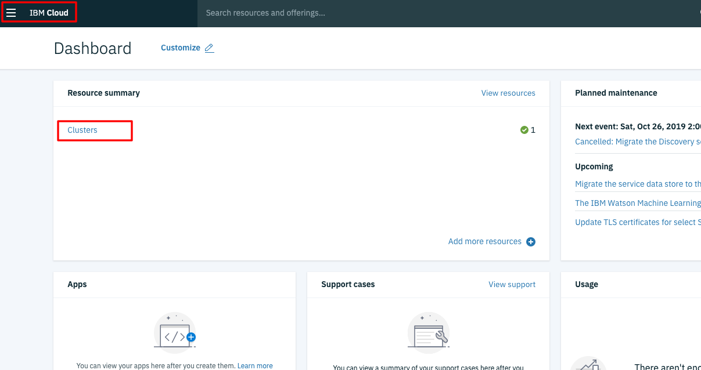
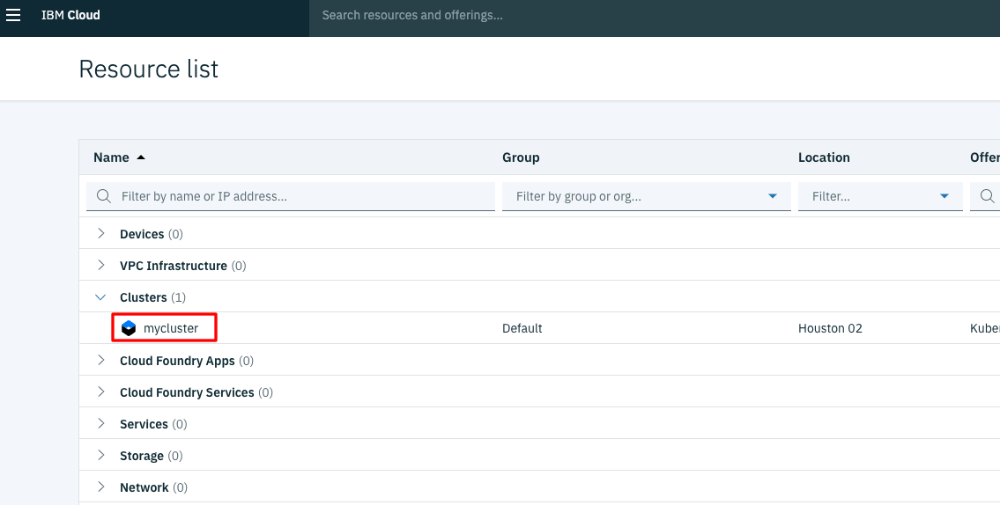
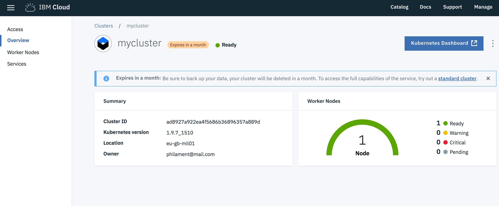
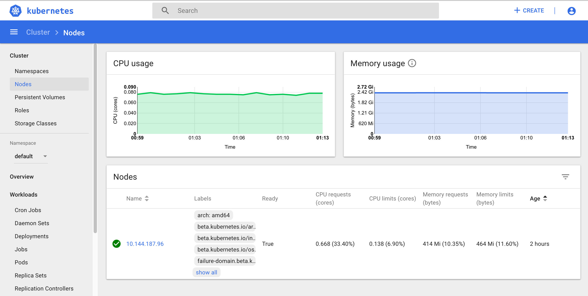
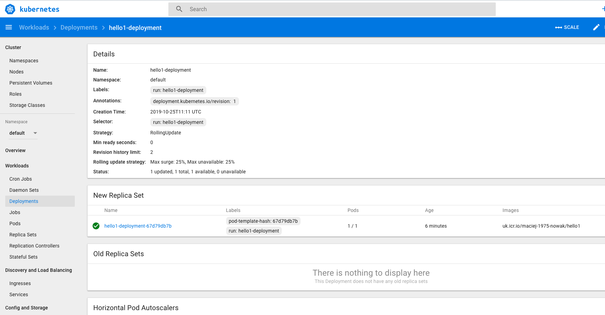
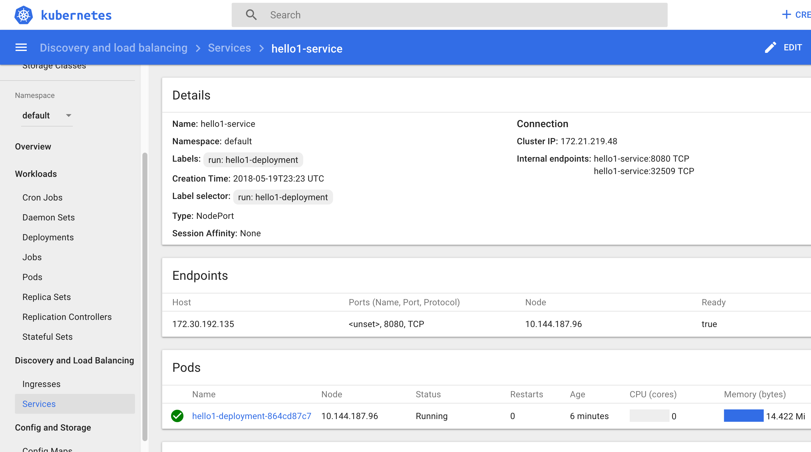
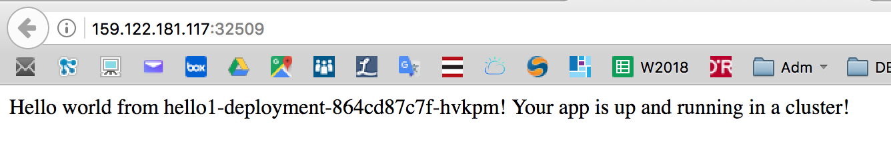

IBM Cloud Container Workshop

---
# Kubernetes Lab
---


---


# Introduction to IBM Cloud Kubernetes Service (IKS)

IBM Cloud Kubernetes Service combines Docker and Kubernetes to deliver powerful tools, an intuitive user experience, and built-in security and isolation to automate the deployment, operation, scaling, and monitoring of containerized apps over a cluster of independent compute hosts by using the Kubernetes APIs.

## Docker containers

Docker is an open source project that was released by dotCloud in 2013. Built on features of the existing Linux container technology (LXC), Docker became a software platform that you can use to build, test, deploy, and scale apps quickly. Docker packages software into standardized units that are called containers that include all of the elements that an app needs to run.

Review these concepts to learn about basic Docker concepts.

**Container**

A container is a standard way to package an app and all its dependencies so that the app can be moved between environments and run without changes. Unlike virtual machines, containers do not virtualize a device, its operating system, and the underlying hardware. Only the app code, run time, system tools, libraries, and settings are packaged inside the container. Containers run as isolated processes on the compute host where they are deployed to and share the host operating system and its hardware resources. This approach makes a container more lightweight, portable, and efficient than a virtual machine.

**Image**

Every container is based on a Docker image and is considered to be an instance of an image. An image is built from a Dockerfile, which is a file that contains instructions how to build the image, and any build artifacts, such as an app, the app's configuration, and its dependencies.ls -ltr

**Registry**

An image registry is a place where you store, retrieve, and share Docker images. Images that are stored in a registry can either be publicly available (public registry) or accessible by a small group of users only (private registry). IBM Cloud Kubernetes Service offers public images, such as ibmliberty that you can use to get started with Docker and Kubernetes to create your first containerized app in a cluster. When it comes to enterprise applications, use a private registry like the one provided in IBM Cloud to protect your images from being used and changed by unauthorized users. 

When you want to deploy a container from an image, you must make sure that the image is stored in either a public or private image registry.

## Kubernetes

Kubernetes was developed by Google as part of the Borg project and handed off to the open source community in 2015. Kubernetes combines more than 15 years of Google research in running a containerized infrastructure with production work loads, open source contributions, and Docker container management tools to provide an isolated and secure app platform that is portable, extensible, and self-healing in case of failovers.

Learn about the basics of how Kubernetes works with a little terminology.


**Cluster**

A Kubernetes cluster consists of one or more virtual machines that are called worker nodes. Every worker node represents a compute host where you can deploy, run, and manage containerized apps. Worker nodes are managed by a Kubernetes master that centrally controls and monitors all Kubernetes resources in the cluster. When you deploy a containerized app, the Kubernetes master decides where to deploy the app, taking into account the deployment requirements and available capacity in the cluster.

**Pod**

Every containerized app that is deployed into a Kubernetes cluster is deployed, run, and managed by a pod. Pods represent the smallest deployable units in a Kubernetes cluster and are used to group containers that must be treated as a single unit. In most cases, a container is deployed to its own pod. However, an app might require a container and other helper containers to be deployed into one pod so that those containers can be addressed by using the same private IP address.

**Deployment**

A deployment is a Kubernetes resource where you specify your containers and other Kubernetes resources that are required to run your app, such as persistent storage, services, or annotations. Deployments are documented in a Kubernetes deployment script. When you run a deployment, the Kubernetes master deploys the specified containers into pods taking into account the capacity that is available on the worker nodes of the cluster. Other Kubernetes resources are created and configured as specified in the deployment script. 

You can use a deployment to define update strategies for your app, which includes the number of pods that you want to add during a rolling update and the number of pods that can be unavailable at a time. When you perform a rolling update, the deployment checks whether the revision is working and stops the rollout when failures are detected.

**Service**

A Kubernetes service groups a set of pods and provides network connection to these pods for other services in the cluster without exposing the actual private IP address of each pod. You can use a service to make your app available within your cluster or to the public internet. 

With IBM Cloud Kubernetes Service (IKS), you can define complex architectures that implement resiliency, high availability and replication between data centers and regions (also called AZ – availability zones).  

In this lab, we are not going to implement such a complex environment. 

We will use the cluster that You have provisioned in the "Preparations" lab today.

# Task 1 : prepare your environment

Deploy and manage your own Kubernetes cluster in the cloud. You can automate the deployment, operation, scaling, and monitoring of containerized apps in a cluster of independent compute hosts called worker nodes.

**To set up the infrastructure:**
•	Install all the CLIs for using the Kubernetes API and managing Docker images
•	Create a private image repository in IBM Cloud Container Registry to store your images

It can take 10min utes to provision your cluster. To make the most of your time, create your cluster before installing all the CLIs. 

On your laptop, you have to prepare your environment to be ready to use Kubernetes and your cluster **mycluster**.

## 

### 1. Login to Your virtual machine

Login to Your provisioned server. Use Your IP address, as reveived from IBM staff.

```ssh root@<YOUR IP ADDRESS>```

Launch a shell or a command line and confirm that docker is installed.

`docker version`


### 2. Check that ibmcloud container service and ibmcloud container registry plugins have been installed

`ibmcloud plugin list`

Results: 

```bash
$ ibmcloud plugin list
Listing installed plug-ins...

Plugin Name          Version   
container-registry                     0.1.339   
container-service/kubernetes-service   0.1.581    
```

If there is no container-registry and container service, ask Your IBM staff.


### 3. Check kubectl 

type the following command :

`kubectl version --short`

And you should get version for your client (exact version may differ, it's OK) :

``` bash
$ kubectl version --short
Client Version: v1.9.8
error: You must be logged in to the server (the server has asked for the client to provide credentials)
```

The error at the end is **normal** because we need to specify how to connect to the master (see below).

If You have logged previously, than You may not see that.


### 4. Gain access to the cluster

Log into your IBM Cloud account if no already logged in.

`ibmcloud login -a https://api.eu-gb.bluemix.net`


Enter ibmcloud target command  **with Your** **email name** (the same as You've used for IBM Cloud account creation):

`ibmcloud target -o <Your Email> -s dev`

like:

`ibmcloud target -o kari@dmailpro.net -s dev`

**IMPORTANT : At this point, your cluster should have been started. Check in the IBM Cloud Console.**

Then go to your Cluster Region :

`ibmcloud cs region-set uk-south`

Set the context for the cluster in your CLI.

`ibmcloud cs cluster-config mycluster`

Output:

``` bash
root@warsaw901:~# ibmcloud cs cluster-config mycluster
WARNING: This legacy command is deprecated and will soon be unsupported. Use the 'ibmcloud ks cluster config' command instead.
For more information, see http://ibm.biz/iks-cli-v1

WARNING: The behavior of this command in your current CLI version is deprecated, and becomes unsupported when CLI version 1.0 is released in March 2020. To use the new behavior now, set the 'IKS_BETA_VERSION' environment variable. In bash, run 'export IKS_BETA_VERSION=1'.
Note: Changing the beta version can include other breaking changes. For more information, see http://ibm.biz/iks-cli-v1

OK
The configuration for mycluster was downloaded successfully.

Export environment variables to start using Kubernetes.

export KUBECONFIG=/root/.bluemix/plugins/container-service/clusters/mycluster/kube-config-hou02-mycluster.yml
```

 > IMPORTANT : Set the KUBECONFIG environment variable. **Copy the output from the previous command and paste it in your terminal**. The command output should look similar to the following.

 `export KUBECONFIG=/root/.bluemix/plugins/container-service/clusters/mycluster/kube-config-hou02-mycluster.yml`

 Verify that you can connect to your cluster by listing your worker nodes.

 `kubectl get nodes`

 The output should be :

```con
root@warsaw901:~# kubectl get nodes
NAME            STATUS   ROLES    AGE   VERSION
10.76.165.189   Ready    <none>   46m   v1.14.7+IKS
```

**YOU ARE NOW CONNECTED TO YOUR CLUSTER** !


# Task 2 : Creating a private registry

Set up your own private image repository in IBM Cloud Container Registry to securely store and share Docker images with all cluster users. A private image repository in IBM Cloud is identified by a **namespace**. The namespace is used to create a unique URL to your image repository that developers can use to access private Docker images.

We choose a unique name as our namespace to group all images in our account. 

Replace <your_namespace> with a namespace of your choice and not something that is related to the tutorial. In case of doubts, use  ***<Surname>-<Born Year>-<Name>***, i.e: **maciej-1975-nowak**

```
ibmcloud cr namespace-add <my_namespace>
```

Results:

```bash
ibmcloud cr namespace-add maciej-1975-nowak
Adding namespace 'maciej-1975-nowak'...

Successfully added namespace 'maciej-1975-nowak'
```

Now login to the IBM Cloud registry:

`ibmcloud cr login`

Output:

```bash
root@warsaw901:~# ibmcloud cr login 
Logging in to 'registry.eu-gb.bluemix.net'...
Logged in to 'registry.eu-gb.bluemix.net'.

Logging in to 'uk.icr.io'...
Logged in to 'uk.icr.io'.

OK
```


To test our new **private registry**, do the following steps:

1. get the hello-world image from Docker-Hub

`docker pull hello-world`

2. tag the hello-world image with a name containing your private registry name :

`docker tag hello-world uk.icr.io/<my_namespace>/hello-world:latest`
like:
`docker tag hello-world uk.icr.io/maciej-1975-nowak/hello-world:latest`

3. push your image in the private registry

`docker push uk.icr.io/<my_namespace>/hello-world:latest`
like:
`docker push uk.icr.io/maciej-1975-nowak/hello-world:latest`

4. List the images in the private registry

`ibmcloud cr image-list`

example:

```bash 
root@warsaw901:~# ibmcloud cr image-list
Listing images...

Repository                                Tag      Digest         Namespace           Created        Size    Security status   
uk.icr.io/maciej-1975-nowak/hello-world   latest   92c7f9c92844   maciej-1975-nowak   9 months ago   977 B   Unsupported OS   
```


# Task 3 : Deploying Apps with Kubernetes


### 1. Check connection to your cluster 

Also test your connectivity to the cluster with this command:

 `kubectl get nodes`


result:

```aaaa
root@warsaw901:~# kubectl get nodes
NAME            STATUS   ROLES    AGE   VERSION
10.76.165.189   Ready    <none>   54m   v1.14.7+IKS
```

If you get an error message like "error: You must be logged in to the server (Unauthorized)", then you must setup your KUBECONFIG (see a previous topic)
​    

### 2. Download a GIT repo for this exercise

**Create a directory** on your computer and move to that directory

```
cd
mkdir started
cd started
```


Get and download this github repository into that directory :

`git clone https://github.com/IBM/container-service-getting-started-wt.git`
​	

```
root@warsaw901:~/started# git clone https://github.com/IBM/container-service-getting-started-wt.git
Cloning into 'container-service-getting-started-wt'...
remote: Enumerating objects: 62, done.
remote: Counting objects: 100% (62/62), done.
remote: Compressing objects: 100% (43/43), done.
remote: Total 1038 (delta 24), reused 37 (delta 14), pack-reused 976
Receiving objects: 100% (1038/1038), 3.01 MiB | 3.30 MiB/s, done.
Resolving deltas: 100% (520/520), done.
Checking connectivity... done.
```


### 3. Build a Docker image 

Build the image locally and tag it with the name that you want to use on the  kubernetes cluster. The tag includes the namespace name of `<namespace>` in the cluster. The tag also targets the master node of the cluster, which manages the job of placing it on one or more worker nodes. This is because of the alias you created in the previous step, with the cluster name linked to the master node name. Tagging the image this way tells Docker where to push the image in a later step. Use **lowercase alphanumeric** characters or underscores only in the image name. Don't forget the period (.) at the end of the command. The period tells Docker to look inside the current directory for the Dockerfile and build artifacts to build the image.

`cd "container-service-getting-started-wt/Lab 1"`

and than build the image:

`docker build -t uk.icr.io/<your namespace>/hello1 .`

like:

`docker build -t uk.icr.io/maciej-1975-nowak/hello1 .`

Output is:

```
$docker build -t uk.icr.io/maciej-1975-nowak/hello1 .
Sending build context to Docker daemon  14.85kB
Step 1/6 : FROM node:9.4.0-alpine
 ---> b5f94997f35f
Step 2/6 : COPY app.js .
 ---> Using cache
 ---> 79935ddaca75
Step 3/6 : COPY package.json .
 ---> Using cache
 ---> 25178eb638f5
Step 4/6 : RUN npm install &&    apk update &&    apk upgrade
 ---> Using cache
 ---> 3bfa8ca606de
Step 5/6 : EXPOSE  8080
 ---> Using cache
 ---> 1a593e66c363
Step 6/6 : CMD node app.js
 ---> Using cache
 ---> b022e60e6a4e
Successfully built b022e60e6a4e
Successfully tagged uk.icr.io/maciej-1975-nowak/hello1:latest

```

To see the image, use the following command:

```
docker images uk.icr.io/<your_namespace>/hello1
```


Example:

 ```
$docker images uk.icr.io/maciej-1975-nowak/hello1
REPOSITORY                           TAG                 IMAGE ID            CREATED             SIZE
uk.icr.io/maciej-1975-nowak/hello1   latest              b022e60e6a4e        24 minutes ago      76.1MB
 ```

### 4. Push the image to the registry and authorise IKS to use the registry

Push your image into the private registry :

`docker push uk.icr.io/<Your Namespace>/hello1:latest`

like:

`docker push uk.icr.io/maciej-1979-nowak/hello1:latest`

 Your output should look like this.

```
$docker push uk.icr.io/maciej-1975-nowak/hello1:latest
The push refers to repository [uk.icr.io/maciej-1975-nowak/hello1]
bf97ba0dc7d0: Pushed 
5f00af5dbfb8: Layer already exists 
ae36be318d10: Layer already exists 
0804854a4553: Layer already exists 
6bd4a62f5178: Layer already exists 
9dfa40a0da3b: Layer already exists 
latest: digest: sha256:b1740229e9b86efa538fb987a13d6e488501742c375e624c5deee4740e3ceef2 size: 1576
```

> **IMPORTANT** : be sure that all the layers have been pushed, wait for the digest line at the end.


IKS service needs a permission to connect to image rregistry. While it is usually provisioned properly, the accounts created in the past may have improper secrets set. We need to make sure they are OK...

Run following command to pull the secrets required for IKS to pull from the git

```
$ibmcloud ks cluster pull-secret apply --cluster mycluster
OK
```

Verify if the secrets are ready:

```
kubectl get secrets
```

proper result:

```
$kubectl get secrets
NAME                  TYPE                                  DATA   AGE
default-au-icr-io     kubernetes.io/dockerconfigjson        1      90m
default-de-icr-io     kubernetes.io/dockerconfigjson        1      90m
default-icr-io        kubernetes.io/dockerconfigjson        1      90m
default-jp-icr-io     kubernetes.io/dockerconfigjson        1      90m
default-token-jmvwt   kubernetes.io/service-account-token   3      91m
default-uk-icr-io     kubernetes.io/dockerconfigjson        1      90m
default-us-icr-io     kubernetes.io/dockerconfigjson        1      90m
```


### 5. Open the Kubernetes Console

Go to your IBM Cloud Console and click on the IBM Cloud icon on the top left part of the screen, than pick  "Clusters":



Pick "mycluster"



You are presented with a view on the cluster You've created.




> Now go to the Worker Nodes section (on the left pane) and **take a note** of the **public IP of that worker node** :


On the right part of the screen, **click the blue button** : Kubernetes Dashboard



You can look around in the dashboard to see all the different resources (pods, nodes ...) or  the workloads (deployments, services ...).


### 6. Run a deployment

Use your image to create a kubernetes deployment with the following command.

`kubectl run hello1-deployment --image=uk.icr.io/<namespace>/hello1`

Output is :

```
$ kubectl run hello1-deployment --image=uk.icr.io/maciej-1975-nowak/hello1
kubectl run --generator=deployment/apps.v1beta1 is DEPRECATED and will be removed in a future version. Use kubectl create instead.
deployment.apps/hello1-deployment created

```
You can also look at the Kubernetes dashboard to see the deployment:



### 7. Create a service 

Create a service to access your running container using the following command.

`kubectl expose deployment/hello1-deployment --type=NodePort --port=8080 --name=hello1-service --target-port=8080`


Your output should be:

```
$ kubectl expose deployment/hello1-deployment --type=NodePort --port=8080 --name=hello1-service --target-port=8080
service "hello1-service" exposed
```

And you can also go to the dashboard :




### 8. NodePort type

With the NodePort type of service, the kubernetes cluster creates a 5-digit port number to access the running container through the service. 

The service is accessed through the IP address of the proxy node with the NodePort port number. To discover the NodePort number that has been assigned, use the following command.

`kubectl describe service hello1-service`

 Your output should look like this.

```
$ kubectl describe service hello1-service
Name:                     hello1-service
Namespace:                default
Labels:                   run=hello1-deployment
Annotations:              <none>
Selector:                 run=hello1-deployment
Type:                     NodePort
IP:                       172.21.219.48
Port:                     <unset>  8080/TCP
TargetPort:               8080/TCP
NodePort:                 <unset>  32509/TCP
Endpoints:                172.30.192.135:8080
Session Affinity:         None
External Traffic Policy:  Cluster
Events:                   <none>
```

Or look at the dashboard:


 


### 9. NodePort number 

Your port may be different! Check it before!

Open a Firefox browser window or tab and go to the URL of your Kubernetes node (You should have noted it before) with your NodePort number, such as `http://159.122.181.117:32509`. Your output should look like this.



In case You've not noted the public IP it may be acquired via command line using kubectl command:

`kubectl get nodes -o wide`

output:

```
root@warsaw9101:~/started/container-service-getting-started-wt/Lab 1# kubectl get nodes -o wide

NAME      STATUS  ROLES  AGE  VERSION    INTERNAL-IP   EXTERNAL-IP   OS-IMAGE       KERNEL-VERSION   CONTAINER-RUNTIME

10.76.199.223  Ready  <none>  24m  v1.14.9+IKS  10.76.199.223  184.172.234.24  Ubuntu 16.04.6 LTS  4.4.0-169-generic  containerd://1.2.10
```

In the example above the public IP is 184.172.234.24

### 10. Application troubleshooting 

You can obtain text-based information on all the resources running in your cluster using the following command if you want to debug your application when running

`kubectl get pods`

Results:

```
# kubectl get pods
NAME                                      READY     STATUS    RESTARTS   AGE
hello-world-deployment-67b694c76f-hvg9k   1/1       Running   0          11m
```

If the POD is running then look at the log (change the pod name with the one shown in latest command):

`kubectl logs hello-world-deployment-67b694c76f-hvg9k  `

Results:

```
# kubectl logs hello-world-deployment-67b694c76f-hvg9k
Sample app is listening on port 8080.

```

You can see the output of your nodeJS application.

You can also go inside your container:

`kubectl exec -it hello-world-deployment-67b694c76f-hvg9k /bin/sh`

Results:

```
# kubectl exec -it hello-world-deployment-67b694c76f-hvg9k /bin/sh
/ # ps
PID   USER     TIME   COMMAND
    1 root       0:00 /bin/sh -c node app.js
    7 root       0:00 node app.js
   19 root       0:00 /bin/sh
   25 root       0:00 ps
/ # 
/ # ls -l
total 96
-rw-r--r--    1 root     root           325 Nov 30 15:30 app.js
drwxr-xr-x    1 root     root          4096 Nov 30 15:31 bin
drwxr-xr-x    5 root     root           360 Nov 30 15:37 dev
drwxr-xr-x    1 root     root          4096 Nov 30 15:37 etc
drwxr-xr-x    1 root     root          4096 Jan 11  2018 home
drwxr-xr-x    1 root     root          4096 Nov 30 15:31 lib
drwxr-xr-x    5 root     root          4096 Jan  9  2018 media
drwxr-xr-x    2 root     root          4096 Jan  9  2018 mnt
drwxr-xr-x   80 root     root          4096 Nov 30 15:31 node_modules
drwxr-xr-x    3 root     root          4096 Jan 11  2018 opt
-rw-r--r--    1 root     root         25023 Nov 30 15:31 package-lock.json
-rw-r--r--    1 root     root           183 Nov 30 15:30 package.json
dr-xr-xr-x  583 root     root             0 Nov 30 15:37 proc
drwx------    1 root     root          4096 Nov 30 15:59 root
drwxr-xr-x    2 root     root          4096 Jan  9  2018 run
drwxr-xr-x    1 root     root          4096 Nov 30 15:31 sbin
drwxr-xr-x    2 root     root          4096 Jan  9  2018 srv
dr-xr-xr-x   13 root     root             0 Nov 30 15:03 sys
drwxrwxrwt    1 root     root          4096 Jan 11  2018 tmp
drwxr-xr-x    1 root     root          4096 Jan 11  2018 usr
drwxr-xr-x    1 root     root          4096 Jan  9  2018 var
/ # 

```

You can use some commands like: ps, ls, cat ... and you can also install commands that are not there (using apt-get install for example).

Dont forget to **exit**

`# exit`


Congratulations ! You have deployed your first app to the IBM Cloud kubernetes cluster.


# Task 5 : Scaling Apps with Kubernetes

In this lab, understand how to update the number of replicas a deployment has and how to safely roll out an update on Kubernetes. Learn, also, how to perform a simple health check.

For this lab, you need a running deployment with a single replica. First, we cleaned up the running deployment.

### 1. Clean up the current deployment

To do so, use the following commands :
- To remove the deployment, use:

`kubectl delete deployment hello1-deployment`

- To remove the service, use: 

`kubectl delete service hello1-service`

### 2. Run a clean deployment

To do so, use the following commands :

`kubectl run hello1-deployment --image=uk.icr.io/<namespace>/hello1`

### 3. Scale the application

A replica is how Kubernetes accomplishes scaling out a deployment. A replica is a copy of a pod that already contains a running service. By having multiple replicas of a pod, you can ensure your deployment has the available resources to handle increasing load on your application.

kubectl provides a scale subcommand to change the size of an existing deployment. Let's us it to go from our single running instance to 10 instances.

`kubectl scale --replicas=10 deployment hello1-deployment`

Here is the result:

```
$ kubectl scale --replicas=10 deployment hello1-deployment
deployment "hello1-deployment" scaled
```

Kubernetes will now act according to the desired state model to try and make true, the condition of 10 replicas. It will do this by starting new pods with the same configuration.

To see your changes being rolled out, you can run: 

`kubectl rollout status deployment/hello1-deployment`

The rollout might occur so quickly that the following messages might not display:

```bash
$ kubectl rollout status deployment/hello1-deployment
Waiting for rollout to finish: 1 of 10 updated replicas are available...
Waiting for rollout to finish: 2 of 10 updated replicas are available...
Waiting for rollout to finish: 3 of 10 updated replicas are available...
Waiting for rollout to finish: 4 of 10 updated replicas are available...
Waiting for rollout to finish: 5 of 10 updated replicas are available...
Waiting for rollout to finish: 6 of 10 updated replicas are available...
Waiting for rollout to finish: 7 of 10 updated replicas are available...
Waiting for rollout to finish: 8 of 10 updated replicas are available...
Waiting for rollout to finish: 9 of 10 updated replicas are available...
deployment "hello1-deployment" successfully rolled out
```


Once the rollout has finished, ensure your pods are running by using: 

`kubectl get pods`

You should see output listing 10 replicas of your deployment:

Results :

```
$ kubectl get pods
NAME                                 READY     STATUS    RESTARTS   AGE
hello1-deployment-864cd87c7f-675sr   1/1       Running   0          5m
hello1-deployment-864cd87c7f-6wxkp   1/1       Running   0          3m
hello1-deployment-864cd87c7f-8fb7b   1/1       Running   0          3m
hello1-deployment-864cd87c7f-fn5t8   1/1       Running   0          3m
hello1-deployment-864cd87c7f-ksvgm   1/1       Running   0          3m
hello1-deployment-864cd87c7f-l2x97   1/1       Running   0          3m
hello1-deployment-864cd87c7f-mb5fw   1/1       Running   0          3m
hello1-deployment-864cd87c7f-nwzr5   1/1       Running   0          3m
hello1-deployment-864cd87c7f-vfnbl   1/1       Running   0          3m
hello1-deployment-864cd87c7f-w7p6m   1/1       Running   0          3m
```

### 4. Rollout an update to  the application

Kubernetes allows you to use a rollout to update an app deployment with a new Docker image. This allows you to easily update the running image and also allows you to easily undo a rollout, if a problem is discovered after deployment.

In the previous lab, we created an image with a 1 tag. Let's make a version of the image that includes new content and use a 2 tag. This lab also contains a Dockerfile. Let's build and push it up to our image registry.

If you are in "Lab 1" directory, you need to go to "Lab 2" directory:

`cd "../Lab 2"`


Build a new version (2) of that application: 

`docker build -t uk.icr.io/<namespace>/hello1:2 .`

Then push the new version into the registry:

`docker push uk.icr.io/<namespace>/hello1:2`

example output:

```
$ docker push uk.icr.io/maciej-1975-nowak/hello1:2
The push refers to repository [uk.icr.io/maciej-1975-nowak/hello1]
4e45a1180b5a: Pushed 
7bc02a5513a6: Pushed 
ea7615adcaaa: Pushed 
0804854a4553: Layer already exists 
6bd4a62f5178: Layer already exists 
9dfa40a0da3b: Layer already exists 
2: digest: sha256:37ee02cd782beca59372dd1add486ab4a648a4459ee3bdb029aefad5bb6ddf48 size: 1576
```


Using kubectl, you can now update your deployment to use the latest image. kubectl allows you to change details about existing resources with the set subcommand. We can use it to change the image being used.

```
kubectl set image deployment/hello1-deployment hello1-deployment=uk.icr.io/maciej-1975-nowak/hello1:2
```


example output:

```
$ kubectl set image deployment/hello1-deployment hello1-deployment=uk.icr.io/maciej-1975-nowak/hello1:2
deployment.extensions/hello1-deployment image updated
```


Note that a pod could have multiple containers, in which case each container will have its own name. Multiple containers can be updated at the same time. 

Run kubectl rollout status deployment/hello-world or kubectl get replicasets to check the status of the rollout. The rollout might occur so quickly that the following messages might not display:

`kubectl rollout status deployment/hello1-deployment`

```bash
$ kubectl rollout status deployment/hello1-deployment
Waiting for rollout to finish: 2 out of 10 new replicas have been updated...
Waiting for rollout to finish: 3 out of 10 new replicas have been updated...
Waiting for rollout to finish: 3 out of 10 new replicas have been updated...
Waiting for rollout to finish: 3 out of 10 new replicas have been updated...
Waiting for rollout to finish: 4 out of 10 new replicas have been updated...
Waiting for rollout to finish: 4 out of 10 new replicas have been updated...
Waiting for rollout to finish: 4 out of 10 new replicas have been updated...
Waiting for rollout to finish: 4 out of 10 new replicas have been updated...
Waiting for rollout to finish: 4 out of 10 new replicas have been updated...
Waiting for rollout to finish: 5 out of 10 new replicas have been updated...
Waiting for rollout to finish: 5 out of 10 new replicas have been updated...
Waiting for rollout to finish: 5 out of 10 new replicas have been updated...
Waiting for rollout to finish: 6 out of 10 new replicas have been updated...
Waiting for rollout to finish: 6 out of 10 new replicas have been updated...
Waiting for rollout to finish: 6 out of 10 new replicas have been updated...
Waiting for rollout to finish: 7 out of 10 new replicas have been updated...
Waiting for rollout to finish: 7 out of 10 new replicas have been updated...
Waiting for rollout to finish: 7 out of 10 new replicas have been updated...
Waiting for rollout to finish: 7 out of 10 new replicas have been updated...
Waiting for rollout to finish: 8 out of 10 new replicas have been updated...
Waiting for rollout to finish: 8 out of 10 new replicas have been updated...
Waiting for rollout to finish: 8 out of 10 new replicas have been updated...
Waiting for rollout to finish: 8 out of 10 new replicas have been updated...
Waiting for rollout to finish: 9 out of 10 new replicas have been updated...
Waiting for rollout to finish: 9 out of 10 new replicas have been updated...
Waiting for rollout to finish: 9 out of 10 new replicas have been updated...
Waiting for rollout to finish: 1 old replicas are pending termination...
Waiting for rollout to finish: 1 old replicas are pending termination...
Waiting for rollout to finish: 1 old replicas are pending termination...
Waiting for rollout to finish: 9 of 10 updated replicas are available...
Waiting for rollout to finish: 9 of 10 updated replicas are available...
Waiting for rollout to finish: 9 of 10 updated replicas are available...
deployment "hello1" successfully rolled out
```

Finally, use that command to see the result:
`kubectl get replicasets`

Results:

```bash
$ kubectl get replicasets
NAME                           DESIRED   CURRENT   READY     AGE
hello1-deployment-864cd87c7f   0         0         0         23m
hello1-deployment-d7cb4bfcf    10        10        10        2m
```

Create a new service:

`kubectl expose deployment/hello1-deployment --type=NodePort --port=8080 --name=hello1-service --target-port=8080`

Check new port for the app

```
kubectl get svc hello1-service
NAME             TYPE       CLUSTER-IP     EXTERNAL-IP   PORT(S)          AGE
hello1-service   NodePort   172.21.51.42   <none>        8080:31952/TCP   56s
```


Collect the NodePort and test your new code :


# Conclusion

You have learnt how to create a Kubernetes cluster and see how to configure all the necessary tools (CLI, connection) to manage a cluster and the kubernetes resources (PODs, Services). And you have deployed and scaled an application in that kubernetes cluster !


# End of the lab
---
# IBM Cloud Container Workshop
---
