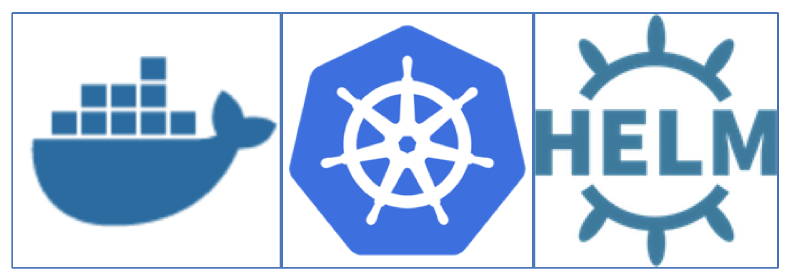
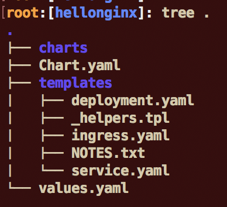
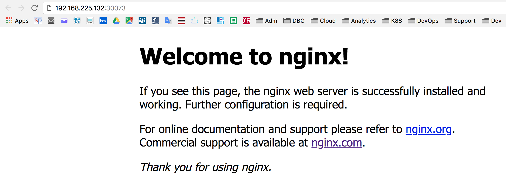
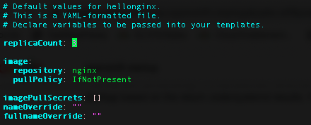

# IBM CloudPak Workshop

###### version: 2020-03-03

---

# Lab 7: Let's get familiar with Helm

---


---


# Docker, Kubernetes and Helm Lab

---





This lab is going to focus on "Helm" which a package manager for Kubernetes. 

**We will be using Kubernetes on IBM Cloud, so have Your IBM Cloud account created in the first lab  ready!**

## 1. Login to Your virtual machine

Connect to the lab27 server provided by IBM using server name, port number, username and password. 

``ssh -p <PORT> root@<Your IP Address:port``

or use any other SSH client (like putty)


### 2. Gain access to the cluster

You have created cluster in the IBM Cloud in the first lab . Now it is the time to connect!

We need to:

1. Login to IBM Cloud

2. Target Your cluster

3. Get credentials for kubectl command to work.

    

So - log into your IBM Cloud account, use the account data that You have created before:

`ibmcloud login -a cloud.ibm.com -r us-south -g Default`

result:

```
# ibmcloud login -a cloud.ibm.com -r us-south -g Default
API endpoint: https://cloud.ibm.com

Email> kari@dmailpro.net

Password> 
Authenticating...
OK

Targeted account Kiali Malli's Account (60b7082462f64beabb5dabae8a8b1b95)

Targeted resource group Default

Targeted region us-south

                      
API endpoint:      https://cloud.ibm.com   
Region:            us-south   
User:              kari@dmailpro.net   
Account:           Kiali Malli's Account (60b7082462f64beabb5dabae8a8b1b95)   
Resource group:    Default   
CF API endpoint:      
Org:                  
Space:                

Tip: If you are managing Cloud Foundry applications and services
- Use 'ibmcloud target --cf' to target Cloud Foundry org/space interactively, or use 'ibmcloud target --cf-api ENDPOINT -o ORG -s SPACE' to target the org/space.
- Use 'ibmcloud cf' if you want to run the Cloud Foundry CLI with current IBM Cloud CLI context.

```

Now we are logged in. Next we need to to select our cluster using "ibmcloud ks" command and prepare the "kubectl" credentials.

`ibmcloud ks cluster config mycluster`

Output:

``` bash
root@lnx101:~# ibmcloud ks cluster config mycluster
WARNING: The behavior of this command in your current CLI version is deprecated, and becomes unsupported when CLI version 1.0 is released in March 2020. To use the new behavior now, set the 'IKS_BETA_VERSION' environment variable. In bash, run 'export IKS_BETA_VERSION=1'.
Note: Changing the beta version can include other breaking changes. For more information, see 'https://ibm.biz/iks-cli-v1'

OK
The configuration for mycluster was downloaded successfully.

Export environment variables to start using Kubernetes.

export KUBECONFIG=/root/.bluemix/plugins/container-service/clusters/mycluster/kube-config-hou02-mycluster.yml
```


Now we are ready to configure kubectl command.

 > IMPORTANT** : Set the KUBECONFIG environment variable. **Copy the output from the previous command and paste it in your terminal**. The command output should look similar to the following.

 

```
export KUBECONFIG=/root/.bluemix/plugins/container-service/clusters/mycluster/kube-config-hou02-mycluster.yml
```


 Verify that you can connect to your cluster:

```
kubectl version --short
```

response:

```
root@lnx15:~# kubectl version --short
Client Version: v1.15.10
Server Version: v1.15.10+IKS
```

The versions may differ, it's fine.


Check if the node(s) are ready:

 `kubectl get nodes`

 The output should be :

```con
# kubectl get nodes
NAME            STATUS   ROLES    AGE   VERSION
10.44.102.249   Ready    <none>   97s   v1.15.10+IKS
```

The version and IP may differ, but the status has to be Ready!

## 3 : Define a Helm chart

Now that you have understood the structure of a kubernetes manifest file, you can start working with helm chart. Basically a helm chart is a collection of manifest files that are deployed as a group. The deployment includes the ability to perform variable substitution based on a configuration file.

### 1. Check Helm

Then check helm version : 

`helm version`

Results:

```console 
root@lnx15:~# helm version
version.BuildInfo{Version:"v3.1.1", GitCommit:"afe70585407b420d0097d07b21c47dc511525ac8", GitTreeState:"clean", GoVersion:"go1.13.8"}
```

Then set an environment variable:

```console
export HELM_HOME=/root/.helm
```

## 2. Deploy existing chart

Let's install simple helm chart to our cluster - nginx. 

First we need to add a nginx repo with command:

```
helm repo add nginx-stable https://helm.nginx.com/stable
```

next step is to update repo database:

```
helm repo update
```

result:

```
root@lnx15:~/hellonginx# helm repo update
Hang tight while we grab the latest from your chart repositories...
...Successfully got an update from the "nginx-stable" chart repository
Update Complete. ⎈ Happy Helming!⎈ 
```

Let's check what is inside the repo we have installed:

```
helm search repo 
```

result:

```
# helm search repo 
NAME                      	CHART VERSION	APP VERSION	DESCRIPTION             
nginx-stable/nginx-ingress	0.4.2        	1.6.2      	NGINX Ingress Controller
```

So it looks we may install nginx-ingress:

```
# helm install my-release nginx-stable/nginx-ingress
```

result:

```
# helm install my-release nginx-stable/nginx-ingress
NAME: my-release
LAST DEPLOYED: Tue Mar  3 12:14:26 2020
NAMESPACE: default
STATUS: deployed
REVISION: 1
TEST SUITE: None
NOTES:
The NGINX Ingress Controller has been installed.
```

Is it really installed? Let's check:

```
# kubectl get pods | grep nginx
```

result:

```
# kubectl get pods | grep nginx

my-release-nginx-ingress-6cd66ccff7-4jzct  1/1   Running  0     5m46s
```

So it looks like it is installed. It is also possible to list all charts installed with helm command:

```
helm list
```

result:

```
# helm list

NAME   	NAMESPACE	REVISION	UPDATED                	STATUS 	CHART       	APP VERSION

my-release	default 	1    	2020-03-03 12:14:26.927936348 +0000 UTC	deployed	nginx-ingress-0.4.2	1.6.2 
```

So let's delete the installation:

```
# helm uninstall my-release
```

result

```
# helm uninstall my-release

release "my-release" uninstalled
```

Is it really un-installed? Let's check:

```
# kubectl get pods | grep nginx
```

result:

```
# kubectl get pods | grep nginx

```

Yes, it is - there are no pods running. 


### 2. Create own chart

Go to home directory and create basic chart structure

```
# cd

# helm create hellonginx
```

get into the directory

`cd hellonginx`

Install the tree utility to see directory structure

`apt install tree`

and verify what has been created:

`tree .`





Edit the value.yaml file that contains app parameters:

`nano values.yaml`

Look at **values.yaml** and **modify it**. 

`nano values.yaml`

Replace the **service section** and choose a port (like 30073 for instance) with the following code:

**Remember that yaml is based on number of spaces in indentation, check it carefully**

```console
service:
  name: hellonginx-service
  type: NodePort
  externalPort: 80
  internalPort: 80
  nodePort: 30073
```

The main content for **values.yaml** whould be as follows:

```
# Default values for hellonginx.
# This is a YAML-formatted file.
# Declare variables to be passed into your templates.

replicaCount: 1

image:
  repository: nginx
  tag: stable
  pullPolicy: IfNotPresent

service:
  name: hellonginx-service
  type: NodePort
  externalPort: 80  
  internalPort: 80  
  nodePort: 30073

ingress:
  enabled: false
  annotations: {}
    # kubernetes.io/ingress.class: nginx
    # kubernetes.io/tls-acme: "true"
  path: /
  hosts:
    - chart-example.local
  tls: []
  #  - secretName: chart-example-tls
  #    hosts:
  #      - chart-example.local

resources: {}
  # We usually recommend not to specify default resources and to leave this as a conscious
  # choice for the user. This also increases chances charts run on environments with little
  # resources, such as Minikube. If you do want to specify resources, uncomment the following
  # lines, adjust them as necessary, and remove the curly braces after 'resources:'.
  # limits:
  #  cpu: 100m
  #  memory: 128Mi
  # requests:
  #  cpu: 100m
  #  memory: 128Mi

nodeSelector: {}

tolerations: []

affinity: {}
```


Review deployment template:

`nano /root/hellonginx/templates/deployment.yaml`

**Don't change anything.**

```
apiVersion: apps/v1beta2
kind: Deployment
metadata:
  name: {{ template "hellonginx.fullname" . }}
  labels:
    app: {{ template "hellonginx.name" . }}
    chart: {{ template "hellonginx.chart" . }}
    release: {{ .Release.Name }}
    heritage: {{ .Release.Service }}
spec:
  replicas: {{ .Values.replicaCount }}
  selector:
    matchLabels:
      app: {{ template "hellonginx.name" . }}
      release: {{ .Release.Name }}
  template:
    metadata:
      labels:
        app: {{ template "hellonginx.name" . }}
        release: {{ .Release.Name }}
    spec:
      containers:
        - name: {{ .Chart.Name }}
          image: "{{ .Values.image.repository }}:{{ .Values.image.tag }}"
          imagePullPolicy: {{ .Values.image.pullPolicy }}
          ports:
            - name: http
              containerPort: 80
              protocol: TCP
          livenessProbe:
            httpGet:
              path: /
              port: http
          readinessProbe:
            httpGet:
              path: /
              port: http
          resources:
{{ toYaml .Values.resources | indent 12 }}
    {{- with .Values.nodeSelector }}
      nodeSelector:
{{ toYaml . | indent 8 }}
    {{- end }}
    {{- with .Values.affinity }}
      affinity:
{{ toYaml . | indent 8 }}
    {{- end }}
    {{- with .Values.tolerations }}
      tolerations:
{{ toYaml . | indent 8 }}
    {{- end }}
```

Then review the **service template**:
`nano /root/hellonginx/templates/service.yaml`

We will use the NodePort service,m which requires 3 ports to define. That's why we have to modify the service file.

Change the **-port section** with the following code (don't introduce any TAB in the file, carefully verify!):

```
    - port: {{ .Values.service.externalPort }}
      targetPort: {{ .Values.service.internalPort }}
      protocol: TCP
      nodePort: {{ .Values.service.nodePort }}
      name: {{ .Values.service.name }}
```


So the service should look as follows:

```
apiVersion: v1
kind: Service
metadata:
  name: {{ template "hellonginx.fullname" . }}
  labels:
    app: {{ template "hellonginx.name" . }}
    chart: {{ template "hellonginx.chart" . }}
    release: {{ .Release.Name }}
    heritage: {{ .Release.Service }}
spec:
  type: {{ .Values.service.type }}
  ports:
    - port: {{ .Values.service.externalPort }}
      targetPort: {{ .Values.service.internalPort }}
      protocol: TCP
      nodePort: {{ .Values.service.nodePort }}
      name: {{ .Values.service.name }}
  selector:
    app: {{ template "hellonginx.name" . }}
    release: {{ .Release.Name }}
```

### 3. Check the chart

Go back to the hellonginx path and check the validity of the helm chart.

`cd /root/hellonginx`

`helm lint`

result:

```
root@lnx15:~/hellonginx# helm lint
==> Linting .
[INFO] Chart.yaml: icon is recommended

1 chart(s) linted, 0 chart(s) failed
root@lnx15:~/hellonginx# 

```

In case of error, you can :

- Analyse your change
- Check you didn't introduce any tab or cyrillic characters in the YAML files
- Check the parenthesis in the files


## 4 : Install the chart

The helm chart that we created in the previous section that has been verified now can be deployed.


Type the following command and don't forget the dot at the end:

`helm install hellonginx .`

Result:
```console
root@lnx15:~/hellonginx# helm install hellonginx .
NAME: hellonginx
LAST DEPLOYED: Tue Mar  3 12:32:36 2020
NAMESPACE: default
STATUS: deployed
REVISION: 1
NOTES:
1. Get the application URL by running these commands:
  export NODE_PORT=$(kubectl get --namespace default -o jsonpath="{.spec.ports[0].nodePort}" services hellonginx)
  export NODE_IP=$(kubectl get nodes --namespace default -o jsonpath="{.items[0].status.addresses[0].address}")
  echo http://$NODE_IP:$NODE_PORT
```


Let's use the instructions to get URL and PORT for our app, **but we need to modify the IP section and ask for external IP, not the internal one as the command above provides**.

 So - **do not use the instructions from helm** and use the commands below instead:

```
# export NODE_PORT=$(kubectl get --namespace default -o jsonpath="{.spec.ports[0].nodePort}" services hellonginx)

# export NODE_IP=$(kubectl get nodes --namespace default -o wide -o jsonpath="{.items[0].status.addresses[1].address}")

# echo http://$NODE_IP:$NODE_PORT
```

So our URL should be similar to:

```
http://184.172.252.163:30073
```


Try this url and get the nginx hello (use the browser on Your laptop):



### 5. Upgrade

We now want to change the number of replicas to **3** (change the **replicaCount** variable in the **values.yaml** file:

`nano values.yaml`

Change the replicas to 3



 and then upgrade hellonginx:

`helm  upgrade hellonginx .`

**Results**

```console
root@lnx15:~/hellonginx# helm upgrade hellonginx .
Release "hellonginx" has been upgraded. Happy Helming!
NAME: hellonginx
LAST DEPLOYED: Tue Mar  3 12:42:40 2020
NAMESPACE: default
STATUS: deployed
REVISION: 2
NOTES:
1. Get the application URL by running these commands:
  export NODE_PORT=$(kubectl get --namespace default -o jsonpath="{.spec.ports[0].nodePort}" services hellonginx)
  export NODE_IP=$(kubectl get nodes --namespace default -o jsonpath="{.items[0].status.addresses[0].address}")
  echo http://$NODE_IP:$NODE_PORT
```

Let's verify if the number of replicas has been updated:

```
kubectl get pods | grep nginx
```

result

```
# kubectl get pods | grep nginx

hellonginx-64587fcfcd-qjcng     1/1   Running  0     47s

hellonginx-64587fcfcd-s4hjf     1/1   Running  0     10m

hellonginx-64587fcfcd-tr6qb     1/1   Running  0     47s
```


## 

# IBM CloudPak Workshop
