# OpenShift First Steps Labs


Duration: 30 minutes


This lab is based on efforts of Philippe Thomas, IBM available at https://github.com/phthom/cp4a, tailored to our local needs.


##  Introduction

During this lab, we are going to set up your laptop to be prepared to all labs during this workshop. You should be able to connect to an **OpenShift** Cluster thru the Web Console and navigate thru the different kubernetes resources.

The instructor has already built a POC OpenShift Cluster for you. 


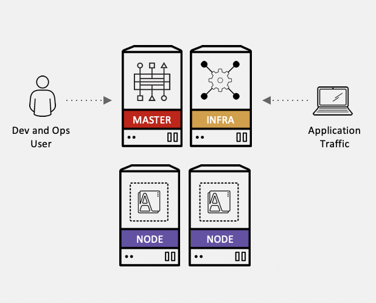


As you can see on the picture, you will connect to the OpenShift Cluster Web UI to the Master for management and development purposes. The end-users will connect to the applications thru the Infra Node.


## Task #1 - Modifying your environment

The instructor will give you some informations:

- a user ID and password to connect to the Master Node. The user ID is in the format **labuser<xx>** where xx is a number from 00 to 99. Don't use someone else userID except if the instructor ask you to do so. 
- a project name in the format **labproj<xx>**. Each project is associated to the corresponding labuser<xx>. 


## Task #2 - Connecting to the Web Console

You can now use the following link in your preferred browser :

```http
https://master.x.cloudpak.site:8443
```

Please take a note of this link because we will use it very often.

You should see the following page after a few seconds:


Type your credentials (**user ID, password**) and click **Log in**

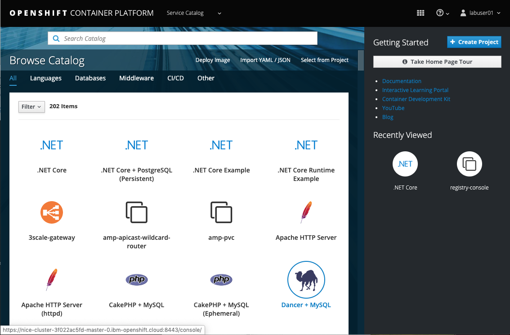


> Be very careful when you type the line especially on the IP address and the hostnames. 
>
>

## Task #2 - Connecting via command line

### 1. Login to the server

We don't want to install anything on Your local machine, that's why we will use another Linux server with pre-confiured tools.

Login to the server `master.x.cloudpak.site` using ssh on port 22 with Your username (labuserXX) and password provided by IBM staff. Use any SSH client You have. 

If there is no SSH client on Your workstation, just install putty.

`slogin -l labuserXX master.x.cloudpak.site`


### 2. Check the OC command

Open a terminal or a command line console and type:

```shell
oc login https://master.x.cloudpak.site:8443
```

Then enter your credentials (userID and password) as an example:

```shell
[labuser01@master ~]$ oc login https://master.x.cloudpak.site:8443
Authentication required for https://master.x.cloudpak.site:8443 (openshift)
Username: labuser01
Password: 
Login successful.

You have one project on this server: "labproj01"

Using project "labproj01".
Welcome! See 'oc help' to get started.
[labuser01@master ~]$ 
```

> **You don't need to create a new project because a new secure project space has already been created for you.** 

If you had to create a new project, you would have typed : oc new-project labproj<xx> where **xx** is your number.

To understand what project you are using:

```
oc projects
```

Results:

```shell
[labuser01@master ~]$ oc projects
You have one project on this server: "labproj01".

Using project "labproj01" on server "https://master.x.cloudpak.site:8443".
```

In the case of using multiple projects, you can change from one project to another one, use the following command :

``` shell
oc project <another project>
```

Now you are ready to go thru the exercises. 


## Task #3 - Deploy some code

Now go back to the Web UI and deploy your first application.

In later lab we will dig into the builds, for now You will just get familiar with the console.

From the **catalog console**, find the **Node.js** tile. 

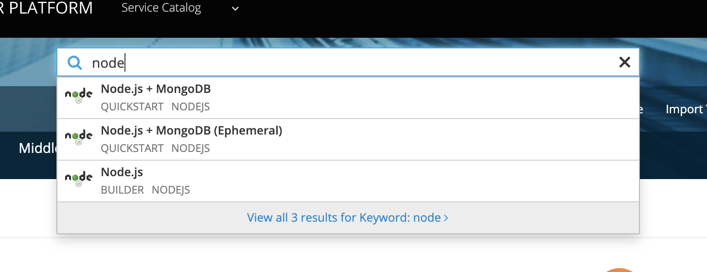


Select **Node.js** entry:

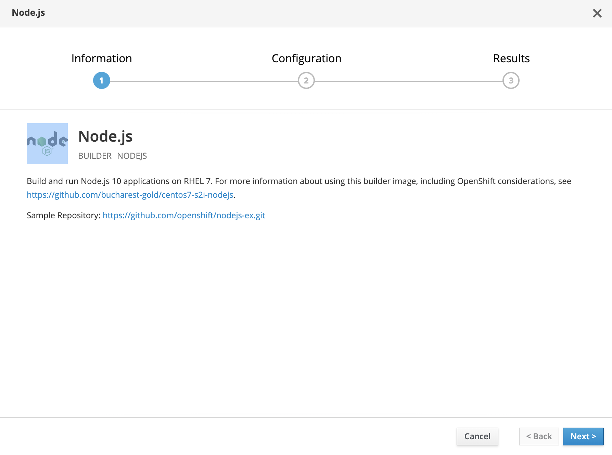

You can have a look to the github **sample** repository. 

Click **next**.

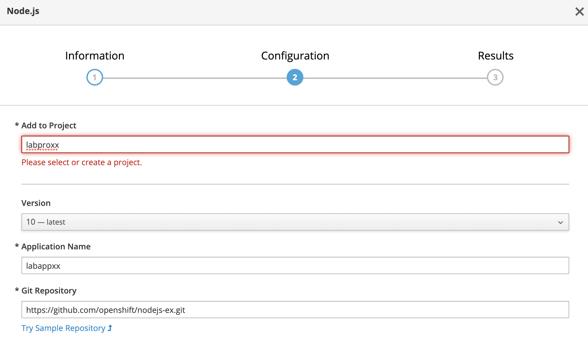

Replace xx with your own number:

- labproj<xx> in the add to project field

- labapp<xx> in the Application name

- https://github.com/openshift/nodejs-ex.git  in the git repository where we have our code

  

Click "**Create**"


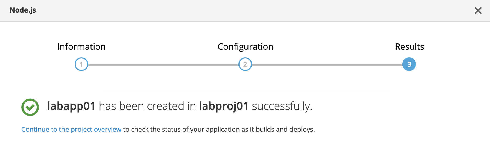

Click **close**.

Go back to the Catalog Console and click on **view all** to select your project **labproj<xx>**.

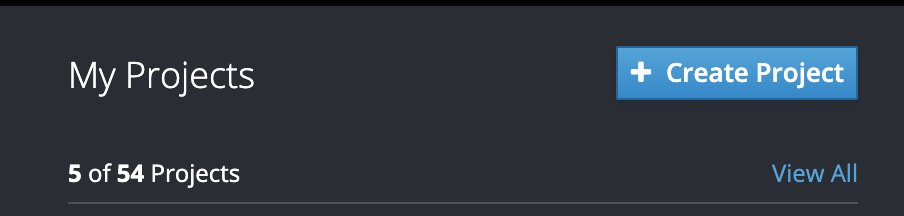

As an example in the **application console**, you should see you application deployment **labapp<xx>**:

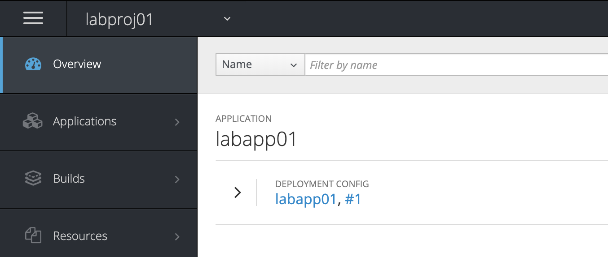

If you drill down, at some point you should see your pod running. It may take a minute or two for the system to build the app:

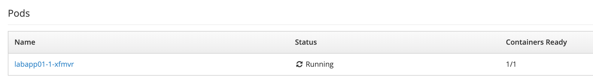

To get access to your application, you have to find the route: go to **Application** on the left pane and the choose **Route**:

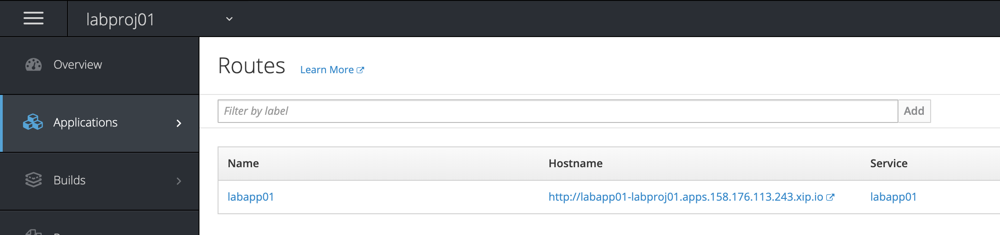

Click on the hostname link and voilà ! You get access to your application.

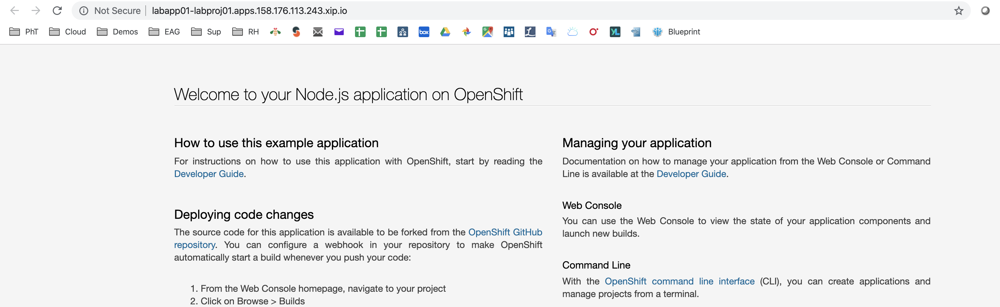

### Task #3 - Clean the application

Clean the system - delete the application created.

The system has created a few comonents. As our resources are limited, before we will start fith further labs we need to delete the application created.

### 1. Clean the deployment

Select "**Applications**" -> "**Deployments**" from the web console menu on the left.

Click on the application that You have created:


From the **"Actions"** select "**Delete**". Confirm with "**Delete**" again.

## Conclusion

**Congrats !**  You successfully installed and used the oc CLI and the OpenShift web console thru the installation of a typical Node.JS application (from Github). 

You noticed the following details:

- easy to install for the oc CLI
- easy to access the OpenShift web console
- easy to build and deploy a simple application with the console.


----

----


# End of Lab


X