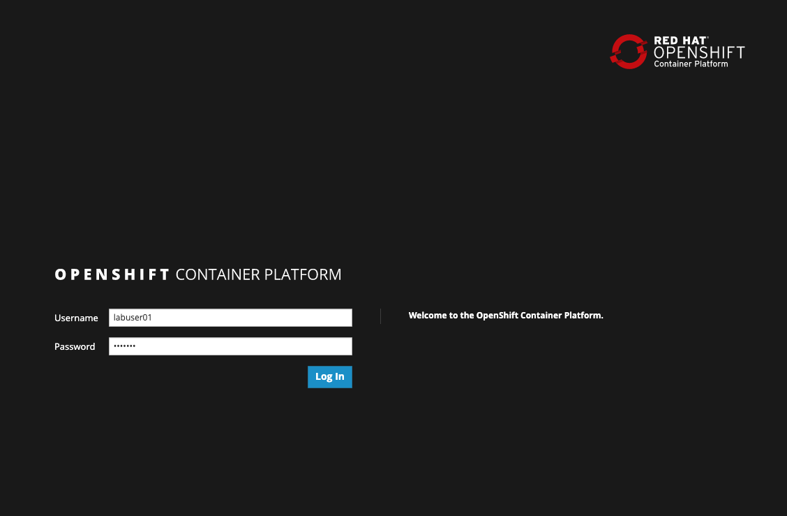

# IBM Cloud Container Workshop

###### Version: 2020-03-03

---

## Lab 4: OpenShift First Steps Lab


This lab is partialy based on efforts of Philippe Thomas, IBM available at https://github.com/phthom/cp4a, tailored to our local needs.


##  Introduction

During this lab, we are going to set up your laptop to be prepared to all labs during this workshop. You should be able to connect to an **OpenShift** Cluster thru the Web Console and navigate thru the different kubernetes resources.

The instructor has already built a POC OpenShift Cluster for you. 


As you can see on the picture, you will connect to the OpenShift Cluster Web UI to the Master for management and development purposes. The end-users will connect to the applications thru the Infra Node.


## 1 - Modifying your environment

The instructor will give you some informations:

- a user ID and password to connect to the Master Node. The user ID is in the format **labuser<xx>** where xx is a number from 00 to 99. Don't use someone else userID except if the instructor ask you to do so. 

- a project name in the format **labproj<xx>**. Each project is associated to the corresponding labuser<xx>. 

  

## 2 - Connecting to the server

We have desktop service provisioned on the lab server, accesible via VNC. 

If You don't have vnc client, get it from https://www.realvnc.com/en/connect/download/viewer/ or any other source.

Use the vnc client and connect to the lab27 server. Please double check the port number that this service runs!


## 3 - Connecting to the Web Console

Select Applications->Internet and open firefox browser


You can now use the following link :

```http
https://master.x.cloudpak.site:8443
```

Please take a note of this link because we will use it very often. 

**This server is accesible ONLY via the VNC session, so do not try to open it from Your local web browser!**


Our server is using self-signed certificate, which may be identified by the browser as security risk.

Accept any security risk You may encounter (Advanced->Accept Risk and continue).


You are presented with Openshift login page.




Type your credentials (**user ID, password**) and click **Log in**


## 4 - Connecting via command line

### 1. Login to the server

We don't want to install anything on Your local machine, that's why we will use another Linux server with pre-confiured tools. Connect to the lab27 server provided by IBM using server name, port number, username and password. 

``ssh -p <PORT> root@<Your IP Address:port``

or use any other SSH client (like putty)


### 2. Check the OC command

Open a terminal or a command line console and type:

```shell
oc login https://master.x.cloudpak.site:8443
```

Then enter your credentials (userID and password) as an example:

```shell
[labuser01@master ~]$ oc login https://master.x.cloudpak.site:8443
Authentication required for https://master.x.cloudpak.site:8443 (openshift)
Username: labuser01
Password: 
Login successful.

You have one project on this server: "labproj01"

Using project "labproj01".
Welcome! See 'oc help' to get started.
[labuser01@master ~]$ 
```


To understand what project you are using:

```
oc projects
```

Results:

```shell
[labuser01@master ~]$ oc projects
You have one project on this server: "labproj01".

Using project "labproj01" on server "https://master.x.cloudpak.site:8443".
```

In the case of using multiple projects, you can change from one project to another one, use the following command :

``` shell
oc project <another project>
```

Now you are ready to go thru the exercises. 


## 5 - Deploy some code

Now go back to the Web UI and deploy your first application.

In later lab we will dig into the builds, for now You will just get familiar with the console.

From the **catalog console**, find the **Node.js** tile. 


Select **Node.js** BUILDER NODEJS entry:


You can have a look to the github **sample** repository. 

Click **next**.


Replace labprojxx/labappxx with your own number as given on the cluster login page.

- labproj<xx> in the add to project field

- labapp<xx> in the Application name

- https://github.com/openshift/nodejs-ex.git  in the git repository where we have our code

  

Click "**Create**"


Click **close**.

Expand "**Service Catalog**" item in the upper part of the screen and select "**Application Console**".

Click on Your project to open it, than select "**Overview**" from the left menu and click on ">" to see deployment details:


At some point, when the build finishes you should see build finishes and app running. It may take a up to 2-3 minutes for the system to build the app, depending on current load on the cluster and the network:


To get access to your application click on the **"Routes - External Traffic"**  or manually find the route: go to **Application** on the left pane and the choose **Route**:


Click on the hostname link and voilà ! You get access to your application.


## 6 - Clean the application

Clean the system - delete the application created.

The system has created a few comonents. As our resources are limited, before we will start with further labs we need to delete the application created. **Do not skip this step!**

#### 1. Clean the deployment

Select "**Applications**" -> "**Deployments**" from the web console menu on the left.

Click on the application that You have created:


From the **"Actions"** select "**Delete**". Confirm with "**Delete**" again.

## 7. Conclusion

**Congrats !**  You successfully installed and used the oc CLI and the OpenShift web console thru the installation of a typical Node.JS application (from Github). 

You noticed the following details:

- easy to install for the oc CLI
- easy to access the OpenShift web console
- easy to build and deploy a simple application with the console.


----

----


# End of Lab


